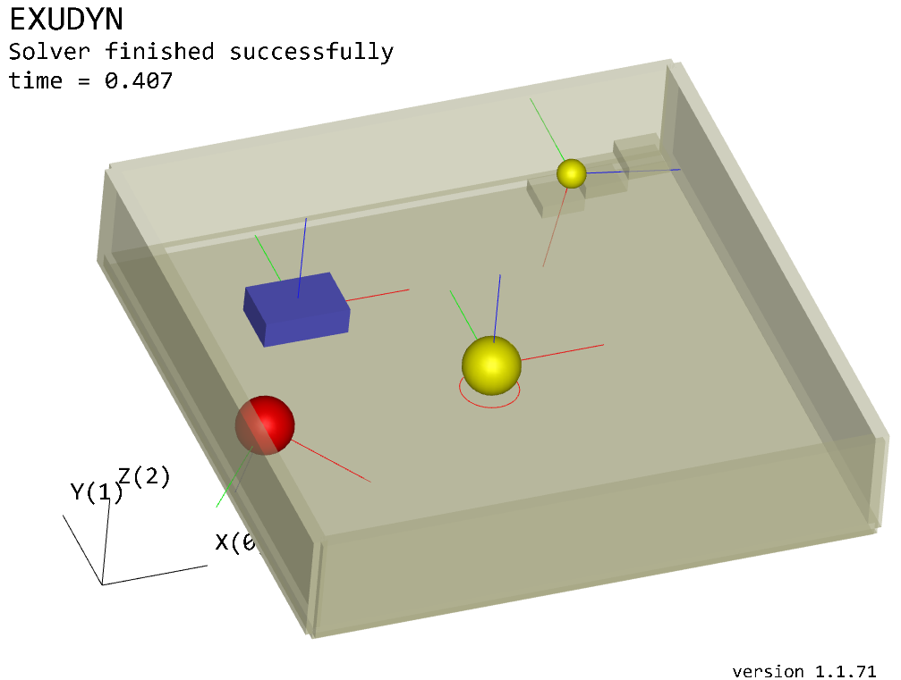

|Documentation GithubIO|

.. |Documentation GithubIO| image:: https://img.shields.io/website-up-down-green-red/https/jgerstmayr.github.io/EXUDYN.svg
   :target: https://jgerstmayr.github.io/EXUDYN/

|Github all releases|

.. |Github all releases| image:: https://img.shields.io/github/downloads/jgerstmayr/EXUDYN/total.svg
   :target: https://github.com/jgerstmayr/EXUDYN/releases/

|GitHub commits|

.. |GitHub commits| image:: https://img.shields.io/github/commits-since/jgerstmayr/EXUDYN/v1.0.0.svg
   :target: https://github.com/jgerstmayr/EXUDYN/

|PyPI version exudyn|

.. |PyPI version exudyn| image:: https://badge.fury.io/py/exudyn.svg
   :target: https://pypi.python.org/pypi/exudyn/

|PyPI pyversions|

.. |PyPI pyversions| image:: https://img.shields.io/pypi/pyversions/exudyn.svg
   :target: https://pypi.python.org/pypi/exudyn/

|PyPI download total|

.. |PyPI download total| image:: https://img.shields.io/pypi/dt/exudyn.svg
   :target: https://pypi.python.org/pypi/exudyn/

|PyPI download month|

.. |PyPI download month| image:: https://img.shields.io/pypi/dm/exudyn.svg
   :target: https://pypi.python.org/pypi/exudyn/

======
Exudyn
======

**A flexible multibody dynamics systems simulation code with Python and C++**

+  Exudyn version = 1.5.90.dev1 (Fitzgerald)
+  build date and time=2023-02-02  18:27
+  **University of Innsbruck**, Austria, Department of Mechatronics

Exudyn 1.5 is out! It includes now Python 3.7/8 - 3.10 wheels for MacOS (since 1.5.11.dev1 also showing tkinter dialogs!), improved compatibility for AVX2, simple reeving system, improved Lie group integration, improved RollingDisc, DistanceSensor, and many fixes; further features are multi-threading support; minimum coordinate formulation (KinematicTree); machine learning and artificial intelligence interface (openAI gym); improved explicit and implicit solvers; sparse matrix support; basic hydraulic actuator; creation of beams along curves; extended robotics modules; contact module; **PlotSensor** for simple post processing, and some improved 3D visualization, ...   See theDoc.pdf chapter **Issues and Bugs** for changes!

If you like using Exudyn, please add a *star* on github, and send an email to  ``reply.exudyn@gmail.com`` such that we can add you to our newsletter. Let us know, which features you are using or which **features you are missing** and follow us on 
`Twitter @RExudyn <https://twitter.com/RExudyn>`_ !

A paper on Exudyn has been presented at the `6th Joint International Conference on Multibody System Dynamics <http://imsdacmd2020.iitd.ac.in>`_ and **submitted** to the proceedings: J. Gerstmayr, Exudyn - A C++ based Python package for flexible multibody systems, Proceedings of The 6th Joint International Conference on Multibody System Dynamics and the 10th Asian Conference on Multibody System Dynamics 2020, New Delhi, India, 2022. `PDF <https://github.com/jgerstmayr/EXUDYN/blob/master/docs/publications/GerstmayrIMSD2022.pdf>`_

+  **NOTE**: for pure installation, use **pip install exudyn** (see further description below)
+  *free, open source* and with plenty of *documentation* and *examples*
+  **pre-built** for Python 3.6 - 3.10 under **Windows** and **Linux**, Python 3.8 - 3.10 under **MacOS** available; build wheels yourself, see `theDoc.pdf <https://github.com/jgerstmayr/EXUDYN/blob/master/docs/theDoc/theDoc.pdf>`_ )
+  Exudyn can be linked to any other Python package, but we explicitly mention: `NGsolve <https://github.com/NGSolve/ngsolve>`_, `OpenAI <https://github.com/openai>`_, `OpenAI gym <https://github.com/openai/gym>`_, `Robotics Toolbox (Peter Corke) <https://github.com/petercorke/robotics-toolbox-python>`_, `Pybind11 <https://github.com/pybind/pybind11>`_

.. |pic1| image:: docs/demo/screenshots/pistonEngine.gif
   :width: 200

.. |pic2| image:: docs/demo/screenshots/hydraulic2arm.gif
   :width: 200

.. |pic3| image:: docs/demo/screenshots/particles2M.gif
   :width: 120

.. |pic4| image:: docs/demo/screenshots/shaftGear.png
   :width: 160

.. |pic5| image:: docs/demo/screenshots/rotor_runup_plot3.png
   :width: 190

.. |pic6| image:: docs/theDoc/figures/DrawSystemGraphExample.png
   :width: 240
   
|pic1| |pic2| |pic3| |pic4| |pic5| |pic6|

This README document is a small part of the complete documentation found as PDF document in docs/theDoc/theDoc.pdf.
It is auto-generated from .tex files (sorry for some conversion errors!). 
Due to limitations for complex formulas and tables in .rst files, details of the reference manual and many other parts of the documentation are only available in theDoc.pdf, see the `github page of Exudyn <https://github.com/jgerstmayr/EXUDYN/blob/master/docs/theDoc/theDoc.pdf>`_ !

For license, see LICENSE.txt in the root folder!

In addition to the tutorial in the documentation, many ( **100+** ) examples can be found under main/pythonDev/Examples and main/pythonDev/TestModels .

Tutorial videos can be found in the `youtube channel of Exudyn <https://www.youtube.com/playlist?list=PLZduTa9mdcmOh5KVUqatD9GzVg_jtl6fx>`_ !

Enjoy the Python library for multibody dynamics modeling, simulation, creating large scale systems, parameterized systems, component mode synthesis, optimization, ...

================================
Installation and Getting Started
================================

Exudyn is hosted on `GitHub <https://github.com>`_ :

+  web: `https://github.com/jgerstmayr/EXUDYN <https://github.com/jgerstmayr/EXUDYN>`_

For any comments, requests, issues, bug reports, send an email to: 

+  email: \ ``reply.exudyn@gmail.com``\ 

Thanks for your contribution!

---------------
Getting started
---------------

This section will show:

+  What is Exudyn ?
+  Who is developing Exudyn ?
+  How to install Exudyn 
+  How to link Exudyn and Python
+  Goals of Exudyn
+  Run a simple example in Python
+  FAQ -- Frequently asked questions

What is Exudyn ?
===================

Exudyn --  (fl\ **EX**\ ible m\ **U**\ ltibody \ **DYN**\ amics  -- \ **EX**\ tend yo\ **U**\ r \ **DYN**\ amics)

Exudyn is a C++ based Python library for efficient simulation of flexible multibody dynamics systems.
It is the follow up code of the previously developed multibody code HOTINT, which Johannes Gerstmayr started during his PhD-thesis.
It seemed that the previous code HOTINT reached limits of further (efficient) development and it seemed impossible to continue from this code as it was outdated regarding programming techniques and the numerical formulation at the time Exudyn was started.

Exudyn is designed to easily set up complex multibody models, consisting of rigid and flexible bodies with joints, loads and other components. It shall enable automatized model setup and parameter variations, which are often necessary for system design but also for analysis of technical problems. The broad usability of Python allows to couple a multibody simulation with environments such as optimization, statistics, data analysis, machine learning and others.

The multibody formulation is mainly based on redundant coordinates. This means that computational objects (rigid bodies, flexible bodies, ...) are added as independent bodies to the system. Hereafter, connectors (e.g., springs or constraints) are used to interconnect the bodies. The connectors are using Markers on the bodies as interfaces, in order to transfer forces and displacements.
For details on the interaction of nodes, objects, markers and loads see theDoc.pdf.

Developers of Exudyn and thanks
==================================

Exudyn is currently  developed at the University of Innsbruck.
In the first phase most of the core code is written by Johannes Gerstmayr, implementing ideas that followed out of the project HOTINT . 15 years of development led to a lot of lessons learned and after 20 years, a code must be re-designed.

Some important tests for the coupling between C++ and Python have been written by Stefan Holzinger. Stefan also helped to set up the previous upload to GitLab and to test parallelization features.
For the interoperability between C++ and Python, we extensively use \ **Pybind11**\ , originally written by Jakob Wenzel, see \ ``https://github.com/pybind/pybind11``\ . Without Pybind11 we couldn't have made this project -- Thanks a lot!

Important discussions with researchers from the community were important for the design and development of Exudyn , where we like to mention Joachim Schöberl from TU-Vienna who boosted the design of the code with great concepts. 

The cooperation and funding within the EU H2020-MSCA-ITN project 'Joint Training on Numerical Modelling of Highly Flexible Structures for Industrial Applications' contributes to the development of the code.

The following people have contributed to Python and C++ library implementations (as well as to testing, examples, theory, ...):

+  Joachim Schöberl, TU Vienna (Providing specialized NGsolve  core library with \ ``taskmanager``\  for \ **multi-threaded parallelization**\ ; NGsolve mesh and FE-matrices import; highly efficient eigenvector computations)
+  Stefan Holzinger, University of Innsbruck (Lie group module and solvers in Python, Lie group node, testing)
+  Andreas Zwölfer, Technical University Munich (FFRF and CMS formulation)
+  Peter Manzl, University of Innsbruck (ConvexRoll Python and C++ implementation, pip install on linux, wsl with graphics)
+  Martin Sereinig, University of Innsbruck (special robotics functionality)
+  Michael Pieber, University of Innsbruck (helped in several Python libraries)
+  Grzegorz Orzechowski, Lappeenranta University of Technology (coupling with openAI gym and running machine learning algorithms)
+  Aaron Bacher, University of Innsbruck (helped to integrated OpenVR, connection with Franka Emika Panda)

The following people have contributed to examples, testing and theory:

+  Konstantina Ntarladima, Manuel Schieferle, Martin Knapp, Lukas March, Dominik Sponring, David Wibmer, Simon Scheiber

-- thanks a lot! --

-------------------------
Installation instructions
-------------------------

Requirements for Exudyn ?
============================

Exudyn only works with Python. Thus, you need an appropriate Python installation.
So far (2021-07), we tested

+  \ **Anaconda 2021-11, 64bit, Python 3.9**\  (older Anaconda3 versions can be downloaded via the repository archive \ ``https://repo.anaconda.com/archive/``\ )
+  Currently, we work with Python 3.6 - Python 3.10 \ **conda environments**\  on Windows, Linux and MacOS (3.8-3.10).
+  \ **Spyder 5.1.5**\  (with Python 3.9.7, 64bit) and \ **Spyder 4.1.3**\  (with Python 3.7.7, 64bit), which is included in the Anaconda installation (or 64bit and are compiled up to the same minor version, i.e., 3.7.x. There will be a strange .DLL error, if you mix up 32/64bit. It is possible to install both, Anaconda 32bit and Anaconda 64bit -- then you should follow the recommendations of paths as suggested by Anaconda installer.); Spyder works with all virtual environments

Many alternative options exist:

+  Users report successful use of Exudyn with \ **Visual Studio Code**\ . \ **Jupyter**\  has been tested with some examples; both environments should work with default settings.
+  Anaconda 2020-11 with \ **Python 3.8**\  and Spyder 4.1.5: no problems except some regular crashes of Spyder, TestSuite runs without problems since Exudyn version 1.0.182.
+  Alternative option with more stable Spyder (as compared to Spyder 4.1.3): Anaconda, 64bit, Python 3.6.5) (Anaconda 64bit with Python3.6 can be downloaded via the repository archive \ ``https://repo.anaconda.com/archive/``\  choosing \ ``Anaconda3-5.2.0-Windows-x86_64.exe``\  for 64bit.)

If you plan to extend the C++ code, we recommend to use VS2017 (previously, VS2019 was recommended: However, VS2019 has problems with the library 'Eigen' and therefore leads to erroneous results with the sparse solver. VS2017 can also be configured with Python 3.7 now.) to compile your code, which offers Python 3.7 compatibility.
Once again, remember that Python versions and the version of the Exudyn module must be identical (e.g., Python 3.6 32 bit \ **both**\  in the Exudyn module and in Spyder).

\paragraphRun without Anaconda:
If you do not install Anaconda (e.g., under Linux), make sure that you have the according Python packages installed:

+  \ ``numpy``\  (used throughout the code, inevitable)
+  \ ``matplotlib``\  (for any plot, also PlotSensor(...))
+  \ ``tkinter``\  (for interactive dialogs, SolutionViewer, etc.)
+  \ ``scipy``\  (needed for eigenvalue computation)

You can install most of these packages using \ ``pip install numpy``\  (Windows) or \ ``pip3 install numpy``\  (Linux).

For interaction (right-mouse-click, some key-board commands) you need the Python module \ ``tkinter``\ . This is included in regular Anaconda distributions (recommended, see below), but on UBUNTU you need to type alike (do not forget the '3', otherwise it installs for Python2 ...):

   \ ``sudo apt-get install python3-tk``\ 

see also common blogs for your operating system.

Install Exudyn with PIP INSTALLER (pypi.org)
===============================================

Pre-built versions of Exudyn are hosted on \ ``pypi.org``\ , see the project

 +  `https://pypi.org/project/exudyn <https://pypi.org/project/exudyn>`_

As with most other packages, in the regular case (if your binary has been pre-built) you just need to do (If the index of pypi is not updated, it may help to use \ ``pip install -i https://pypi.org/project/ exudyn``\  )

   \ ``pip install exudyn``\ 

On Linux (currently only pre-built for UBUNTU, but should work on many other linux platforms), \bf update pip to at least 20.3 and use 

   \ ``pip3 install exudyn``\ 

For pre-releases (use with care!), add '--pre' flag:

   \ ``pip install exudyn --pre``\ 

In some cases (e.g. for AppleM1), your pre-built binary will not work due to some incompatibilities. Then you need to build from source as described in the 'Build and install' sections, theDoc.pdf.

Install from specific Wheel (UBUNTU and Windows)
================================================

A way to install the Python package Exudyn is to use the so-called 'wheels' (file ending \ ``.whl``\ ).
Wheels can be downloaded directly from `https://pypi.org/project/exudyn/\#files <https://pypi.org/project/exudyn/\#files>`_, for many Python versions and architectures.

For UBUNTU18.04 (which by default uses Python 3.6) this may read (version number 1.0.20 may be different):

+  \ ``Python 3.6, 64bit``\ : pip3 install dist\exudyn-1.0.20-cp36-cp36-linux_x86_64.whl

For UBUNTU20.04 (which by default uses Python 3.8) this may read (version number 1.0.20 may be different):

+  \ ``Python 3.8, 64bit``\ : pip3 install dist\exudyn-1.0.20-cp38-cp38-linux_x86_64.whl

NOTE that your installation may have environments with different Python versions, so install that Exudyn version appropriately!
If the wheel installation does not work on UBUNTU, it is highly recommended to build Exudyn for your specific system as given in theDoc.pdf.

\ **Windows**\ :

First, open an Anaconda prompt:

+  EITHER calling: START->Anaconda->... OR go to anaconda/Scripts folder and call activate.bat
+  You can check your Python version then, by running \ ``python``\  (\ ``python3``\  under UBUNTU 18.04), the output reads like:
  
   \ ``Python 3.6.5 |Anaconda, Inc.| (default, Mar 29 2018, 13:32:41) [MSC v.1900 64 bit (AMD64)] on win32``\ 
   ...
  
+  type \ ``exit()``\  to close Python

For Windows the installation commands may read (version number 1.0.20 may be different):

+  \ ``Python 3.6, 32bit``\ : pip install dist\exudyn-1.0.20-cp36-cp36m-win32.whl
+  \ ``Python 3.6, 64bit``\ : pip install dist\exudyn-1.0.20-cp36-cp36m-win_amd64.whl
+  \ ``Python 3.7, 64bit``\ : pip install dist\exudyn-1.0.20-cp37-cp37m-win_amd64.whl

Build and install Exudyn under Windows 10?
=============================================

Note that there are a couple of pre-requisites, depending on your system and installed libraries. For Windows 10, the following steps proved to work:

+  you need an appropriate compiler (tested with Microsoft Visual Studio; recommended: VS2017)
+  install your Anaconda distribution including Spyder
+  close all Python programs (e.g. Spyder, Jupyter, ...) 
+  run an Anaconda prompt (may need to be run as administrator)
+  if you cannot run Anaconda prompt directly, do:
  
+  open windows shell (cmd.exe) as administrator (START => search for cmd.exe => right click on app => 'run as administrator' if necessary) [may not be necessary]
+  go to your Scripts folder inside the Anaconda folder (e.g. \ ``C:\ProgramData\Anaconda\Scripts``\ ) [may not be necessary]
+  run 'activate.bat' [may not be necessary]
  
+  go to 'main' of your cloned github folder of Exudyn 
+  run: (the \ ``--parallel``\  option performs parallel compilation on multithreaded CPUs and can speedup by 2x - 8x) \ ``python setup.py install --parallel``\ 
+  read the output; if there are errors, try to solve them by installing appropriate modules

You can also create your own wheels, doing the above steps to activate the according Python version and then calling:

   \ ``python setup.py bdist_wheel --parallel``\ 

This will add a wheel in the \ ``dist``\  folder.

Build and install Exudyn under Mac OS X?
===========================================

Installation and building on Mac OS X is less frequently tested, but successful compilation including GLFW has been achieved.
Requirements are an according Anaconda (or Miniconda) installation.

\ **Tested configurations**\ :

+  Mac OS 11.x 'Big Sur', Mac Mini (2021), Apple M1, 16GB Memory
+  Miniconda with conda environments (x86 / i368 based with Rosetta 2) with Python 3.7 - 3.10
+  Miniconda with conda environments (ARM) with Python 3.8 - 3.10
   => wheels are available on pypi since Exudyn 1.5.0 

\ **NOTE**\ :

+  Multi-threading is not fully supported, but may work in some applications
+  On Apple M1 processors the newest Anaconda supports now all required features; environments with Python 3.8-3.10 have been successfully tested;
+  The Rosetta (x86 emulation) mode on Apple M1 also works now without much restrictions; these files should also work on older Macs
+  \ ``tkinter``\  has been adapted (some workarounds needed on MacOS!), available since Exudyn 1.5.15.dev1
+  Some optimization and processing functions do not run (especially multiprocessing and tqdm); 

Alternatively, we tested on:

+  Mac OS X 10.11.6 'El Capitan', Mac Pro (2010), 3.33GHz 6-Core Intel Xeon, 4GB Memory, Anaconda Navigator 1.9.7, Python 3.7.0, Spyder 3.3.6

\ **Compile from source**\ :

If you would like to compile from source, just use a bash terminal on your Mac, and do the following steps inside the \ ``main``\  directory of your repository and type

+  uninstall if old version exists (may need to repeat this!): \ ``pip uninstall exudyn``\ 
+  remove the \ ``build``\  directory if you would like to re-compile without changes
+  to perform compilation from source, write: (the \ ``--parallel``\  option performs parallel compilation on multithreaded CPUs and can speedup by 2x - 8x)
+  \ ``python setup.py bdist_wheel --parallel``\ 
+  which takes 75 seconds on Apple M1 in parallel mode, otherwise 5 minutes. To install Exudyn , run
   \ ``python setup.py install``\ 
   => this will only install, but not re-compile. Otherwise, just use pip install from the created wheel in the dist folder
   \ **NOTE**\  that conda environments are highly recommended

Then just go to the \ ``pythonDev/Examples``\  folder and run an example:

   \ ``python springDamperUserFunctionTest.py``\ 

If there are other issues, we are happy to receive your detailed bug reports. 

Note that you need to run 

   \ ``exudyn.StartRenderer()``\ 
   \ ``exudyn.DoRendererIdleTasks(-1)``\ 

in order to interact with the render window, as there is only a single-threaded version available for Mac OS.

Build and install Exudyn under UBUNTU?
=========================================

Having a new UBUNTU 18.04 standard installation (e.g. using a VM virtual box environment), the following steps need to be done (Python \ **3.6**\  is already installed on UBUNTU18.04, otherwise use \ ``sudo apt install python3``\ ) (https://www.youtube.com/playlist?list=PLZduTa9mdcmOh5KVUqatD9GzVg_jtl6fx):

First update ...

.. code-block::

  sudo apt-get update

Install necessary Python libraries and pip3; \ ``matplotlib``\  and\ ``scipy``\  are not required for installation but used in Exudyn examples:

.. code-block::

  sudo dpkg --configure -a
  sudo apt install python3-pip
  pip3 install numpy
  pip3 install matplotlib
  pip3 install scipy

Install pybind11 (needed for running the setup.py file derived from the pybind11 example):

.. code-block::

  pip3 install pybind11

If graphics is used (\ ``\#define USE_GLFW_GRAPHICS``\  in \ ``BasicDefinitions.h``\ ), you must install the according GLFW and OpenGL libs:

.. code-block::

  sudo apt-get install freeglut3 freeglut3-dev
  sudo apt-get install mesa-common-dev
  sudo apt-get install libglfw3 libglfw3-dev
  sudo apt-get install libx11-dev xorg-dev libglew1.5 libglew1.5-dev libglu1-mesa libglu1-mesa-dev libgl1-mesa-glx libgl1-mesa-dev

With all of these libs, you can run the setup.py installer (go to \ ``Exudyn_git/main``\  folder), which takes some minutes for compilation (the --user option is used to install in local user folder) (the \ ``--parallel``\  option performs parallel compilation on multithreaded CPUs and can speedup by 2x - 8x):

.. code-block::

  sudo python3 setup.py install --user --parallel

Congratulation! \ **Now, run a test example**\  (will also open an OpenGL window if successful):

   \ ``python3 pythonDev/Examples/rigid3Dexample.py``\ 

You can also create a UBUNTU wheel which can be easily installed on the same machine (x64), same operating system (UBUNTU18.04) and with same Python version (e.g., 3.6):

   \ ``sudo pip3 install wheel``\ 
   \ ``sudo python3 setup.py bdist_wheel --parallel``\ 

\ **Exudyn under Ubuntu / WSL**\ :

+  Note that Exudyn also nicely works under WSL (Windows subsystem for linux; tested for Ubuntu18.04) and an according xserver (VcXsrv).
+  Just set the display variable in your .bashrc file accordingly and you can enjoy the OpenGL windows and settings.
+  It shall be noted that WSL + xserver works better than on MacOS, even for tkinter, multitasking, etc.! So, if you have troubles with your Mac, use a virtual machine with ubuntu and a xserver, that may do better

\ **Exudyn under Raspberry Pi 4b**\ :

+  Exudyn also compiles under RaspberryPi 4b, Ubuntu Mate 20.04, Python 3.8; current version should compile out of the box using \ ``python3 setup.py install``\  command.
+  Performance is quite ok and it is even capable to use all cores (but you should add a fan!)
+  => this could lead to a nice cluster project!

\ **KNOWN issues for linux builds**\ :

+  Using \ **WSL2**\  (Windows subsystem for linux), there occur some conflicts during build because of incompatible windows and linux file systems and builds will not be copied to the dist folder; workaround: go to explorer, right click on 'build' directory and set all rights for authenticated user to 'full access'
+  \ **compiler (gcc,g++) conflicts**\ : It seems that Exudyn works well on UBUNTU18.04 with the original \ ``Python 3.6.9``\  and \ ``gcc-7.5.0``\  version as well as with UBUNTU20.04 with \ ``Python 3.8.5``\  and \ ``gcc-9.3.0``\ . Upgrading \ ``gcc``\  on a linux system with Python 3.6 to, e.g., \ ``gcc-8.2``\  showed us a linker error when loading the Exudyn module in Python -- there are some common restriction using \ ``gcc``\  versions different from those with which the Python version has been built. Starting \ ``python``\  or \ ``python3``\  on your linux machine shows you the \ ``gcc``\  version it had been build with. Check your current \ ``gcc``\  version with: \ ``gcc --version``\ 

Uninstall Exudyn 
====================

To uninstall exudyn under Windows, run (may require admin rights):

   \ ``pip uninstall exudyn``\ 

To uninstall under UBUNTU, run:

   \ ``sudo pip3 uninstall exudyn``\ 

If you upgrade to a newer version, uninstall is usually not necessary!

How to install Exudyn and use the C++ source code (advanced)?
================================================================

Exudyn is still under intensive development of core modules.
There are several ways of using the code, but you \ **cannot**\  install Exudyn as compared to other executable programs and apps.

In order to make full usage of the C++ code and extending it, you can use:

+  Windows / Microsoft Visual Studio 2017 and above:
  
+  get the files from git
+  put them into a local directory (recommended: \ ``C:/DATA/cpp/EXUDYN_git``\ )
+  start \ ``main_sln.sln``\  with Visual Studio
+  compile the code and run \ ``main/pythonDev/pytest.py``\  example code
+  adapt \ ``pytest.py``\  for your applications
+  extend the C++ source code
+  link it to your own code
+  NOTE: on Linux systems, you mostly need to replace '/' with '\'
  
+  Linux, etc.: not fully supported yet; however, all external libraries are Linux-compatible and thus should run with minimum adaptation efforts.

-------------
Further notes
-------------

Goals of Exudyn
==================

After the first development phase (2019-2021), it

+  is a moderately large (2MB on windows!) multibody library, which can be easily linked to other projects,
+  contains basic multibody rigid bodies, flexible bodies, joints, contact, etc.,
+  includes a large Python utility library for convenient building and post processing of models,
+  allows to efficiently simulate small scale systems (compute 100\,000s of time steps per second for systems with n_DOF<10),
+  allows to efficiently simulate medium scaled systems for problems with n_DOF < 1\,000\,000,
+  is a safe and widely accessible module for Python,
+  allows to add user defined objects and solvers in C++,
+  allows to add user defined objects and solvers in Python.

Future goals (2022-2024) are:

+  add more multi-threaded parallel computing techniques (DONE, Q2 2022),
+  add vectorization,
+  add specific and advanced connectors/constraints (extended wheels, contact, control connector)
+  kinematical trees with minimum coordinates (DONE, Q1 2022),
+  automatic step size selection for second order solvers (planned, 2023),
+  deeper integration of Lie groups (Q3 2022),
+  more interfaces for robotics (DONE, Q1 2022),
+  add 3D beams (first attempts exist; planned, Q1 2023),
+  export equations (planned, 2024)

For solved issues (and new features), see section 'Issues and Bugs', theDoc.pdf.
For specific open issues, see \ ``trackerlog.html``\  -- a document only intended for developers!

------------------------------
Run a simple example in Python
------------------------------

After performing the steps of the previous section, this section shows a simplistic model which helps you to check if Exudyn runs on your computer.

In order to start, run the Python interpreter Spyder (or any preferred Python environment).
In order to test the following example, which creates a mbs, adds a node, an object, a marker and a load and simulates everything with default values, 

+  open \ ``myFirstExample.py``\  from your \ ``Examples``\  folder.

Hereafter, press the play button or \ ``F5``\  in Spyder.

If successful, the IPython Console of Spyder will print something like:

.. code-block::

  runfile('C:/DATA/cpp/EXUDYN_git/main/pythonDev/Examples/myFirstExample.py', 
    wdir='C:/DATA/cpp/EXUDYN_git/main/pythonDev/Examples')
  +++++++++++++++++++++++++++++++
  EXUDYN V1.2.9 solver: implicit second order time integration
  STEP100, t = 1 sec, timeToGo = 0 sec, Nit/step = 1
  solver finished after 0.0007824 seconds.

If you check your current directory (where \ ``myFirstExample.py``\  lies), you will find a new file \ ``coordinatesSolution.txt``\ , which contains the results of your computation (with default values for time integration).
The beginning and end of the file should look like: 

.. code-block::

  #Exudyn implicit second order time integration solver solution file
  #simulation started=2022-04-07,19:02:19
  #columns contain: time, ODE2 displacements, ODE2 velocities, ODE2 accelerations
  #number of system coordinates [nODE2, nODE1, nAlgebraic, nData] = [2,0,0,0]
  #number of written coordinates [nODE2, nVel2, nAcc2, nODE1, nVel1, nAlgebraic, nData] = [2,2,2,0,0,0,0]
  #total columns exported  (excl. time) = 6
  #number of time steps (planned) = 100
  #Exudyn version = 1.2.33.dev1; Python3.9.11; Windows AVX2 FLOAT64
  #
  0,0,0,0,0,0.0001,0
  0.01,5e-09,0,1e-06,0,0.0001,0
  0.02,2e-08,0,2e-06,0,0.0001,0
  0.03,4.5e-08,0,3e-06,0,0.0001,0
  0.04,8e-08,0,4e-06,0,0.0001,0
  0.05,1.25e-07,0,5e-06,0,0.0001,0

  ...

  0.96,4.608e-05,0,9.6e-05,0,0.0001,0
  0.97,4.7045e-05,0,9.7e-05,0,0.0001,0
  0.98,4.802e-05,0,9.8e-05,0,0.0001,0
  0.99,4.9005e-05,0,9.9e-05,0,0.0001,0
  1,5e-05,0,0.0001,0,0.0001,0
  #simulation finished=2022-04-07,19:02:19
  #Solver Info: stepReductionFailed(or step failed)=0,discontinuousIterationSuccessful=1,newtonSolutionDiverged=0,massMatrixNotInvertible=1,total time steps=100,total Newton iterations=100,total Newton jacobians=100

Within this file, the first column shows the simulation time and the following columns provide coordinates, their derivatives and Lagrange multipliers on system level. For relation of local to global coordinates, see theDoc.pdf. As expected, the x-coordinate of the point mass has constant acceleration a=f/m=0.001/10=0.0001, the velocity grows up to 0.0001 after 1 second and the point mass moves 0.00005 along the x-axis.

Note that line 8 contains the Exudyn and Python versions (as well as some other specific information on the platform and compilation settings (which may help you identify with which computer, etc., you created results)) provided in the solution file are the versions at which Exudyn has been compiled with.
The Python micro version (last digit) may be different from the Python version from which you were running Exudyn.
This information is also provided in the sensor output files.

------------------------
Trouble shooting and FAQ
------------------------

Trouble shooting
================

\ **Python import errors**\ :

+  Sometimes the Exudyn module cannot be loaded into Python. Typical \ **error messages if Python versions are not compatible**\  are: 

.. code-block::

  Traceback (most recent call last):

    File "<ipython-input-14-df2a108166a6>", line 1, in <module>
      import exudynCPP

  ImportError: Module use of python36.dll conflicts with this version of Python.

  Typical \ **error messages if 32/64 bits versions are mixed**\ :

.. code-block::

  Traceback (most recent call last):
  
    File "<ipython-input-2-df2a108166a6>", line 1, in <module>
      import exudynCPP

  ImportError: DLL load failed: \%1 is not a valid Win32 application.

\ **There are several reasons and workarounds**\ :

  |  =>  You mixed up 32 and 64 bits version (see below) 
  |  =>  You are using an exudyn version for Python x_1.y_1 (e.g., 3.6.z_1) different from the Python x_2.y_2 version in your Anaconda (e.g., 3.7.z_2); note that x_1=x_2 and y_1=y_2 must be obeyed while z_1 and z_2 may be different

+  \ **Import of exudyn C++ module failed Warning: ...**\ :

  |  =>  ... and similar messages with: ModuleNotFoundError, Warning, with AVX2, without AVX2
  |  =>  A known reason is that your CPU \ **does not support AVX2**\ , while Exudyn is compiled with the AVX2 option (not support AVX2, e.g.,  Intel Celeron G3900, Intel core 2 quad q6600, Intel Pentium Gold G5400T; check the system settings of your computer to find out the processor type; typical CPU manufacturer pages or Wikipedia provide information on this).
  |  =>  \ **solution**\ : the release versions without the .dev1 ending in the wheel contain C++ libraries which are compiled without AVX/AVX2; the module loader will usually detect automatically, if your CPU supports AVX/AVX2; if not, it will load the exudynCPPnoAVX.cp ... .pyd file; if this does not work, try

\ ``import sys``\ 

\ ``sys.exudynCPUhasAVX2 = False``\ 

to explicitly load the version without AVX2.
  |  =>  you can also compile for your specific Python version without AVX if you adjust the \ ``setup.py``\  file in the \ ``main``\  folder.
  |  =>  \ **DEPRECATED workaround**\  to solve the AVX problem: use the Python 3.6 version (up to Exudyn V1.2.28 only the 32bit version), which is compiled without AVX2.
  |  =>  The \ ``ModuleNotFoundError``\  may also happen if something went wrong during installation (paths, problems with Anaconda, ..) => very often a new installation of Anaconda and Exudyn helps.

\ **Typical Python errors**\ :

+  Typical Python \ **syntax error**\  with missing braces:

.. code-block::

  File "C:\DATA\cpp\EXUDYN_git\main\pythonDev\Examples\springDamperTutorial.py", line 42
      nGround=mbs.AddNode(NodePointGround(referenceCoordinates = [0,0,0]))
             ^
  SyntaxError: invalid syntax

  |  =>  such an error points to the line of your code (line 42), but in fact the error may have been caused in previous code, such as in this case there was a missing brace in the line 40, which caused the error:

.. code-block:: python

  38  n1=mbs.AddNode(Point(referenceCoordinates = [L,0,0], 
  39                       initialCoordinates = [u0,0,0], 
  40                       initialVelocities= [v0,0,0])	
  41  #ground node
  42  nGround=mbs.AddNode(NodePointGround(referenceCoordinates = [0,0,0]))
  43  

+  Typical Python \ **import error**\  message on Linux / UBUNTU if Python modules are missing:

.. code-block::

  Python WARNING [file '/home/johannes/.local/lib/python3.6/site-packages/exudyn/solver.py', line 236]: 
  Error when executing process ShowVisualizationSettingsDialog':
  ModuleNotFoundError: No module named 'tkinter'

  |  =>  see installation instructions to install missing Python modules, theDoc.pdf.

+  Problems with \ **tkinter**\ , especially on MacOS:

  Exudyn uses \ ``tkinter``\ , based on tcl/tk, to provide some basic dialogs, such as visualizationSettings

  As Python is not suited for multithreading, this causes problems in window and dialog workflows. Especially on MacOS
  \ ``tkinter``\  is less stable and compatible with the window manager. Especially, \ ``tkinter``\  already needs to run
  before the application's OpenGL window (renderer) is opened. Therefore, on MacOS \ ``tkinter.Tk()``\  is called before the 
  renderer is started.
  In some cases, visualizationSettings dialog may not be available and changes have to be made inside the code.
  |  =>  To resolve issues, the following visualizationSettings may help (before starting renderer!), but may reduce functionality: 
  dialogs.multiThreadedDialogs = False, general.useMultiThreadedRendering = False
 

\ **Typical solver errors**\ :

+  \ ``SolveDynamic``\  or \ ``SolveStatic``\  \ **terminated due to errors**\ :

  |  =>  use flag \ ``showHints = True``\  in \ ``SolveDynamic``\  or \ ``SolveStatic``\ 

+  Very simple example \ **without loads**\  leads to error: \ ``SolveDynamic``\  or \ ``SolveStatic``\  \ **terminated due to errors**\ :

  |  =>  see also 'Convergence problems', theDoc.pdf
  |  =>  may be caused due to nonlinearity of formulation and round off errors, which restrict Newton to achieve desired tolerances; adjust  \ ``.newton.relativeTolerance``\  / \ ``.newton.absoluteTolerance``\  in static solver or in time integration

+  Typical \ **solver error due to redundant constraints or missing inertia terms**\ , could read as follows:

.. code-block::

  =========================================
  SYSTEM ERROR [file 'C:\ProgramData\Anaconda3_64b37\lib\site-packages\exudyn\solver.py', line 207]: 
  CSolverBase::Newton: System Jacobian seems to be singular / not invertible!
  time/load step #1, time = 0.0002
  causing system equation number (coordinate number) = 42
  =========================================

  |  =>  this solver error shows that equation 42 is not solvable. The according coordinate is shown later in such an error message:

.. code-block::

  ...
  The causing system equation 42 belongs to a algebraic variable (Lagrange multiplier)
  Potential object number(s) causing linear solver to fail: [7]
      object 7, name='object7', type=JointGeneric

  |  =>  object 7 seems to be the reason, possibly there are too much (joint) constraints applied to your system, check this object.
  |  =>  show typical REASONS and SOLUTIONS, by using \ ``showHints=True``\  in \ ``exu.SolveDynamic(...)``\  or \ ``exu.SolveStatic(...)``\ 
  |  =>  You can also \ **highlight**\  object 7 by using the following code in the iPython console:

.. code-block:: python

  exu.StartRenderer()
  HighlightItem(SC,mbs,7)

which draws the according object in red and others gray/transparent (but sometimes objects may be hidden inside other objects!). See the command's description for further options, e.g., to highlight nodes.

+  Typical \ **solver error if Newton does not converge**\ :

.. code-block::

  +++++++++++++++++++++++++++++++
  EXUDYN V1.0.200 solver: implicit second order time integration
    Newton (time/load step #1): convergence failed after 25 iterations; relative error = 0.079958, time = 2
    Newton (time/load step #1): convergence failed after 25 iterations; relative error = 0.0707764, time = 1
    Newton (time/load step #1): convergence failed after 25 iterations; relative error = 0.0185745, time = 0.5
    Newton (time/load step #2): convergence failed after 25 iterations; relative error = 0.332953, time = 0.5
    Newton (time/load step #2): convergence failed after 25 iterations; relative error = 0.0783815, time = 0.375
    Newton (time/load step #2): convergence failed after 25 iterations; relative error = 0.0879718, time = 0.3125
    Newton (time/load step #2): convergence failed after 25 iterations; relative error = 2.84704e-06, time = 0.28125
    Newton (time/load step #3): convergence failed after 25 iterations; relative error = 1.9894e-07, time = 0.28125
  STEP348, t = 20 sec, timeToGo = 0 sec, Nit/step = 7.00575
  solver finished after 0.258349 seconds.

  |  =>  this solver error is caused, because the nonlinear system cannot be solved using Newton's method.
  |  =>  the static or dynamic solver by default tries to reduce step size to overcome this problem, but may fail finally (at minimum step size).
  |  =>  possible reasons are: too large time steps (reduce step size by using more steps/second), inappropriate initial conditions, or inappropriate joints or constraints (remove joints to see if they are the reason), usually within a singular configuration. Sometimes a system may be just unsolvable in the way you set it up.
  |  =>  see also 'Convergence problems', theDoc.pdf

+  Typical solver error if (e.g., syntax) \ **error in user function**\  (output may be very long, \ **read always message on top!**\ ):

.. code-block::

  =========================================
  SYSTEM ERROR [file 'C:\ProgramData\Anaconda3_64b37\lib\site-packages\exudyn\solver.py', line 214]: 
  Error in Python USER FUNCTION 'LoadCoordinate::loadVectorUserFunction' (referred line number my be wrong!):
  NameError: name 'sin' is not defined

  At:
    C:\DATA\cpp\DocumentationAndInformation\tests\springDamperUserFunctionTest.py(48): Sweep
    C:\DATA\cpp\DocumentationAndInformation\tests\springDamperUserFunctionTest.py(54): userLoad
    C:\ProgramData\Anaconda3_64b37\lib\site-packages\exudyn\solver.py(214): SolveDynamic
    C:\DATA\cpp\DocumentationAndInformation\tests\springDamperUserFunctionTest.py(106): <module>
    C:\ProgramData\Anaconda3_64b37\lib\site-packages\spyder_kernels\customize\spydercustomize.py(377): exec_code
    C:\ProgramData\Anaconda3_64b37\lib\site-packages\spyder_kernels\customize\spydercustomize.py(476): runfile
    <ipython-input-14-323569bebfb4>(1): <module>
    C:\ProgramData\Anaconda3_64b37\lib\site-packages\IPython\core\interactiveshell.py(3331): run_code
  ...
  ...
  ; check your Python code!
  =========================================

  Solver stopped! use showHints=True to show helpful information

  |  =>  this indicates an error in the user function \ ``LoadCoordinate::loadVectorUserFunction``\ , because \ ``sin``\  function has not been defined (must be imported, e.g., from \ ``math``\ ). It indicates that the error occurred in line 48 in \ ``springDamperUserFunctionTest.py``\  within function \ ``Sweep``\ , which has been called from function \ ``userLoad``\ , etc.

 
FAQ
===

\ **Some frequently asked questions**\ :

+  When \ **importing**\  Exudyn in Python (windows) I get an error 

  |  =>  see trouble shooting instructions above!

+  I do not understand the \ **Python errors**\  -- how can I find the reason of the error or crash?

  |  =>  Read trouble shooting section above!	
  |  =>  First, you should read all error messages and warnings: from the very first to the last message. Very often, there is a definite line number which shows the error. Note, that if you are executing a string (or module) as a Python code, the line numbers refer to the local line number inside the script or module.
  |  =>  If everything fails, try to execute only part of the code to find out where the first error occurs. By omiting parts of the code, you should find the according source of the error.
  |  =>  If you think, it is a bug: send an email with a representative code snippet, version, etc. to \ `` reply.exudyn@gmail.com``\ 

+  Spyder \ **console hangs**\  up, does not show error messages, ...:

  |  =>  very often a new start of Spyder helps; most times, it is sufficient to restart the kernel or to just press the 'x' in your IPython console, which closes the current session and restarts the kernel (this is much faster than restarting Spyder)
  |  =>  restarting the IPython console also brings back all error messages

+  Where do I find the \ **'.exe' file**\ ?

  |  =>  Exudyn is only available via the Python interface as a module '\ ``exudyn``\ ', the C++ code being inside of \ ``exudynCPP.pyd``\ , which is located in the exudyn folder where you installed the package. This means that you need to \ **run Python**\  (best: Spyder) and import the Exudyn module.

+  I get the error message 'check potential mixing of different (object, node, marker, ...) indices', what does it mean?

  |  =>  probably you used wrong item indexes, see beginning of command interface in theDoc.pdf. 
  |  =>  E.g., an object number \ ``oNum = mbs.AddObject(...)``\  is used at a place where a \ ``NodeIndex``\  is expected, e.g., \ ``mbs.AddObject(MassPoint(nodeNumber=oNum, ...))``\ 
  |  =>  Usually, this is an ERROR in your code, it does not make sense to mix up these indexes!
  |  =>  In the exceptional case, that you want to convert numbers, see beginning of theDoc.pdf.

+  Why does \ **type auto completion**\  not work for mbs (MainSystem)?

  |  =>  UPDATE 2020-06-01: with Spyder 4, using Python 3.7, type auto completion works much better, but may find too many completions.
  |  =>  most Python environments (e.g., with Spyder 3) only have information up to the first sub-structure, e.g., \ ``SC=exu.SystemContainer()``\  provides full access to SC in the type completion, but \ ``mbs=SC.AddSystem()``\  is at the second sub-structure of the module and is not accessible.
  |  =>  WORKAROUND: type \ ``mbs=MainSystem()``\  \ **before**\  the \ ``mbs=SC.AddSystem()``\  command and the interpreter will know what type mbs is. This also works for settings, e.g., simulation settings 'Newton'.

+  How to add graphics?

  |  =>  Graphics (lines, text, 3D triangular / sSTL mesh) can be added to all BodyGraphicsData items in objects. Graphics objects which are fixed with the background can be attached to a ObjectGround object. Moving objects must be attached to the BodyGraphicsData of a moving body. Other moving bodies can be realized, e.g., by adding a ObjectGround and changing its reference with time. Furthermore, ObjectGround allows to add fully user defined graphics.

+  In \ ``GenerateStraightLineANCFCable2D``\  

  |  =>  coordinate constraints can be used to constrain position and rotation, e.g., \ ``fixedConstraintsNode0 = [1,1,0,1]``\  for a beam aligned along the global x-axis; 
  |  =>  this \ **does not work**\  for beams with arbitrary rotation in reference configuration, e.g., 45°. Use a GenericJoint with a rotationMarker instead.

+  What is the difference between MarkerBodyPosition and MarkerBodyRigid?

  |  =>  Position markers (and nodes) do not have information on the orientation (rotation). For that reason, there is a difference between position based and rigid-body based markers. In case of a rigid body attached to ground with a SpringDamper, you can use both, MarkerBodyPosition or MarkerBodyRigid, markers. For a prismatic joint, you will need a MarkerBodyRigid.

+  I get an error in \ ``exu.SolveDynamic(mbs, ...)``\  OR in \ ``exu.SolveStatic(mbs, ...)``\  but no further information -- how can I solve it?

  |  =>  Typical \ **time integration errors**\  may look like:

.. code-block::

  File "C:/DATA/cpp/EXUDYN_git/main/pythonDev/...<file name>", line XXX, in <module>
  solver.SolveSystem(...)
  SystemError: <built-in method SolveSystem of PyCapsule object at 0x0CC63590> returned a result with an error set

  |  =>  The pre-checks, which are performed to enable a crash-free simulation are insufficient for your model
  |  =>  As a first try, \ **restart the IPython console**\  in order to get all error messages, which may be blocked due to a previous run of Exudyn.
  |  =>  Very likely, you are using Python user functions inside Exudyn : They lead to an internal Python error, which is not always catched by Exudyn ; e.g., a load user function UFload(mbs,~t,~load), which tries to access component load[3] of a load vector with 3 components will fail internally;
  |  =>  Use the print(...) command in Python at many places to find a possible error in user functions (e.g., put \ ``print("Start user function XYZ")``\  at the beginning of every user function; test user functions from iPython console
  |  =>  It is also possible, that you are using inconsistent data, which leads to the crash. In that case, you should try to change your model: omit parts and find out which part is causing your error
  |  =>  see also \ **I do not understand the Python errors -- how can I find the cause?**\ 

+  Why can't I get the focus of the simulation window on startup (render window hidden)?

  |  =>  Starting Exudyn out of Spyder might not bring the simulation window to front, because of specific settings in Spyder(version 3.2.8), e.g., Tools=>Preferences=>Editor=>Advanced settings: uncheck 'Maintain focus in the Editor after running cells or selections'; Alternatively, set \ ``SC.visualizationSettings.window.alwaysOnTop=True``\  \ **before**\  starting the renderer with \ ``exu.StartRenderer()``\ 

======================
Overview on Exudyn 
======================

----------------
Module structure
----------------
 
This section will show:

+  Overview of modules
+  Conventions: dimension of nodes, objects and vectors
+  Coordinates: reference coordinates and displacements
+  Nodes, Objects, Markers and Loads

For an introduction to the solvers, see theDoc.pdf.

Overview of modules
===================

Currently, the Exudyn module structure is split into a C++ core part and a set of Python parts,
see Figs. [theDoc.pdf].

+  \ **C++ parts**\ , see Figs. [theDoc.pdf] and [theDoc.pdf]:
  
 -  \ ``exudyn``\ :
    on this level, there are just very few functions: \ ``SystemContainer()``\ , \ ``StartRenderer()``\ , \ ``StopRenderer()``\ , \ ``GetVersionString()``\ , \ ``SolveStatic(...)``\ , \ ``SolveDynamic(...)``\ , ... as well as system and user variable dictionaries \ ``exudyn.variables``\  and \ ``exudyn.sys``\ 
 -  \ ``SystemContainer``\ : contains the systems (most important), solvers (static, dynamics, ...), visualization settings
 -  \ ``mbs``\ : fmbs created with \ ``mbs = SC.AddSystem()``\ , this structure contains everything that defines a solvable multibody system; a large set of nodes, objects, markers, 
    loads can added to the system, see theDoc.pdf;
 -  \ ``mbs.systemData``\ : contains the initial, current, visualization, ... states of the system and holds the items, see [figure in theDoc.pdf]
  
+  \ **Python parts**\  (this list is continuously extended, see theDoc.pdf), sorted by importance:
  
 -  \ ``exudyn.utilities``\ : constains helper classes in Python and includes Exudyn modules \ ``basicUtilities``\ , \ ``rigidBodyUtilities``\ , \ ``graphicsDataUtilities``\ , and \ ``itemInterface``\ , which is recommended to be loaded at beginning of your model file
 -  \ ``exudyn.itemInterface``\ : contains the interface, which transfers Python classes (e.g., of a NodePoint) to dictionaries that can be understood by the C++ module
 -  \ ``exudyn.basicUtilities``\ : contains basic helper classes, without importing numpy
 -  \ ``exudyn.rigidBodyUtilities``\ : contains important helper classes for creation of rigid body inertia, rigid bodies, and rigid body joints; includes helper functions for rotation parameterization, rotation matrices, homogeneous transformations, etc.
 -  \ ``exudyn.graphicsDataUtilities``\ : provides some basic drawing utilities, definition of colors and basic drawing objects (including sSTL import); rotation/translation of graphicsData objects
 -  \ ``exudyn.plot``\ : contains PlotSensor(...), a very versatile interface to matplotlib and other valuable helper functions
 -  \ ``exudyn.processing``\ : methods for optimization, parameter variation, sensitivity analysis, etc.
 -  \ ``exudyn.FEM``\ : everything related to finite element import and creation of model order reduction flexible bodies
 -  \ ``exudyn.robotics``\ : submodule containing several helper modules related to manipulators (\ ``robotics``\ , \ ``robotics.models``\ ), mobile robots (\ ``robotics.mobile``\ ), trajectory generation (\ ``robotics.motion``\ ), etc.
 -  \ ``exudyn.beams``\ : helper functions for creation of beams along straight lines and curves, sliding joints, etc.
 -  \ ``exudyn.interactive``\ : helper classes to create interactive models (e.g. for teaching or demos)
 -  \ ``exudyn.physics``\ : containing helper functions, which are physics related such as friction
 -  \ ``exudyn.signalProcessing``\ : filters, FFT, etc.; interfaces to scipy and numpy methods
 -  \ ``exudyn.solver``\ : functions imported when loading \ ``exudyn``\ , containing main solvers
  

Conventions: items, indexes, coordinates
========================================

In this documentation, we will use the term \ **item**\  to identify nodes, objects, markers, loads and sensors:

  item \in \node, object, marker, load, sensor \

\ **Indexes: arrays and vectors starting with 0:**\  

As known from Python, all \ **indexes**\  of arrays, vectors, matrices, ... are starting with 0. This means that the first component of the vector \ ``v=[1,2,3]``\  is accessed with \ ``v[0]``\  in Python (and also in the C++ part of Exudyn ). The range is usually defined as \ ``range(0,3)``\ , in which '3' marks the index after the last valid component of an array or vector.

\ **Dimensionality of objects and vectors:**\  \ 
2D vs. 3D

As a convention, quantities in Exudyn are 3D, such as nodes, objects, markers, loads, measured quantities, etc. 
For that reason, we denote planar nodes, objects, etc. with the suffix 2D, but 3D objects do not get this suffix (There are some rare exceptions, such as Beam3D as the pure beam may easily lead to name space conflicts in Python).

Output and input to objects, markers, loads, etc. is usually given by 3D vectors (or matrices), such as (local) position, force, torque, rotation, etc. However, initial and reference values for nodes depend on their dimensionality.
As an example, consider a \ ``NodePoint2D``\ :

+  \ ``referenceCoordinates``\  is a 2D vector (but could be any dimension in general nodes)
+  measuring the current position of \ ``NodePoint2D``\  gives a 3D vector
+  when attaching a \ ``MarkerNodePosition``\  and a \ ``LoadForceVector``\ , the force will be still a 3D vector

Furthermore, the local position in 2D objects is provided by a 3D vector. Usually, the dimensionality is given in the reference manual. User errors in the dimensionality will be usually detected either by the Python interface (i.e., at the time the item is created) or by the system-preprocessor

---------------------------------------------------
Items: Nodes, Objects, Loads, Markers, Sensors, ...
---------------------------------------------------
 
In this section, the most important part of Exudyn are provided. An overview of the interaction of the items is given in [figure in theDoc.pdf]

Nodes
=====

Nodes provide the coordinates (and the degrees of freedom) to the system. They have no mass, stiffness or whatsoever assigned.
Without nodes, the system has no unknown coordinates.
Adding a node provides (for the system unknown) coordinates. In addition we also need equations for every nodal coordinate -- otherwise the system cannot be computed (NOTE: this is currently not checked by the preprocessor).

Objects
=======

Objects are 'computational objects' and they provide equations to your system. Objects often provide derivatives and have measurable quantities (e.g. displacement) and they provide access, which can be used to apply, e.g., forces. Some of this functionality is only available in C++, but not in Python.

Objects can be a:

+  general object (e.g. a controller, user defined object, ...; no example yet)
+  body: has a mass or mass distribution; markers can be placed on bodies; loads can be applied; constraints can be attached via markers; bodies can be:
  
 -  ground object: has no nodes
 -  simple body: has one node (e.g. mass point, rigid body)
 -  finite element and more complicated body (e.g. FFRF-object): has more than one node
  
+  connector: uses markers to connect nodes and/or bodies; adds additional terms to system equations either based on stiffness/damping or with constraints (and Lagrange multipliers). Possible connectors:
  
 -  algebraic constraint (e.g. constrain two coordinates: q_1 = q_2)
 -  classical joint
 -  spring-damper or penalty constraint
  

Markers
=======

Markers are interfaces between objects/nodes and constraints/loads.
A constraint (which is also an object) or load cannot act directly on a node or object without a marker.
As a benefit, the constraint or load does not need to know whether it is applied, e.g., to a node or to a local position of a body.

Typical situations are:

+  Node -- Marker -- Load
+  Node -- Marker -- Constraint (object)
+  Body(object) -- Marker -- Load
+  Body1 -- Marker1 -- Joint(object) -- Marker2 -- Body2

Loads
=====

Loads are used to apply forces and torques to the system. The load values are static values. However, you can use Python functionality to modify loads either by linearly increasing them during static computation or by using the 'mbs.SetPreStepUserFunction(...)' structure in order to modify loads in every integration step depending on time or on measured quantities (thus, creating a controller).

Sensors
=======

Sensors are only used to measure output variables (values) in order to simpler generate the requested output quantities.
They have a very weak influence on the system, because they are only evaluated after certain solver steps as requested by the user.

Reference coordinates and displacements
=======================================

Nodes usually have separated reference and initial quantities. Here, 
\ ``referenceCoordinates``\  are the coordinates for which the system is defined upon creation. Reference coordinates are needed, e.g., for definition of joints and for the reference configuration of finite elements. In many cases it marks the undeformed configuration (e.g., with finite elements), but not, e.g., for \ ``ObjectConnectorSpringDamper``\ , which has its own reference length. 

Initial displacement (or rotation) values are provided separately, in order to start a system from a configuration different from the reference configuration.
As an example, the initial configuration of a \ ``NodePoint``\  is given by \ ``referenceCoordinates + initialCoordinates``\ , while the initial state of a dynamic system additionally needs \ ``initialVelocities``\ .

---------------------------------------------------
Mapping between local and global coordinate indices
---------------------------------------------------
 
The LTG-index-mappings (coordinate transformations!) between local coordinate \ **indices**\ , on node or object level, and global (=system) coordinate \ **indices**\  follows the following rules:

+  LTG-index-mappings are computed during \ ``mbs.Assemble()``\  and are not available before.
+  Nodes own a global index which relates the local coordinates to global (system) coordinate. E.g., for a ODE2 node with node number \ ``i``\ , this index can be obtained via the function \ ``mbs.GetNodeODE2Index(i)``\ .
+  The order of global coordinates is simply following the node numbering. If we add three nodes \ ``NodePoint``\ , the system will contain 9 coordinates, where the first triple (starting index 0) belongs to node 0, the second triple (starting index 3) belongs to node 1 and the third triple (starting index 6) belongs to node 2. After \ ``mbs.Assemble()``\ , you can access the system coordinates via \ ``mbs.systemData.GetODE2Coordinates()``\ , which returns a numpy array with 9 coordinates, containing the initial values provided in \ ``NodePoint``\  (default: zero).
+  Objects have their own LTG-index-mappings for their respective coordinate types. The ODE2 coordinates of an object \ ``j``\  can be retrieved via \ ``mbs.systemData.GetObjectLTGODE2(j)``\ . For a body, these are the global ODE2 coordinates representing the body; for a connector, these are the coordinates to which the connector is linked (usually coordinates of two bodies); for a ground object, the LTG-index-mapping is empty; see also theDoc.pdf.
+  Constraints create algebraic variables (Lagrange multipliers) automatically. For a constraint with object number \ ``k``\ , the global index to algebraic variables (of AE-type) can be accessed via \ ``mbs.systemData.GetObjectLTGAE(k)``\ .

-------------
Exudyn Basics
-------------
 
This section will show:

+  Interaction with the Exudyn module
+  Simulation settings
+  Visualization settings
+  Generating output and results
+  Graphics pipeline
+  Generating animations

Interaction with the Exudyn module
=====================================

It is important that the Exudyn module is basically a state machine, where you create items on the C++ side using the Python interface. This helps you to easily set up models using many other Python modules (numpy, sympy, matplotlib, ...) while the computation will be performed in the end on the C++ side in a very efficient manner. 

\ **Where do objects live?**\ 

Whenever a system container is created with \ ``SC = exu.SystemContainer()``\ , the structure \ ``SC``\  becomes a variable in the Python interpreter, but it is managed inside the C++ code and it can be modified via the Python interface.
Usually, the system container will hold at least one system, usually called \ ``mbs``\ .
Commands such as \ ``mbs.AddNode(...)``\  add objects to the system \ ``mbs``\ . 
The system will be prepared for simulation by \ ``mbs.Assemble()``\  and can be solved (e.g., using \ ``exu.SolveDynamic(...)``\ ) and evaluated hereafter using the results files.
Using \ ``mbs.Reset()``\  will clear the system and allows to set up a new system. Items can be modified (\ ``ModifyObject(...)``\ ) after first initialization, even during simulation.

Simulation settings
===================

The simulation settings consists of a couple of substructures, e.g., for \ ``solutionSettings``\ , \ ``staticSolver``\ , \ ``timeIntegration``\  as well as a couple of general options -- for details see Sections [theDoc.pdf] -- [theDoc.pdf].

Simulation settings are needed for every solver. They contain solver-specific parameters (e.g., the way how load steps are applied), information on how solution files are written, and very specific control parameters, e.g., for the Newton solver. 

The simulation settings structure is created with 

.. code-block:: python

  simulationSettings = exu.SimulationSettings()

Hereafter, values of the structure can be modified, e.g.,

.. code-block:: python

  tEnd = 10 #10 seconds of simulation time:
  h = 0.01  #step size (gives 1000 steps)
  simulationSettings.timeIntegration.endTime = tEnd
  #steps for time integration must be integer:
  simulationSettings.timeIntegration.numberOfSteps = int(tEnd/h)
  #assigns a new tolerance for Newton's method:
  simulationSettings.timeIntegration.newton.relativeTolerance = 1e-9 
  #write some output while the solver is active (SLOWER):
  simulationSettings.timeIntegration.verboseMode = 2                 
  #write solution every 0.1 seconds:
  simulationSettings.solutionSettings.solutionWritePeriod = 0.1      
  #use sparse matrix storage and solver (package Eigen):
  simulationSettings.linearSolverType = exu.LinearSolverType.EigenSparse 

Generating output and results
=============================

The solvers provide a number of options in \ ``solutionSettings``\  to generate a solution file. As a default, exporting solution to the solution file is activated with a writing period of 0.01 seconds.

Typical output settings are:

.. code-block:: python

  #create a new simulationSettings structure:
  simulationSettings = exu.SimulationSettings()
  
  #activate writing to solution file:
  simulationSettings.solutionSettings.writeSolutionToFile = True
  #write results every 1ms:
  simulationSettings.solutionSettings.solutionWritePeriod = 0.001
  
  #assign new filename to solution file
  simulationSettings.solutionSettings.coordinatesSolutionFileName= "myOutput.txt"

  #do not export certain coordinates:
  simulationSettings.solutionSettings.exportDataCoordinates = False

Visualization settings dialog
=============================

Visualization settings are used for user interaction with the model. E.g., the nodes, markers, loads, etc., can be visualized for every model. There are default values, e.g., for the size of nodes, which may be inappropriate for your model. Therefore, you can adjust those parameters. In some cases, huge models require simpler graphics representation, in order not to slow down performance -- e.g., the number of faces to represent a cylinder should be small if there are 10000s of cylinders drawn. Even computation performance can be slowed down, if visualization takes lots of CPU power. However, visualization is performed in a separate thread, which usually does not influence the computation exhaustively.

Details on visualization settings and its substructures are provided in Sections [theDoc.pdf] -- [theDoc.pdf]. These settings may also be edited by pressing 'V' in the active render window (does not work, if there is no active render loop using, e.g., \ ``SC.WaitForRenderEngineStopFlag()``\  or 
\ ``mbs.WaitForUserToContinue()``\  ).

Note that this dialog is automatically created and uses Python's \ ``tkinter``\ , which is lightweight, but not very well suited if display scalings are large (e.g., on high resolution laptop screens). If working with Spyder, it is recommended to restart Spyder, if display scaling is changed, in order to adjust scaling not only for Spyder but also for Exudyn .

The appearance of visualization settings dialogs may be adjusted by directly modifying \ ``exudyn.GUI``\  variables (this may change in the future). For example write in your code before opening the render window (treeEdit and treeview both mean the settings dialog currently used for visualization settings and partially for right-mouse-click):

.. code-block:: python

  import exudyn.GUI
  exudyn.GUI.dialogDefaultWidth             #unscaled width of, e.g., right-mouse-button dialog
  exudyn.GUI.treeEditDefaultWidth = 800
  exudyn.GUI.treeEditDefaultHeight = 600
  exudyn.GUI.treeEditMaxInitialHeight = 600 #otherwise height is increased for larger screens
  exudyn.GUI.treeEditOpenItems = ['general','contact'] #these tree items are opened each time the dialog is opened
  #
  exudyn.GUI.treeviewDefaultFontSize        #this is the base font size of the dialog (also right-mouse-button dialog)
  exudyn.GUI.useRenderWindowDisplayScaling  #if True, the scaling will follow the current scaling of the render window; if False, it will use the \ ``tkinter``\  internal scaling, which uses the main screen where the dialog is created (which won't scale well, if the window is moved to another screen).
  #
  exudyn.GUI.textHeightFactor = 1.45        #this factor is used to increase height of lines in tree view as compared to font size

.. |picVisSettings| image:: docs/theDoc/figures/visualizationSettings.png
   :width: 60%

|picVisSettings|

[View of visualization settings (press 'V' in render window to open dialog).]

The visualization settings structure can be accessed in the system container \ ``SC``\  (access per reference, no copying!), accessing every value or structure directly, e.g.,

.. code-block:: python

  SC.visualizationSettings.nodes.defaultSize = 0.001      #draw nodes very small

  #change openGL parameters; current values can be obtained from SC.GetRenderState()
  #change zoom factor:
  SC.visualizationSettings.openGL.initialZoom = 0.2       
  #set the center point of the scene (can be attached to moving object):
  SC.visualizationSettings.openGL.initialCenterPoint = [0.192, -0.0039,-0.075]

  #turn of auto-fit:
  SC.visualizationSettings.general.autoFitScene = False

  #change smoothness of a cylinder:
  SC.visualizationSettings.general.cylinderTiling = 100
  
  #make round objects flat:
  SC.visualizationSettings.openGL.shadeModelSmooth = False

  #turn on coloured plot, using y-component of displacements:
  SC.visualizationSettings.contour.outputVariable = exu.OutputVariableType.Displacement
  SC.visualizationSettings.contour.outputVariableComponent = 1 #0=x, 1=y, 2=z

Renderer and 3D graphics
========================

A 3D renderer is attached to the simulation. Visualization is started with  \ ``exu.StartRenderer()``\ , see the examples and tutorials.
The renderer uses an OpenGL window of a library called GLFW, which is platform-independent. 
The renderer is set up in a minimalistic way, just to ensure that you can check that the modeling is correct. There is no way to contruct models with the renderer. Try to avoid huge number of triangles in STL files or by creating large number of complex objects, such as spheres or cylinders.

There are some main features in the renderer, using keyboard and mouse:

+  press key H to show help in renderer
+  move model by pressing left mouse button and drag
+  rotate model by pressing right mouse button and drag
+  change visibility (wire frame, solid, transparent, ...) by pressing T
+  zoom all: key A
+  open visualization dialog: key V
+  show item number: click on graphics element with left mouse button
+  show item dictionary: click on graphics element with right mouse button  
+  ... (see theDoc.pdfff.)

Depending on your model (size, place, ...), you may need to adjust the following \ ``openGL``\  parameters in \ ``visualizationSettings``\ :

+  light and light position 
+  shadow (turned off by using 0; turned on by using, e.g., a value of 0.3) and shadow polygon offset; shadow slows down graphics performance by a factor of 2-3, depending on your graphics card
+  visibility of nodes, markers, etc. in according bodies, nodes, markers, ..., \ ``visualizationSettings``\ 
+  move camera with a selected marker: adjust \ ``trackMarker``\  in \ ``visualizationSettings.interactive``\ 
+  ... (see theDoc.pdfff.)

Graphics pipeline
=================

There are basically two loops during simulation, which feed the graphics pipeline.
The solver runs a loop:

+  compute step (or set up initial values)
+  finish computation step; results are in current state
+  copy current state to visualization state (thread safe)
+  signal graphics pipeline that new visualization data is available
+  the renderer may update the visualization depending on \ ``graphicsUpdateInterval``\  in \ \ ``visualizationSettings.general``\ 

The openGL graphics thread (=separate thread) runs the following loop:

+  render openGL scene with a given graphicsData structure (containing lines, faces, text, ...)
+  go idle for some milliseconds
+  check if openGL rendering needs an update (e.g. due to user interaction)
   => if update is needed, the visualization of all items is updated -- stored in a graphicsData structure)
+  check if new visualization data is available and the time since last update is larger than a presribed value, the graphicsData structure is updated with the new visualization state

Storing the model view
======================

There is a simple way to store the current view (zoom, centerpoint, orientation, etc.) by using \ ``SC.GetRenderState()``\  and \ ``SC.SetRenderState()``\ ,
see also theDoc.pdf.
A simple way is to reload the stored render state (model view) after simulating your model once at the end of the simulation (
note that \ ``visualizationSettings.general.autoFitScene``\  should be set False if you want to use the stored zoom factor):

.. code-block:: python

  import exudyn as exu
  SC=exu.SystemContainer()
  SC.visualizationSettings.general.autoFitScene = False #prevent from autozoom
  exu.StartRenderer()
  if 'renderState' in exu.sys:
      SC.SetRenderState(exu.sys['renderState']) 
  #+++++++++++++++
  #do simulation here and adjust model view settings with mouse
  #+++++++++++++++

  #store model view for next run:
  StopRenderer() #stores render state in exu.sys['renderState']

 

Alternatively, you can obtain the current model view from the console after a simulation, e.g.,

.. code-block:: python

  In[1] : SC.GetRenderState()
  Out[1]: 
  'centerPoint': [1.0, 0.0, 0.0],
   'maxSceneSize': 2.0,
   'zoom': 1.0,
   'currentWindowSize': [1024, 768],
   'modelRotation': [[ 0.34202015,  0.        , 0.9396926 ],
                     [-0.60402274,  0.76604444, 0.21984631],
                     [-0.7198463 , -0.6427876 , 0.26200265]])

which contains the last state of the renderer.
Now copy the output and set this with \ ``SC.SetRenderState``\  in your Python code to have a fixed model view in every simulation (\ ``SC.SetRenderState``\  AFTER \ ``exu.StartRenderer()``\ ):

.. code-block:: python

  SC.visualizationSettings.general.autoFitScene = False #prevent from autozoom
  exu.StartRenderer()
  renderState='centerPoint': [1.0, 0.0, 0.0],
               'maxSceneSize': 2.0,
               'zoom': 1.0,
               'currentWindowSize': [1024, 768],
               'modelRotation':     [[ 0.34202015,  0.        ,  0.9396926 ],
                                    [-0.60402274,  0.76604444,  0.21984631],
                                    [-0.7198463 , -0.6427876 ,  0.26200265]])
  SC.SetRenderState(renderState)
  #.... further code for simulation here

Note that in the current version of Exudyn there is more data stored in render state, which is not used in \ ``SC.SetRenderState``\ ,
see also theDoc.pdf.

Graphics user functions via Python
==================================

There are some user functions in order to customize drawing:

+  You can assign graphicsData to the visualization to most bodies, such as rigid bodies in order to change the shape. Graphics can also be imported from files (\ ``GraphicsDataFromSTLfileTxt``\ ) using the established format STL (STereoLithography or Standard Triangle Language; file format available in nearly all CAD systems).
+  Some objects, e.g., \ ``ObjectGenericODE2``\  or \ ``ObjectRigidBody``\ , provide customized a function \ ``graphicsDataUserFunction``\ . This user function just returns a list of GraphicsData, see theDoc.pdf. With this function you can change the shape of the body in every step of the computation.
+  Specifically, the \ ``graphicsDataUserFunction``\  in \ ``ObjectGround``\  can be used to draw any moving background in the scene.

Note that all kinds of \ ``graphicsDataUserFunction``\ s need to be called from the main (=computation) process as Python functions may not be called from separate threads (GIL). Therefore, the computation thread is interrupted to execute the \ ``graphicsDataUserFunction``\  between two time steps, such that the graphics Python user function can be executed. There is a timeout variable for this interruption of the computation with a warning if scenes get too complicated.

Color, RGBA and alpha-transparency
==================================

Many functions and objects include color information. In order to allow alpha-transparency, all colors contain a list of 4 RGBA values, all values being in the range [0..1]:

+  red (R) channel 
+  green (G) channel  
+  blue (B) channel 
+  alpha (A) value, representing the so-called \ **alpha-transparency**\  (A=0: fully transparent, A=1: solid)

E.g., red color with no transparency is obtained by the color=[1,0,0,1]. Color predefinitions are found in \ ``exudynGraphicsDataUtilities.py``\ , e.g., \ ``color4red``\  or \ ``color4steelblue``\  as well a list of 16 colors \ ``color4list``\ , which is convenient to be used in a loop creating objects.

Camera following objects and interacting with model view
========================================================

For some models, it may be advantageous to track the translation and/or rotation of certain bodies, e.g., for cars, (wheeled) robots or bicycles. 
To do so, the current render state (\ ``SC.GetRenderState()``\ , \ ``SC.SetRenderState(...)``\ ) can be obtained and modified, in order to always follow a certain position.
As this needs to be done during redraw of every frame, it is conveniently done in a graphicsUserFunction, e.g., within the ground body. This is shown in the following example, in which \ ``mbs.variables['nTrackNode']``\  is a node number to be tracked:

.. code-block:: python

  #mbs.variables['nTrackNode'] contains node number
  def UFgraphics(mbs, objectNum):
      n = mbs.variables['nTrackNode']
      p = mbs.GetNodeOutput(n,exu.OutputVariableType.Position, 
                            configuration=exu.ConfigurationType.Visualization)
      rs=SC.GetRenderState() #get current render state
      A = np.array(rs['modelRotation'])
      p = A.T @ p #transform point into model view coordinates
      rs['centerPoint']=[p[0],p[1],p[2]]
      SC.SetRenderState(rs)  #modify render state
      return []

  #add object with graphics user function
  oGround2 = mbs.AddObject(ObjectGround(visualization=
                 VObjectGround(graphicsDataUserFunction=UFgraphics)))
  #.... further code for simulation here

Solution viewer
===============

Exudyn offers a convenient WYSIWYS -- 'What you See is What you Simulate' interface, showing you the computation results during simulation.
If you are running large models, it may be more convenient to watch results after simulation has been finished.
For this, you can use

+  \ ``interactive.SolutionViewer``\ , see Section [theDoc.pdf]
+  \ ``interactive.AnimateModes``\ , lets you view the animation of computed modes, see Section [theDoc.pdf]

The \ ``SolutionViewer``\  adds a \ ``tkinter``\  interactive dialog, which lets you interact with the model, with the following features:

+  The SolutionViewer represents a 'Player' for the dynamic solution or a series of static solutions, which is available after simulation if \ ``solutionSettings.writeSolutionToFile = True``\ 
+  The parameter \ ``solutionSettings.solutionWritePeriod``\  represents the time period used to store solutions during dynamic computations.
+  As soon as 'Run' is pressed, the player runs (and it may be started automatically as well)
+  In the 'Static' mode, drag the slider 'Solution steps' to view the solution steps
+  In the 'Continuous run' mode, the player runs in an infinite loop
+  In the 'One cycle' mode, the player runs from the current position to the end; this is perfectly suited to record series of images for \ **creating animations**\ , see theDoc.pdf and works together with the visualization settings dialog.

The solution should be loaded with
\ ``LoadSolutionFile('coordinatesSolution.txt')``\ , where 'coordinatesSolution.txt' represents the stored solution file, 
see 

+  \ ``exu.SimulationSettings().solutionSettings.coordinatesSolutionFileName``\ 

You can call the \ ``SolutionViewer``\  either in the model, or at the command line / IPython to load a previous solution (belonging to the same mbs underlying the solution!):

.. code-block:: python

  from exudyn.interactive import SolutionViewer
  sol = LoadSolutionFile('coordinatesSolution.txt')
  SolutionViewer(mbs, sol)

\ **Alternatively**\ , if no solution is provided, \ ``SolutionViewer``\  tries to reload the solution of the previous simulation that is referred to from \ ``mbs.sys[simulationSettings]``\ :

.. code-block:: python

  from exudyn.interactive import SolutionViewer
  SolutionViewer(mbs)

An example for the \ ``SolutionViewer``\  is integrated into the \ ``Examples/``\  directory, see \ ``solutionViewerTest.py``\ . 

\ **Note**\ : The previous function \ ``AnimateSolution``\  in \ ``exudyn.utilities``\  allows to directly visualize the stored solution for according stored time frames without \ ``tkinter``\  (useful for MacOS).

Generating animations
=====================

In many dynamics simulations, it is very helpful to create animations in order to better understand the motion of bodies. Specifically, the animation can be used to visualize the model much slower or faster than the model is computed.

Animations are created based on a series of images (frames, snapshots) taken during simulation. It is important, that the current view is used to record these images -- this means that the view should not be changed during the recording of images.
To turn on recording of images during solving, set the following flag to a positive value

+  \ ``simulationSettings.solutionSettings.recordImagesInterval = 0.01``\ 

which means, that after every 0.01 seconds of simulation time, an image of the current view is taken and stored in the directory and filename (without filename ending) specified by 

+  \ ``SC.visualizationSettings.exportImages.saveImageFileName = "myFolder/frame"``\ 

By default, a consecutive numbering is generated for the image, e.g., 'frame0000.png, frame0001.png,...'. Note that the standard file format PNG with ending '.png' uses compression libraries included in glfw, while the alternative TGA format produces '.tga' files which contain raw image data and therefore can become very large.

To create animation files, an external tool FFMPEG is used to efficiently convert a series of images into an animation.
=> see theDoc.pdf !

Examples, test models and test suite
====================================

The main collection of examples and models is available under

+  \ ``main/pythonDev/Examples``\ 
+  \ ``main/pythonDev/TestModels``\ 

You can use these examples to build up your own realistic models of multibody systems.
Very often, these models show the way which already works. Alternative ways may exist, but
sometimes there are limitations in the underlying C++ code, such that they won't work as you expect.

We would like to note that, even that some examples and test models contain comparison to 
papers of the literature or analytical solutions, there are many models which may not contain real
mechanical values and these models may not be converged in space or time 
(in order to keep running our test suite in less than a minute).

Finally, note that the \ ``main/pythonDev/TestModels``\  are often only intended to preserve functionality
in the Python and C++ code (e.g., if global methods are changed), but they should not be misinterpreted as validation of the 
implemented methods. The \ ``TestModels``\  are used in the Exudyn \ **TestSuite**\  \ ``TestModels/runTestSuite.py``\ 
which is run after a full build of Python versions. Output for very version is written
to \ ``main/pythonDev/TestSuiteLogs``\  containing the Exudyn version and Python version. At the end of these
files, a summary is included to show if all models completed successfully (which means that a certain error level is achieved, which is rather small and different for the models).
There are also performance tests (e.g., if a certain implementation leads to a significant drop of performance).
However, the output of the performance tests is not stored on github.

We are trying hard to achieve error-free algorithms of physically correct models, but there may always be some errors in the code.

Contact problems
================

Since Q4 2021 a contact module is available in Exudyn. 
This separate module \ ``GeneralContact``\  [\ **still under development, consider with care!**\ ] is highly optimized and implemented with parallelization (multi-threaded) for certain types of contact elements.

.. |cpic2| image:: docs/theDoc/figures/contactTests2.jpg
   :width: 45%

|cpic1| |cpic2|

[Some tests and examples using \ ``GeneralContact``\ ]

\ **Note**\ :

+  \ ``GeneralContact``\  is (in most cases) restricted to dynamic simulation (explicit or implicit [\ **still under development, consider with care!**\ ]) if friction is used; without friction, it also works in the static case
+  in addition to \ ``GeneralContact``\  there are special objects, in particular for rolling and simple 1D contacts, that are available as single objects, cf. \ ``ObjectConnectorRollingDiscPenalty``\ 
+  \ ``GeneralContact``\  is recommended to be used for large numbers of contacts, while the single objects are integrated more directly into mbs.

Currently, \ ``GeneralContact``\  includes:

+  Sphere-Sphere contact (attached to any marker); may represent circle-circle contact in 2D
+  Triangles mounted on rigid bodies, in contact with Spheres [only explicit]
+  ANCFCable2D contacting with spheres (which then represent circles in 2D) [partially implicit, needs revision]

For details on the contact formulations, see theDoc.pdf.

Removing convergence problems and solver failures
=================================================

Nonlinear formulations (such as most multibody systems, especially nonlinear finite elements) cause problems and there is no general nonlinear solver which may reliably and accurately solve such problems.
Tuning solver parameters is at hand of the user. 
In general, the Newton solver tries to reduce the error by the factor given in \ ``simulationSettings.staticSolver.newton.relativeTolerance``\  (for static solver), which is not possible for very small (or zero) initial residuals. The absolute tolerance is helping out as a lower bound for the error, given in \ ``simulationSettings.staticSolver.newton.absoluteTolerance``\  (for static solver), which is by default rather low (1e-10) -- in order to achieve accurate results for small systems or small motion (in mm or \mum regime). Increasing this value helps to solve such problems. Nevertheless, you should usually set tolerances as low as possible because otherwise, your solution may become inaccurate.

The following hints shall be followed (also some solver hints).

+  \ **static solver**\ : load steps are reduced even if the solution seems to be smooth and less steps are expected; larger number of steps may happen for finer discretization; you may adjust (increase) \ ``.newton.relativeTolerance``\  / \ ``.newton.absoluteTolerance``\  in static solver or in time integration to resolve such problems, but check if solution achieves according accuracy
+  \ **static solver**\ : load steps are reduced significantly for highly nonlinear problems; solver repeatedly writes that steps are reduced => try to use \ ``loadStepGeometric``\  and use a large \ ``loadStepGeometricRange``\ : this allows to start with very small loads in which the system is nearly linear (e.g. for thin strings or belts under gravity).
+  \ **static solver**\ : in case that your system is (nearly) kinematic, a static solution can be achieved using \ ``stabilizerODE2term``\ , which adds mass-proportional stiffness terms during load steps < 1.
+  very small loads or even \ **zero loads**\  do not converge: \ ``SolveDynamic``\  or \ ``SolveStatic``\  \ **terminated due to errors**\ 
  
  |  =>  the reason is the nonlinearity of formulations (nonlinear kinematics, nonlinear beam, etc.) and round off errors, which restrict Newton to achieve desired tolerances
  |  =>  adjust (increase) \ ``.newton.relativeTolerance``\  / \ ``.newton.absoluteTolerance``\  in static solver or in time integration
  |  =>  in many cases, especially for static problems, the \ ``.newton.newtonResidualMode = 1``\  evaluates the increments; the nonlinear problems is assumed to be converged, if increments are within given absolute/relative tolerances; this also works usually better for kinematic solutions
  
+  for \ **discontinuous problems**\ : try to adjust solver parameters; especially the \ ``discontinuous.iterationTolerance``\  and \ ``discontinuous.maxIterations``\ ; try to make smaller load or time steps in order to resolve switching points of contact or friction; generalized alpha solvers may cause troubles when reducing step sizes => use TrapezoidalIndex2 solver
+  if you see further problems, please post them (including relevant example) at the Exudyn github page!

Performance and ways to speed up computations
=============================================

Multibody dynamics simulation should be accurate and reliable on the one hand side. Most solver settings are such that they lead to comparatively reliable results.
However, in some cases there is a significant possibility for speeding up computations, which are described in the following list. Not all recommendations may apply to your models.

The following examples refer to \ ``simulationSettings = exu.SimulationSettings()``\ .
In general, to see where CPU time is lost, use the option turn on \ ``simulationSettings.displayComputationTime = True``\  to see which parts of the solver need most of the time (deactivated in exudynFast versions!).

To activate the Exudyn C++ versions without range checks, which may be approx. 30 percent faster in some situations, use the following code snippet before first import of \ ``exudyn``\ :

.. code-block:: python

  import sys
  sys.exudynFast = True #this variable is used to signal to load the fast exudyn module
  import exudyn as exu

The faster versions are available for all release versions, but only for some \ ``.dev1``\  development versions (Python 3.10), which can be determined by trying \ ``import exudyn.exudynCPPfast``\ .

However, there are many \ **ways to speed up Exudyn in general**\ :

+  for models with more than 50 coordinates, switching to sparse solvers might greatly improve speed: \ ``simulationSettings.linearSolverType = exu.LinearSolverType.EigenSparse``\ 
+  try to avoid Python functions or try to speed up Python functions
+  instead of user functions in objects or loads (computed in every iteration), some problems would also work if these parameters are only updated in \ ``mbs.SetPreStepUserFunction(...)``\ 
+  Python user functions can be speed up using the Python numba package, using \ ``@jit``\  in front of functions (for more options, see `https://numba.pydata.org/numba-doc/dev/user/index.html <https://numba.pydata.org/numba-doc/dev/user/index.html>`_); Example given in \ ``Examples/springDamperUserFunctionNumbaJIT.py``\  showing speedups of factor 4; more complicated Python functions may see speedups of 10 - 50
+  for \ **discontinuous problems**\ , try to adjust solver parameters; especially the discontinuous.iterationTolerance which may be too tight and cause many iterations; iterations may be limited by discontinuous.maxIterations, which at larger values solely multiplies the computation time with a factor if all iterations are performed
+  For multiple computations / multiple runs of Exudyn (parameter variation, optimization, compute sensitivities), you can use the processing sub module of Exudyn to parallelize computations and achieve speedups proporional to the number of cores/threads of your computer; specifically using the \ ``multiThreading``\  option or even using a cluster (using \ ``dispy``\ , see \ ``ParameterVariation(...)``\  function)
+  In case of multiprocessing and cluster computing, you may see a very high CPU usage of "Antimalware Service Executable", which is the Microsoft Defender Antivirus; you can turn off such problems by excluding \ ``python.exe``\  from the defender (on your own risk!) in your settings:

  Settings => Update \& Security => Windows Security => Virus \& threat protection settings => Manage settings => Exclusions => Add or remove exclusions 

\ **Possible speed ups for dynamic simulations**\ :

+  for implicit integration, turn on \ **modified Newton**\ , which updates jacobians only if needed: \ ``simulationSettings.timeIntegration.newton.useModifiedNewton = True``\ 
+  use \ **multi-threading**\ : \ ``simulationSettings.parallel.numberOfThreads = ...``\ , depending on the number of cores (larger values usually do not help); improves greatly for contact problems, but also for some objects computed in parallel; will improve significantly in future
+  decrease number of steps (\ ``simulationSettings.timeIntegration.numberOfSteps = int(tEnd/h)``\ ) by increasing the step size h if not needed for accuracy reasons; not that in general, the solver will reduce steps in case of divergence, but not for accuracy reasons, which may still lead to divergence if step sizes are too large
+  switch off measuring computation time, if not needed: \ ``simulationSettings.displayComputationTime = False``\ 
+  try to switch to \ **explicit solvers**\ , if problem has no constraints and if problem is not stiff
+  try to have \ **constant mass matrices**\  (see according objects, which have constant mass matrices; e.g. rigid bodies using RotationVector Lie group node have constant mass matrix)
+  for explicit integration, set \ ``computeEndOfStepAccelerations = False``\ , if you do not need accurate evaluation of accelerations at end of time step (will then be taken from beginning)
+  for explicit integration, set \ ``explicitIntegration.computeMassMatrixInversePerBody=True``\ , which avoids factorization and back substitution, which may speed up computations with many bodies / particles
+  if you are sure that your mass matrix is constant, set \ ``simulationSettings.timeIntegration.reuseConstantMassMatrix = True``\ ; check results!
+  check that \ ``simulationSettings.timeIntegration.simulateInRealtime = False``\ ; if set True, it breaks down simulation to real time
+  do not record images, if not needed: \ ``simulationSettings.solutionSettings.recordImagesInterval = -1``\ 
+  in case of bad convergence, decreasing the step size might also help; check also other flags for adaptive step size and for Newton
+  use \ ``simulationSettings.timeIntegration.verboseMode = 1``\ ; larger values create lots of output which drastically slows down
+  use \ ``simulationSettings.timeIntegration.verboseModeFile = 0``\ , otherwise output written to file
+  adjust \ ``simulationSettings.solutionSettings.sensorsWritePeriod``\  to avoid time spent on writing sensor files
+  use \ ``simulationSettings.timeIntegration.writeSolutionToFile = False``\ , otherwise much output may be written to file; 
+  if solution file is needed, adjust \ ``simulationSettings.solutionSettings.solutionWritePeriod``\  to larger values and also adjust \ ``simulationSettings.solutionSettings.outputPrecision``\ , e.g., to 6, in order to avoid larger files; also adjust \ ``simulationSettings.solutionSettings.exportVelocities = False``\  and \ ``simulationSettings.solutionSettings.exportAccelerations = False``\  to avoid large output files

---------------
Advanced topics
---------------
 
This section covers some advanced topics, which may be only relevant for a smaller group of people. 
Functionality may be extended but also removed in future

------
OpenVR
------
 
The general open source libraries from Valve, see

   https://github.com/ValveSoftware/openvr

have been linked to Exudyn . In order to get OpenVR fully integrated, you need to run \ ``setup.py``\  Exudyn with the \ ``--openvr``\  flag. For general installation instructions, see theDoc.pdf.

Running OpenVR either requires an according head mounted display (HMD) or a virtualization using, e.g., Riftcat 2 to use a mobile phone with an according adapter. Visualization settings are available in \ ``interactive.openVR``\ , but need to be considered with care.
An example is provided in \ ``engineOpenVR.py``\ , showing some optimal flags like locking the model rotation, zoom or translation.

Everything is experimental, but contributions are welcome!

----------------------------
Interaction with other codes
----------------------------
 
Interaction with other codes and computers (E.g., MATLAB or other C++ codes, or other Python versions)
is possible. 
To connect to any other code, it is convenient to use a TCP/IP connection. This is enabled via 
the \ ``exudyn.utilities``\  functions

+  \ ``CreateTCPIPconnection``\ 
+  \ ``TCPIPsendReceive``\ 
+  \ ``CloseTCPIPconnection``\ 

Basically, data can be transmitted in both directions, e.g., within a preStepUserFunction. In Examples, you can find 
 TCPIPexudynMatlab.py which shows a basic example for such a connectivity.

---
ROS
---
 
Basic interaction with ROS has been tested. However, make sure to use Python 3, as there is (and will never be) a Python 2
support for Exudyn .

--------
C++ Code
--------

This section covers some information on the C++ code. For more information see the Open source code and use doxygen.

Exudyn was developed for the efficient simulation of flexible multi-body systems. Exudyn was designed for rapid implementation and testing of new formulations and algorithms in multibody systems, whereby these algorithms can be easily implemented in efficient C++ code. The code is applied to industry-related research projects and applications.

Focus of the C++ code
=====================

The code focuses on four principles, starting with highest priority: 

+  developer-friendly
+  error minimization
+  user-friendliness
+  efficiency

The focus is therefore on:

+  A developer-friendly basic structure regarding the C++ class library and the possibility to add new components.
+  The basic libraries are slim, but extensively tested; only the necessary components are available
+  Complete unit tests are added to new program parts during development; for more complex processes, tests are available in Python
+  In order to implement the sometimes difficult formulations and algorithms without errors, error avoidance is always prioritized.
+  To generate efficient code, classes for parallelization (vectorization and multithreading) are provided. We live the principle that parallelization takes place on multi-core processors with a central main memory, and thus an increase in efficiency through parallelization is only possible with small systems, as long as the program runs largely in the cache of the processor cores. Vectorization is tailored to SIMD commands as they have Intel processors, but could also be extended to GPGPUs in the future.
+  The user interface (Python) provides a nearly 1:1 image of the system and the processes running in it, which can be controlled with the extensive possibilities of Python.

C++ Code structure
==================

The following \ **entry points**\  into the C++ code can be found:

+  Python -- C++: the creation of the module \ ``exudyn``\  is found in:

    \ ``main/src/Pymodules/PybindModule.cpp``\ 

  it includes large header files, which are automatically created for binding C++ code with Python.%blank line needed for .rst:
  
+  The object factory for creation of items (calling \ ``mbs.AddNode(...)``\  and similar): 

    \ ``main/src/Main/MainObjectFactory.h / .cpp``\ 
+  Using the VisualStudio \ ``.sln``\  file and using the Debug mode allows you to smoothly walk from Python to C++ code (though that this takes some time to start up and it does not work always; and it does not work for graphics if it runs in a separate thread).

The functionality of the code is mainly based on systems (MainSystem and CSystem), items and solvers representing the multibody system or similar physical systems to be simulated. Parts of the core structure of Exudyn are:

+  CSystem / MainSystem: a multibody system which consists of nodes, objects, markers, loads, etc.
+  SystemContainer: holds a set of systems; connects to visualization (container)
+  items: node, (computational) object, marker, load, sensor
+  computational objects: efficient objects for computation = bodies, connectors, connectors, loads, nodes, ...
+  visualization objects: interface between computational objects and 3D graphics
+  main (manager) objects: do all tasks (e.g. interface to visualization objects, GUI, Python, ...) which are not needed during computation
+  static solver, kinematic solver, time integration
+  Python interface via pybind11; items are accessed with a dictionary interface; system structures and settings read/written by direct access to the structure (e.g. SimulationSettings, VisualizationSettings)
+  interfaces to linear solvers; future: optimizer, eigenvalue solver, ... (mostly external or in Python)
+  \ **autogenerated**\ : this folder in \ ``main/src``\  contains many item definitions as well as other interface files; they are all automatically generated by some Python code and should not be changed manually as they will be overwritten.

C++ Code: Modules
=================

The following internal modules are used, which are represented by directories in \ ``main/src``\ :

+  Autogenerated: item (nodes, objects, markers and loads) classes split into main (management, Python connection), visualization and computation
+  Graphics: a general data structure for 2D and 3D graphical objects and a tiny openGL visualization; linkage to GLFW
+  Linalg: Linear algebra with vectors and matrices; separate classes for small vectors (SlimVector), large vectors (Vector and ResizableVector), vectors without copying data (LinkedDataVector), and vectors with constant size (ConstVector)
+  Main: mainly contains SystemContainer, System and ObjectFactory
+  Objects: contains the implementation part of the autogenerated items
+  Pymodules: manually created libraries for linkage to Python via pybind; remaining linking to Python is located in autogenerated folder
+  pythonGenerator: contains Python files for automatic generation of C++ interfaces and Python interfaces of items;
+  Solver: contains all solvers for solving a CSystem
+  System: contains core item files (e.g., MainNode, CNode, MainObject, CObject, ...)
+  Tests: files for testing of internal linalg (vector/matrix), data structure libraries (array, etc.) and functions
+  Utilities: array structures for administrative/managing tasks (indexes of objects ... bodies, forces, connectors, ...); basic classes with templates and definitions

The following main external libraries are linked to Exudyn:

+  LEST: for testing of internal functions (e.g. linalg)
+  GLFW: 3D graphics with openGL; cross-platform capabilities
+  Eigen: linear algebra for large matrices, linear solvers, sparse matrices and link to special solvers
+  pybind11: linking of C++ to Python

Code style and conventions
==========================

This section provides general coding rules and conventions, partly applicable to the C++ and Python parts of the code. Many rules follow common conventions (e.g., google code style, but not always -- see notation):

+  write simple code (no complicated structures or uncommon coding)
+  write readable code (e.g., variables and functions with names that represent the content or functionality; AVOID abbreviations)
+  put a header in every file, according to Doxygen format
+  put a comment to every (global) function, member function, data member, template parameter
+  ALWAYS USE curly brackets for single statements in 'if', 'for', etc.; example: if (i<n) \i += 1;\
+  use Doxygen-style comments (use '//!' Qt style and '@ date' with '@' instead of '\' for commands)
+  use Doxygen (with preceeding '@') 'test' for tests, 'todo' for todos and 'bug' for bugs
+  USE 4-spaces-tab
+  use C++11 standards when appropriate, but not exhaustively
+  ONE class ONE file rule (except for some collectors of single implementation functions)
+  add complete unit test to every function (every file has link to LEST library)
+  avoid large classes (>30 member functions; > 15 data members)
+  split up god classes (>60 member functions)
+  mark changed code with your name and date
+  REPLACE tabs by spaces: Extras->Options->C/C++->Tabstopps: tab stopp size = 4 (=standard) +  KEEP SPACES=YES

Notation conventions
====================

The following notation conventions are applied (\ **no exceptions!**\ ):

+  use lowerCamelCase for names of variables (including class member variables), consts, c-define variables, ...; EXCEPTION: for algorithms following formulas, e.g., f = M*q_tt + K*q, GBar, ...
+  use UpperCamelCase for functions, classes, structs, ...
+  Special cases for CamelCase (with some exceptions that happened in the past ...): 
    
+  continue upper case after upper case abbreviations in case of \ **functions or classes**\ : 'ODESystem', 'Point2DClass', 'ANCFCable2D', 'ANCFALE', 'ComputeODE1Equations', ... (this is not always nice to read, but has become a standard and will be further used!) 
+  for variables and class member variables continue \ **lower case**\ : 'nODE1variables', 'dim2Dspecial', 'ANCFsize'
+  abbreviations at beginning of expressions: for functions or classes use \ ``ODEComputeCoords()``\ , for variables avoid 'ODE' at beginning: use 'nODE' or write 'odeCoordinates'
    
+  '[...]Init' ... in arguments, for initialization of variables; e.g. 'valueInit' for initialization of member variable 'value'
+  use American English throughout: Visualization, etc.
+  AVOID consecutive capitalized words, e.g., avoid 'ODEAE'
+  do not use '_' within variable or function names; exception: derivatives
+  use name which exactly describes the function/variable: 'numberOfItems' instead of 'size' or 'l'
+  examples for variable names: secondOrderSize, massMatrix, mThetaTheta
+  examples for function/class names: \ ``SecondOrderSize``\ , \ ``EvaluateMassMatrix``\ , \ ``Position(const Vector3D\& localPosition)``\ 
+  use the Get/Set...() convention if data is retrieved from a class (Get) or something is set in a class (Set); Use \ ``const T\& Get()/T\& Get``\  if direct access to variables is needed; Use Get/Set for pybind11
+  example Get/Set: \ ``Real* GetDataPointer()``\ , \ ``Vector::SetAll(Real)``\ , \ ``GetTransposed()``\ , \ ``SetRotationalParameters(...)``\ , \ ``SetColor(...)``\ , ...
+  use 'Real' instead of double or float: for compatibility, also for AVX with SP/DP
+  use 'Index' for array/vector size and index instead of size_t or int
+  item: object, node, marker, load: anything handled within the computational/visualization systems
+  Do not use numbers (3 for 3D or any other number which represents, e.g., the number of rotation parameters). Use const Index or constexpr to define constants.

No-abbreviations-rule
=====================

The code uses a \ **minimum set of abbreviations**\ ; however, the following abbreviation rules are used throughout:
In general: DO NOT ABBREVIATE function, class or variable names: GetDataPointer() instead of GetPtr(); exception: cnt, i, j, k, x or v in cases where it is really clear (short, 5-line member functions).

\ **Exceptions**\  to the NO-ABBREVIATIONS-RULE, see also \hyperref[sec:listOfAbbreviations]\underlineList of Abbreviations: %no section number!!!: theDoc.pdf

+  ODE
+  ODE2: marks parts related to second order differential equations (SOS2, EvalF2 in HOTINT)
+  ODE1: marks parts related to first order differential equations (ES, EvalF in HOTINT)
+  AE; note: using the term 'AEcoordinates' for 'algebraicEquationsCoordinates'
+  'C[...]' ... Computational, e.g. for ComputationalNode ==> use 'CNode'
+  mbs
+  min, max
+  abs, rel
+  trig 
+  quad
+  RHS
+  LHS
+  EP
+  Rxyz%: consecutive rotations around x, y and z-axis (Tait-Bryan rotations);
+  coeffs
+  pos
+  T66; based on 6\times 6 matrix transformations
+  write time derivatives with underscore: _t, _tt; example: Position_t, Position_tt, ...
+  write space-wise derivatives ith underscore: _x, _xx, _y, ...
+  if a scalar, write coordinate derivative with underscore: _q, _v (derivative w.r.t. velocity coordinates)
+  for components, elements or entries of vectors, arrays, matrices: use 'item' throughout
+  '[...]Init' ... in arguments, for initialization of variables; e.g. 'valueInit' for initialization of member variable 'value'

Implementation of new computational items in C++
================================================

This section should sketch which changes will be needed to integrate new C++ items.
In general, it is recommended to first start with a Python implementation with user functions based on
\ ``NodeGeneric...``\ , \ ``ObjectGeneric...``\ , \ ``ObjectConnectorCoordinateVector``\  for constraints and
any suitable connector for new nodes or objects. New sensors can be based on the \ ``SensorUserFunction``\ .

If such an implementation is successful, but too slow, a C++ implementation can be considered.
In the following, two use cases are shown, which show the simplicity of the procedure:

+  \ **Case 1**\ : user object (body):

  It is recommended to first search for a body with a similar behavior.
  Copy the definition of such an object inside the file \ ``objectDefinition.py``\  and edit the according lines. 
  There is not much description of 
  this file yet (except from the first lines of the file), as it will be transformed into another format in the future.
  Basically, you need to edit the interface, which contains parameters (which are linked to Python) and functions, 
  which go to the header file.
  When you finished editing, run \ ``pythonAutoGenerateObjects.py``\ . This generates the header file in \ ``src/autogenerated``\ 
  but also adds description to some docs files and adds the \ ``pybind11``\  interface. 
  Now copy the implementation (\ ``.cpp``\ ) file of the same connector from which you copied from and rename and edit all functions.
  For the body
  
+  \ ``ComputeMassMatrix``\ : computes the mass matrix either in sparse or dense mode; this function is performance-critical if the mass matrix is non-constant
+  \ ``ComputeODE2LHS``\ : computes the LHS generalized forces of the body; this function is performance-critical
+  \ ``GetAccessFunctionTypes``\ : specifies, which access functions are available in \ ``GetAccessFunctionBody(...)``\ 
+  \ ``GetAccessFunctionBody``\ : needs to compute functions for 'access' to the body, in the sense that e.g. forces or torques can be applied. 
+  \ ``GetAvailableJacobians``\ : shall return the flags which jacobians of \ ``ComputeODE2LHS``\  need to be computed and which are available as functions; binary flags added up
+  \ ``GetOutputVariableBody``\ : function needs to implement the output variables, such as position, acceleration, forces, etc. as defined in \ ``GetOutputVariableTypes()``\ 
+  \ ``HasConstantMassMatrix``\ : specifies, if mass matrix is constant
+  \ ``GetNumberOfNodes``\ : number of nodes of object
+  \ ``GetODE2Size``\ : total number of ODE2 coordinates
+  \ ``GetType``\ : some flags for objects, such as \ ``Body``\ , \ ``SingleNoded``\ , \ ``SuperElement``\ , ...; these flags are needed for connectivity and special treatment in the system
+  \ ``GetPosition, GetVelocity, ...``\ : provide this functions as far as possible; rigid bodies need to provide positions and rotation matrix, as well as velocity and angular velocity for markers; if functions do not exist, some marker or sensor functions may fail
+  ...   possibly some helper functions, which you should implement for the functionality of your object.
  
+  \ **Case 2**\ : user connector:

  It is recommended to search for a connector with similar behavior; first check, if you would like to implement 
  an algebraic constraint or a spring-damper-like connector.
  Again, copy a similar connector in \ ``objectDefinition.py``\  and edit the according lines. 
  When you finished editing, run \ ``pythonAutoGenerateObjects.py``\  and make a copy of the copied implementation (\ ``.cpp``\ ) file.
  The implementation file usually consists of
  
+  \ ``ComputeODE2LHS``\ : this function shall compute the LHS generalized forces on the two marker objects
+  \ ``ComputeJacobianODE2_ODE2``\ : computes the \ ``GetAvailableJacobians()``\  is not providing any '..._function' flag, which indicates that these jacobians are available as function
+  \ ``GetOutputVariableConnector``\ : this function needs to compute all output variables as given in \ ``GetOutputVariableTypes()``\ 
+  ...   possibly some helper functions, which you should implement for the functionality of your object.
  

========
Tutorial
========

This section will show:

+  A basic tutorial for a 1D mass and spring-damper with initial displacements, shortest possible model with practically no special settings
+  A more advanced rigid-body model, including 3D rigid bodies and revolute joints
+  Links to examples section

A large number of examples, some of them quite advanced, can be found in:

   \ ``main/pythonDev/Examples``\ 
   \ ``main/pythonDev/TestModels``\ 

---------------------------
Mass-Spring-Damper tutorial
---------------------------

The python source code of the first tutorial can be found in the file:

   \ ``main/pythonDev/Examples/springDamperTutorial.py``\ 

This tutorial will set up a mass point and a spring damper, dynamically compute the solution and evaluate the reference solution.

We import the exudyn library and the interface for all nodes, objects, markers, loads and sensors:

.. code-block:: python

  import exudyn as exu
  from exudyn.itemInterface import *
  import numpy as np #for postprocessing

Next, we need a \ ``SystemContainer``\ , which contains all computable systems and add a new MainSystem \ ``mbs``\ .
Per default, you always should name your system 'mbs' (multibody system), in order to copy/paste code parts from other examples, tutorials and other projects:

.. code-block:: python

  SC = exu.SystemContainer()
  mbs = SC.AddSystem()

In order to check, which version you are using, you can printout the current Exudyn version. This version is in line with the issue tracker and marks the number of open/closed issues added to Exudyn :

.. code-block:: python

  print('EXUDYN version='+exu.__version__)

Using the powerful Python language, we can define some variables for our problem, which will also be used for the analytical solution:

.. code-block:: python

  L=0.5               #reference position of mass
  mass = 1.6          #mass in kg
  spring = 4000       #stiffness of spring-damper in N/m
  damper = 8          #damping constant in N/(m/s)
  f =80               #force on mass

For the simple spring-mass-damper system, we need initial displacements and velocities:

.. code-block:: python

  u0=-0.08            #initial displacement
  v0=1                #initial velocity
  x0=f/spring         #static displacement
  print('resonance frequency = '+str(np.sqrt(spring/mass)))
  print('static displacement = '+str(x0))

We first need to add nodes, which provide the coordinates (and the degrees of freedom) to the system.
The following line adds a 3D node for 3D mass point (Note: Point is an abbreviation for NodePoint, defined in \ ``itemInterface.py``\ .):

.. code-block:: python

  n1=mbs.AddNode(Point(referenceCoordinates = [L,0,0], 
                       initialCoordinates = [u0,0,0], 
                       initialVelocities = [v0,0,0]))

Here, \ ``Point``\  (=\ ``NodePoint``\ ) is a Python class, which takes a number of arguments defined in the reference manual. The arguments here are \ ``referenceCoordinates``\ , which are the coordinates for which the system is defined. The initial configuration is given by \ ``referenceCoordinates + initialCoordinates``\ , while the initial state additionally gets \ ``initialVelocities``\ .
The command \ ``mbs.AddNode(...)``\  returns a \ ``NodeIndex n1``\ , which basically contains an integer, which can only be used as node number. This node number will be used lateron to use the node in the object or in the marker.

While \ ``Point``\  adds 3 unknown coordinates to the system, which need to be solved, we also can add ground nodes, which can be used similar to nodes, but they do not have unknown coordinates -- and therefore also have no initial displacements or velocities. The advantage of ground nodes (and ground bodies) is that no constraints are needed to fix these nodes.
Such a ground node is added via:

.. code-block:: python

  nGround=mbs.AddNode(NodePointGround(referenceCoordinates = [0,0,0]))

In the next step, we add an object (sec:programStructure.), which provides equations for coordinates. The \ ``MassPoint``\  needs at least a mass (kg) and a node number to which the mass point is attached. Additionally, graphical objects could be attached:

.. code-block:: python

  massPoint = mbs.AddObject(MassPoint(physicsMass = mass, nodeNumber = n1))

In order to apply constraints and loads, we need markers. These markers are used as local positions (and frames), where we can attach a constraint lateron. In this example, we work on the coordinate level, both for forces as well as for constraints.
Markers are attached to the according ground and regular node number, additionally using a coordinate number (0 ... first coordinate):

.. code-block:: python

  groundMarker=mbs.AddMarker(MarkerNodeCoordinate(nodeNumber= nGround, 
                                                  coordinate = 0))
  #marker for springDamper for first (x-)coordinate:
  nodeMarker = mbs.AddMarker(MarkerNodeCoordinate(nodeNumber= n1, 
                                                  coordinate = 0))

This means that loads can be applied to the first coordinate of node \ ``n1``\  via marker with number \ ``nodeMarker``\ ,
which is in fact of type \ ``MarkerIndex``\ .

Now we add a spring-damper to the markers with numbers \ ``groundMarker``\  and the \ ``nodeMarker``\ , providing stiffness and damping parameters:

.. code-block:: python

  nC = mbs.AddObject(CoordinateSpringDamper(markerNumbers = [groundMarker, nodeMarker], 
                                       stiffness = spring, 
                                       damping = damper)) 

A load is added to marker \ ``nodeMarker``\ , with a scalar load with value \ ``f``\ :

.. code-block:: python

  nLoad = mbs.AddLoad(LoadCoordinate(markerNumber = nodeMarker, 
                                     load = f))

Finally, a sensor is added to the coordinate constraint object with number \ ``nC``\ , requesting the \ ``outputVariableType``\  \ ``Force``\ :

.. code-block:: python

  mbs.AddSensor(SensorObject(objectNumber=nC, fileName='groundForce.txt', 
                             outputVariableType=exu.OutputVariableType.Force))

Note that sensors can be attached, e.g., to nodes, bodies, objects (constraints) or loads.
As our system is fully set, we can print the overall information and assemble the system to make it ready for simulation:

.. code-block:: python

  print(mbs)
  mbs.Assemble()

We will use time integration and therefore define a number of steps (fixed step size; must be provided) and the total time span for the simulation:

.. code-block:: python

  tEnd = 1     #end time of simulation
  h = 0.001    #step size; leads to 1000 steps

All settings for simulation, see according reference section, can be provided in a structure given from \ ``exu.SimulationSettings()``\ . Note that this structure will contain all default values, and only non-default values need to be provided:

.. code-block:: python

  simulationSettings = exu.SimulationSettings()
  simulationSettings.solutionSettings.solutionWritePeriod = 5e-3 #output interval general
  simulationSettings.solutionSettings.sensorsWritePeriod = 5e-3  #output interval of sensors
  simulationSettings.timeIntegration.numberOfSteps = int(tEnd/h) #must be integer
  simulationSettings.timeIntegration.endTime = tEnd

We are using a generalized alpha solver, where numerical damping is needed for index 3 constraints. As we have only spring-dampers, we can set the spectral radius to 1, meaning no numerical damping:

.. code-block:: python

  simulationSettings.timeIntegration.generalizedAlpha.spectralRadius = 1

In order to visualize the results online, a renderer can be started. As our computation will be very fast, it is a good idea to wait for the user to press SPACE, before starting the simulation (uncomment second line):

.. code-block:: python

  exu.StartRenderer()              #start graphics visualization
  #mbs.WaitForUserToContinue()     #wait for pressing SPACE bar to continue (in render window!)

As the simulation is still very fast, we will not see the motion of our node. Using e.g. \ ``steps=10000000``\  in the lines above allows you online visualize the resulting oscillations.

Finally, we start the solver, by telling which system to be solved, solver type and the simulation settings:

.. code-block:: python

  exu.SolveDynamic(mbs, simulationSettings)

After simulation, our renderer needs to be stopped (otherwise it would stay in background and prohibit further simulations). 
Sometimes you would like to wait until closing the render window, using \ ``WaitForRenderEngineStopFlag()``\ :

.. code-block:: python

  #SC.WaitForRenderEngineStopFlag()#wait for pressing 'Q' to quit
  exu.StopRenderer()               #safely close rendering window!

There are several ways to evaluate results, see the reference pages. In the following we take the final value of node \ ``n1``\  and read its 3D position vector:

.. code-block:: python

  #evaluate final (=current) output values
  u = mbs.GetNodeOutput(n1, exu.OutputVariableType.Position)
  print('displacement=',u)

The following code generates a reference (exact) solution for our example:

.. code-block:: python

  import matplotlib.pyplot as plt
  import matplotlib.ticker as ticker

  omega0 = np.sqrt(spring/mass)          #eigen frequency of undamped system
  dRel = damper/(2*np.sqrt(spring*mass)) #dimensionless damping
  omega = omega0*np.sqrt(1-dRel**2)      #eigen freq of damped system
  C1 = u0-x0 #static solution needs to be considered!
  C2 = (v0+omega0*dRel*C1) / omega       #C1, C2 are coeffs for solution
  steps = int(tEnd/h)                    #use same steps for reference solution

  refSol = np.zeros((steps+1,2))
  for i in range(0,steps+1):
    t = tEnd*i/steps
    refSol[i,0] = t
    refSol[i,1] = np.exp(-omega0*dRel*t)*(C1*np.cos(omega*t)+C2*np.sin(omega*t))+x0

  plt.plot(refSol[:,0], refSol[:,1], 'r-', label='displacement (m); exact solution')

Now we can load our results from the default solution file \ ``coordinatesSolution.txt``\ , which is in the same
directory as your python tutorial file. 
\ **Note**\  that the visualization of results can be simplified considerably using the \ ``PlotSensor(...)``\  utility function as shown in the \ **Rigid body and joints tutorial**\ !

For reading the file containing commented lines (this does not work in binary mode!), we use a numpy feature and finally plot the displacement of coordinate 0 or our mass point (\ ``data[:,0]``\  contains the simulation time, \ ``data[:,1]``\  contains displacement of (global) coordinate 0, \ ``data[:,2]``\  contains displacement of (global) coordinate 1, ...)):

.. code-block:: python

  data = np.loadtxt('coordinatesSolution.txt', comments='#', delimiter=',')
  plt.plot(data[:,0], data[:,1], 'b-', label='displacement (m); numerical solution') 

The sensor result can be loaded in the same way. The sensor output format contains time in the first column and sensor values in the remaining columns. The number of columns depends on the 
sensor and the output quantity (scalar, vector, ...):

.. code-block:: python

  data = np.loadtxt('groundForce.txt', comments='#', delimiter=',')
  plt.plot(data[:,0], data[:,1]*1e-3, 'g-', label='force (kN)')

In order to get a nice plot within Spyder, the following options can be used (note, in some environments you need finally the command \ ``plt.show()``\ ):

.. code-block:: python

  ax=plt.gca() # get current axes
  ax.grid(True, 'major', 'both')
  ax.xaxis.set_major_locator(ticker.MaxNLocator(10))
  ax.yaxis.set_major_locator(ticker.MaxNLocator(10))
  plt.legend() #show labels as legend
  plt.tight_layout()
  plt.show() 

The matplotlib output should look like this:

.. image:: docs/theDoc/figures/plotSpringDamper.png
   :width: 400

------------------------------
Rigid body and joints tutorial
------------------------------

The python source code of the first tutorial can be found in the file:

   \ ``main/pythonDev/Examples/rigidBodyTutorial3.py``\ 

This tutorial will set up a multibody system containing a ground, two rigid bodies and two revolute joints driven by gravity, compare a 3D view of the example in  the figure above.

.. image:: docs/theDoc/figures/TutorialRigidBody1desc.png
   :width: 400

We first import the exudyn library and the interface for all nodes, objects, markers, loads and sensors:

.. code-block:: python

  import exudyn as exu
  from exudyn.itemInterface import *
  from exudyn.utilities import * 
  import numpy as np #for postprocessing

The submodule \ ``exudyn.utilities``\  contains helper functions for graphics representation, 3D rigid bodies and joints.

As in the first tutorial, we need a \ ``SystemContainer``\  and add a new MainSystem \ ``mbs``\ :

.. code-block:: python

  SC = exu.SystemContainer()
  mbs = SC.AddSystem()

We define some geometrical parameters for lateron use.

.. code-block:: python

  #physical parameters
  g =     [0,-9.81,0] #gravity
  L = 1               #length
  w = 0.1             #width
  bodyDim=[L,w,w] #body dimensions
  p0 =    [0,0,0]     #origin of pendulum
  pMid0 = np.array([L*0.5,0,0]) #center of mass, body0

We add an empty ground body, using default values. It's origin is at [0,0,0] and here we use no visualization.

.. code-block:: python

  #ground body
  oGround = mbs.AddObject(ObjectGround())

For physical parameters of the rigid body, we can use the class \ ``RigidBodyInertia``\ , which allows to define mass, center of mass (COM) and inertia parameters, as well as shifting COM or adding inertias.
The \ ``RigidBodyInertia``\  can be used directly to create rigid bodies. Special derived classes can be use to define rigid body inertias for cylinders, cubes, etc., so we use a cube here:

.. code-block:: python

  #first link:
  iCube0 = InertiaCuboid(density=5000, sideLengths=bodyDim)
  iCube0 = iCube0.Translated([-0.25*L,0,0]) #transform COM, COM not at reference point!

Note that the COM is translated in axial direction, while it would be at the body's local position [0,0,0] by default!

For visualization, we need to add some graphics for the body defined as a 3D RigidLink object and we additionally draw a basis (three RGB-vectors) at the COM:

.. code-block:: python

  #graphics for body
  graphicsBody0 = GraphicsDataRigidLink(p0=[-0.5*L,0,0],p1=[0.5*L,0,0], 
                                       axis0=[0,0,1], axis1=[0,0,0], radius=[0.5*w,0.5*w], 
                                       thickness=w, width=[1.2*w,1.2*w], color=color4red)
  graphicsCOM0 = GraphicsDataBasis(origin=iCube0.com, length=2*w)

Now we have defined all data for the link (rigid body). We could use \ ``mbs.AddNode(NodeRigidBodyEP(...))``\  and \ ``mbs.AddObject(ObjectRigidBody(...))``\  to create a node and a body, but the \ ``exudyn.rigidBodyUtilities``\  offer a much more comfortable function:

.. code-block:: python

  [n0,b0]=AddRigidBody(mainSys = mbs,
                       inertia = iCube0, #includes COM
                       nodeType = exu.NodeType.RotationEulerParameters,
                       position = pMid0,
                       rotationMatrix = np.diag([1,1,1]),
                       gravity = g,
                       graphicsDataList = [graphicsBody0, graphicsCOM0])

which also adds a gravity load and could also set initial velocities, if wanted. 
The \ ``nodeType``\  specifies the underlying model for the rigid body node, see theDoc.pdf.
We can use 

+  \ ``RotationEulerParameters``\ : for fast computation, but leads to an additional algebraic equation and thus needs an implicit solver
+  \ ``RotationRxyz``\ : contains a singularity if the second angle reaches +/- 90 degrees, but no algebraic equations
+  \ ``RotationRotationVector``\ : basically contains a singularity for 0 degrees, but if used in combination with Lie group integrators, singularities are bypassed

We now add a revolute joint around the (global) z-axis. 
We have several possibilities, which are shown in the following.
For the \ **first two possibilities only**\ , we need the following markers

.. code-block:: python

  #markers for ground and rigid body (not needed for option 3):
  markerGround = mbs.AddMarker(MarkerBodyRigid(bodyNumber=oGround, localPosition=[0,0,0]))
  markerBody0J0 = mbs.AddMarker(MarkerBodyRigid(bodyNumber=b0, localPosition=[-0.5*L,0,0]))

The very general option 1 is to use the \ ``GenericJoint``\ , that can be used to define any kind of joint with translations and rotations fixed or free,

.. code-block:: python

  #revolute joint option 1:
  mbs.AddObject(GenericJoint(markerNumbers=[markerGround, markerBody0J0], 
                             constrainedAxes=[1,1,1,1,1,0],
                             visualization=VObjectJointGeneric(axesRadius=0.2*w, 
                                                               axesLength=1.4*w)))

In addition, transformation matrices (\ ``rotationMarker0/1``\ ) can be added, see the joint description.

Option 2 is using the revolute joint, which allows a free rotation around the local z-axis of marker 0 (\ ``markerGround``\  in our example)

.. code-block:: python

  #revolute joint option 2:
  mbs.AddObject(ObjectJointRevoluteZ(markerNumbers = [markerGround, markerBody0J0], 
                                     rotationMarker0=np.eye(3),
                                     rotationMarker1=np.eye(3),
                                     visualization=VObjectJointRevoluteZ(axisRadius=0.2*w, 
                                                                         axisLength=1.4*w)
                                     )) 

Additional transformation matrices (\ ``rotationMarker0/1``\ ) can be added in order to chose any rotation axis.

Note that an error in the definition of markers for the joints can be also detected in the render window (if you completed the example), e.g., if you change the following marker in the lines above,

.. code-block:: python

  #example if wrong marker position is chosen:
  markerBody0J0 = mbs.AddMarker(MarkerBodyRigid(bodyNumber=b0, localPosition=[-0.4*L,0,0]))

=> you will see a misalignment of the two parts of the joint by \ ``0.1*L``\ .

Due to the fact that the definition of markers for general joints is tedious, there is a utility function, which allows to attach revolute joints immediately to bodies and defining the rotation axis only once for the joint:

.. code-block:: python

  #revolute joint option 3:
  AddRevoluteJoint(mbs, body0=oGround, body1=b0, point=[0,0,0], 
                   axis=[0,0,1], useGlobalFrame=True, showJoint=True,
                   axisRadius=0.2*w, axisLength=1.4*w)

The second link and the according joint can be set up in a very similar way:

.. code-block:: python

  #second link:
  graphicsBody1 = GraphicsDataRigidLink(p0=[0,0,-0.5*L],p1=[0,0,0.5*L], 
                                        axis0=[1,0,0], axis1=[0,0,0], radius=[0.06,0.05], 
                                        thickness = 0.1, width = [0.12,0.12], 
                                        color=color4lightgreen)

  iCube1 = InertiaCuboid(density=5000, sideLengths=[0.1,0.1,1])

  pMid1 = np.array([L,0,0]) + np.array([0,0,0.5*L]) #center of mass, body1
  [n1,b1]=AddRigidBody(mainSys = mbs,
                       inertia = iCube1,
                       nodeType = exu.NodeType.RotationEulerParameters,
                       position = pMid1,
                       rotationMatrix = np.diag([1,1,1]),
                       angularVelocity = [0,0,0],
                       gravity = g,
                       graphicsDataList = [graphicsBody1])

The revolute joint in this case has a free rotation around the global x-axis:

.. code-block:: python

  #revolute joint (free x-axis)
  AddRevoluteJoint(mbs, body0=b0, body1=b1, point=[L,0,0], 
                   axis=[1,0,0], useGlobalFrame=True, showJoint=True,
                   axisRadius=0.2*w, axisLength=1.4*w)

Finally, we also add a sensor for some output of the double pendulum:

.. code-block:: python

  #position sensor at tip of body1
  sens1=mbs.AddSensor(SensorBody(bodyNumber=b1, localPosition=[0,0,0.5*L],
                                 fileName='solution/sensorPos.txt',
                                 outputVariableType = exu.OutputVariableType.Position))

Before simulation, we need to call \ ``Assemble()``\  for our system, which links objects, nodes, ..., assigns initial values and does further pre-computations and checks:

.. code-block:: python

  mbs.Assemble()

After \ ``Assemble()``\ , markers, nodes, objects, etc. are linked and we can analyze the internal structure. First, we can print out useful information, either just typing \ ``mbs``\  in the iPython console to print out overal information:

.. code-block::

  <systemData: 
    Number of nodes= 2
    Number of objects = 5
    Number of markers = 8
    Number of loads = 2
    Number of sensors = 1
    Number of ODE2 coordinates = 14
    Number of ODE1 coordinates = 0
    Number of AE coordinates   = 12
    Number of data coordinates   = 0

  For details see mbs.systemData, mbs.sys and mbs.variables
  >

Note that there are 2 nodes for the two rigid bodies. The five objects are due to ground object, 2 rigid bodies and 2 revolute joints.
The meaning of markers can be seen in the graphical representation described below.

Alternatively we can print the full internal information as a dictionary using:

.. code-block:: python

  mbs.systemData.Info() #show detailed information

which results in the following output (shortened):

.. code-block::

  node0:
      'nodeType': 'RigidBodyEP', 'referenceCoordinates': [0.5, 0.0, 0.0, 1.0, 0.0, 0.0, 0.0], 'addConstraintEquation': True, 'initialCoordinates': [0.0, 0.0, 0.0, 0.0, 0.0, 0.0, 0.0], 'initialVelocities': [0.0, 0.0, 0.0, 0.0, 0.0, 0.0, 0.0], 'name': 'node0', 'Vshow': True, 'VdrawSize': -1.0, 'Vcolor': [-1.0, -1.0, -1.0, -1.0]
  node1:
      'nodeType': 'RigidBodyEP', 'referenceCoordinates': [1.0, 0.0, 0.5, 1.0, 0.0, 0.0, 0.0], 'addConstraintEquation': True, 'initialCoordinates': [0.0, 0.0, 0.0, 0.0, 0.0, 0.0, 0.0], 'initialVelocities': [0.0, 0.0, 0.0, 0.0, 0.0, 0.0, 0.0], 'name': 'node1', 'Vshow': True, 'VdrawSize': -1.0, 'Vcolor': [-1.0, -1.0, -1.0, -1.0]
  object0:
      'objectType': 'Ground', 'referencePosition': [0.0, 0.0, 0.0], 'name': 'object0', 'Vshow': True, 'VgraphicsDataUserFunction': 0, 'Vcolor': [-1.0, -1.0, -1.0, -1.0], 'VgraphicsData': 'TODO': 'Get graphics data to be implemented'
  object1:
      'objectType': 'RigidBody', 'physicsMass': 50.0, 'physicsInertia': [0.08333333333333336, 7.333333333333334, 7.333333333333334, 0.0, 0.0, 0.0], 'physicsCenterOfMass': [-0.25, 0.0, 0.0], 'nodeNumber': 0, 'name': 'object1', 'Vshow': True, 'VgraphicsDataUserFunction': 0, 'VgraphicsData': 'TODO': 'Get graphics data to be implemented'
  object2:
      'objectType': 'JointRevolute', 'markerNumbers': [3, 4], 'rotationMarker0': [[0.0, 1.0, 0.0], [-1.0, 0.0, 0.0], [0.0, 0.0, 1.0]], 'rotationMarker1': [[0.0, 1.0, 0.0], [-1.0, 0.0, 0.0], [0.0, 0.0, 1.0]], 'activeConnector': True, 'name': 'object2', 'Vshow': True, 'VaxisRadius': 0.019999999552965164, 'VaxisLength': 0.14000000059604645, 'Vcolor': [-1.0, -1.0, -1.0, -1.0]
  object3:
  ...

A graphical representation of the internal structure of the model can be shown using the command \ ``DrawSystemGraph``\ :

.. code-block:: python

  DrawSystemGraph(mbs, useItemTypes=True) #draw nice graph of system

For the output see the figure below. Note that obviously, markers are always needed to connect objects (or nodes) as well as loads. We can also see, that 2 markers MarkerBodyRigid1 and MarkerBodyRigid2 are unused, which is no further problem for the model and also does not require additional computational resources (except for some bytes of memory). Having isolated nodes or joints that are not connected (or having too many connections) may indicate that you did something wrong in setting up your model.

.. image:: docs/theDoc/figures/DrawSystemGraphExample.png
   :width: 400

Before starting our simulation, we should adjust the solver parameters, especially the end time and the step size (no automatic step size for implicit solvers available!):

.. code-block:: python

  simulationSettings = exu.SimulationSettings() #takes currently set values or default values

  tEnd = 4 #simulation time
  h = 1e-3 #step size
  simulationSettings.timeIntegration.numberOfSteps = int(tEnd/h)
  simulationSettings.timeIntegration.endTime = tEnd
  simulationSettings.timeIntegration.verboseMode = 1
  #simulationSettings.timeIntegration.simulateInRealtime = True
  simulationSettings.solutionSettings.solutionWritePeriod = 0.005 #store every 5 ms

The \ ``verboseMode``\  tells the solver the amount of output during solving. Higher values (2, 3, ...) show residual vectors, jacobians, etc. for every time step, but slow down simulation significantly.
The option \ ``simulateInRealtime``\  is used to view the model during simulation, while setting this false, the simulation finishes after fractions of a second. It should be set to false in general, while solution can be viewed using the \ ``SolutionViewer()``\ .
With \ ``solutionWritePeriod``\  you can adjust the frequency which is used to store the solution of the whole model, which may lead to very large files and may slow down simulation, but is used in the \ ``SolutionViewer()``\  to reload the solution after simulation.

In order to improve visualization, there are hundreds of options, see Visualization settings in theDoc.pdf, some of them used here:

.. code-block:: python

  SC.visualizationSettings.window.renderWindowSize=[1600,1200]
  SC.visualizationSettings.openGL.multiSampling = 4  #improved OpenGL rendering
  SC.visualizationSettings.general.autoFitScene = False

  SC.visualizationSettings.nodes.drawNodesAsPoint=False
  SC.visualizationSettings.nodes.showBasis=True #shows three RGB (=xyz) lines for node basis

The option \ ``autoFitScene``\  is used in order to avoid zooming while loading the last saved render state, see below.

We can start the 3D visualization (Renderer) now:

.. code-block:: python

  exu.StartRenderer()

In order to reload the model view of the last simulation (if there is any), we can use the following commands:

.. code-block:: python

  if 'renderState' in exu.sys: #reload old view
      SC.SetRenderState(exu.sys['renderState'])

  mbs.WaitForUserToContinue() #stop before simulating

the function \ ``WaitForUserToContinue()``\  waits with simulation until we press SPACE bar. This allows us to make some pre-checks.

Finally, the \ **index 2**\  (velocity level) implicit time integration (simulation) is started with:

.. code-block:: python

  exu.SolveDynamic(mbs, simulationSettings = simulationSettings,
                   solverType=exu.DynamicSolverType.TrapezoidalIndex2)

This solver is used in the present example, but should be considered with care as it leads to (small) drift of position constraints, linearly increasing in time. Using sufficiently small time steps, this effect is often negligible on the advantage of having a \ **energy-conserving integrator**\  (guaranteed for linear systems, but very often also for the nonlinear multibody system). Due to the velocity level, the integrator is less sensitive to consistent initial conditions on position level and compatible to frequent step size changes, however, initial jumps in velocities may never damp out in undamped systems.

Alternatively, an \ **index 3**\  implicit time integration -- the generalized-\alpha method -- is started with:

.. code-block:: python

  exu.SolveDynamic(mbs, simulationSettings = simulationSettings)

Note that the \ **generalized-\alpha method**\  includes numerical damping (adjusted with the spectral radius) for stabilization of index 3 constraints. This leads to effects every time the integrator is (re-)started, e.g., when adapting time step sizes. For fixed step sizes, this is \ **the recommended integrator**\ .

After simulation, the library would immediately exit (and jump back to iPython or close the terminal window). In order to avoid this, we can use \ ``WaitForRenderEngineStopFlag()``\  to wait until we press key 'Q'.

.. code-block:: python

  SC.WaitForRenderEngineStopFlag() #stop before closing
  exu.StopRenderer() #safely close rendering window!

If you entered everything correctly, the render window should show a nice animation of the 3D double pendulum after pressing the SPACE key. 
If we do not stop the renderer (\ ``StopRenderer()``\ ), it will stay open for further simulations. However, it is safer to always close the renderer at the end.

As the simulation will run very fast, if you did not set \ ``simulateInRealtime``\  to true. However, you can reload the stored solution and view the stored steps interactively:

.. code-block:: python

  sol = LoadSolutionFile('coordinatesSolution.txt')
  from exudyn.interactive import SolutionViewer
  SolutionViewer(mbs, sol)

Finally, we can plot our sensor, drawing the y-component of the sensor (check out the many options in \ ``PlotSensor(...)``\  to conveniently represent results!):

.. code-block:: python

  from exudyn.plot import PlotSensor
  PlotSensor(mbs, [sens1],[1])

\ **Congratulations**\ ! You completed the rigid body tutorial, which gives you the ability to model multibody systems. Note that much more complicated models are possible, including feedback control or flexible bodies, see the Examples!

\ **FOR FURTHER INFORMATION GO TO theDoc.pdf !!!**\ 

