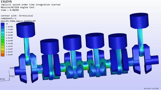
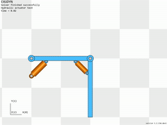
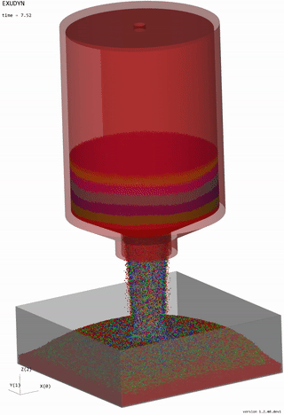
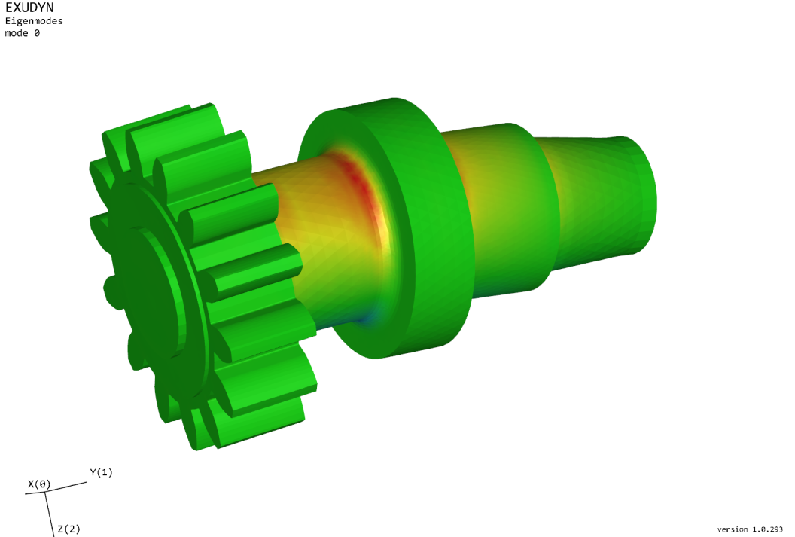
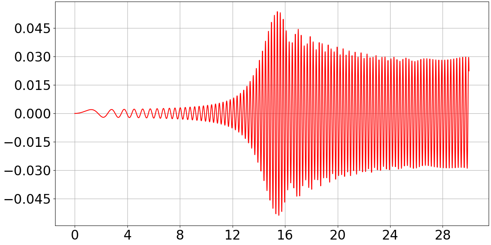
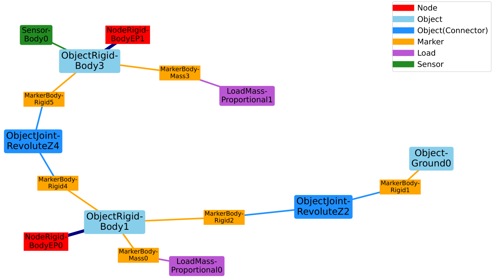

|RTD documentation| |PyPI version exudyn| |PyPI pyversions| |PyPI download month| |Github release date| 
|Github issues| |Github stars| |Github commits| |Github last commit| |CI build|

.. |PyPI version exudyn| image:: https://badge.fury.io/py/exudyn.svg
   :target: https://pypi.python.org/pypi/exudyn/

.. |PyPI pyversions| image:: https://img.shields.io/pypi/pyversions/exudyn.svg
   :target: https://pypi.python.org/pypi/exudyn/

.. |PyPI download month| image:: https://img.shields.io/pypi/dm/exudyn.svg
   :target: https://pypi.python.org/pypi/exudyn/

.. |RTD documentation| image:: https://readthedocs.org/projects/exudyn/badge/?version=latest
   :target: https://exudyn.readthedocs.io/en/latest/?badge=latest

.. |Github issues| image:: https://img.shields.io/github/issues-raw/jgerstmayr/exudyn
   :target: https://jgerstmayr.github.io/EXUDYN/

.. |Github stars| image:: https://img.shields.io/github/stars/jgerstmayr/exudyn?style=plastic
   :target: https://jgerstmayr.github.io/EXUDYN/

.. |Github release date| image:: https://img.shields.io/github/release-date/jgerstmayr/exudyn?label=release
   :target: https://jgerstmayr.github.io/EXUDYN/

.. |Github commits| image:: https://img.shields.io/github/commits-since/jgerstmayr/exudyn/v1.0.6
   :target: https://jgerstmayr.github.io/EXUDYN/

.. |Github last commit| image:: https://img.shields.io/github/last-commit/jgerstmayr/exudyn
   :target: https://jgerstmayr.github.io/EXUDYN/

.. |CI build| image:: https://github.com/jgerstmayr/EXUDYN/actions/workflows/wheels.yml/badge.svg

******
Exudyn
******

**A flexible multibody dynamics systems simulation code with Python and C++**

**Since version 1.11.0, Exudyn is heavily developed with Anthropic's Claude Code**: code,
workflows, documentation, tests and examples.

.. the line below is written by tools/issueTracker/issueTracker.py; everything else in this
.. file is hand-written (decision D11)

+  Exudyn version = 1.12.243.dev1 (Metheney)
+  **University of Innsbruck**, Department of Mechatronics, Innsbruck, Austria

**Update on Exudyn V1.12**: a revision of the whole project - star imports now export only what a module defines (add ``import numpy as np`` and friends to older scripts), ``python -m exudyn info`` reports an installation, exceptions say what kind of problem they are, the documentation is Markdown and there is a ``CHANGELOG.md``; the wheels and the documentation are built by GitHub CI. The full list is in the `revisions chapter <https://exudyn.readthedocs.io/en/latest/docs/manual/revisions.html>`_.

**Update on Exudyn V1.9.0**: newer examples use ``exudyn.graphics`` instead of ``GraphicsData`` functions. FEM now uses internally in mass and stiffness matrices the scipy sparse csr matrices.

+  **Exudyn** is *free, open source* and with plenty of *documentation*, *examples*, and *test models*
+  **pre-built** for Python 3.10 - 3.14 under **Windows** , **Linux** and **MacOS** available ( older versions available for Python >= 3.6); to build wheels yourself, see `docs/dev/BUILD.md <https://github.com/jgerstmayr/EXUDYN/blob/master/docs/dev/BUILD.md>`_
+  Exudyn can be linked to any other Python package, but we explicitly mention: `NGsolve <https://github.com/NGSolve/ngsolve>`_, `OpenAI <https://github.com/openai>`_, `OpenAI gym <https://github.com/openai/gym>`_, `Robotics Toolbox (Peter Corke) <https://github.com/petercorke/robotics-toolbox-python>`_, `Pybind11 <https://github.com/pybind/pybind11>`_

   
|pic1| |pic2| |pic3| |pic4| |pic5| |pic6|

How to cite:

+ Johannes Gerstmayr. Exudyn -- A C++ based Python package for flexible multibody systems. Multibody System Dynamics, Vol. 60, pp. 533-561, 2024. `https://doi.org/10.1007/s11044-023-09937-1 <https://doi.org/10.1007/s11044-023-09937-1>`_

The full documentation is the HTML documentation on `Read the Docs <https://exudyn.readthedocs.io/>`_ : the user manual, the reference manual of all items, the Python utility functions and the Python-C++ command interface.

For license, see LICENSE.txt in the root github folder on github!

If you like using Exudyn, please add a *star* on github and follow us on 
`Twitter @RExudyn <https://twitter.com/RExudyn>`_ !

In addition to the tutorials in the documentation, many ( **250+** ) examples can be downloaded on github under python/Examples and python/TestModels . They are also on ReadTheDocs.

Note that **ChatGPT** and other large language models know Exudyn quite well. They are able to build parts of your code or even full models, see `https://doi.org/10.1007/s11044-023-09962-0 <https://doi.org/10.1007/s11044-023-09962-0>`_

Tutorial videos can be found in the `YouTube channel of Exudyn <https://www.youtube.com/playlist?list=PLZduTa9mdcmOh5KVUqatD9GzVg_jtl6fx>`_ !

**NOTE**: **NumPy** switched to version 2.x which causes problems with packages that are not adapted to NumPy 2.x. 
The current version of Exudyn is already compatible with NumPy 2.x AND 1.x, however, some external packages (SciPy, robotics tools, etc.) may cause problems, therefore you could still use Numpy 1.26 (not available for Python >= 3.13).

**NOTE**: We finally like to emphasize that this is an open source library; we receive no specific money and most developements are done during free (=night) time; some models are simplifications that work for our needs, but may not be appropriate in your case; some models are under development (usually stated in the documentation) or may have bugs, therefore do not fully rely on all elements of the library!

Enjoy the Python library for multibody dynamics modeling, simulation, creating large scale systems, parameterized systems, component mode synthesis, optimization, ...

Changes can be tracked in the Issue tracker, see Github pages and Read the Docs.

\ **FOR FURTHER INFORMATION see** `Exudyn Github pages <https://jgerstmayr.github.io/EXUDYN>`_\  and `Read the Docs <https://exudyn.readthedocs.io/>`_ !!!

