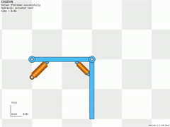
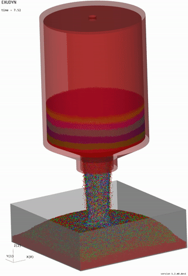
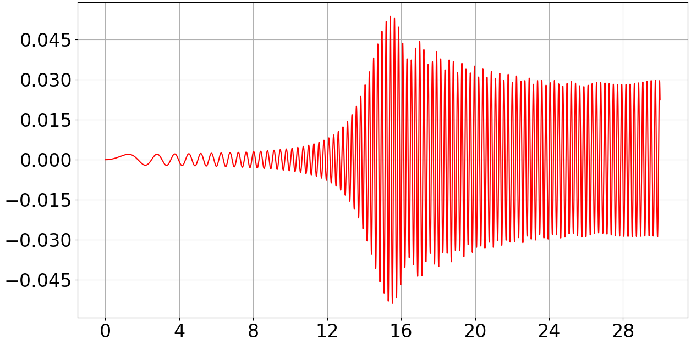
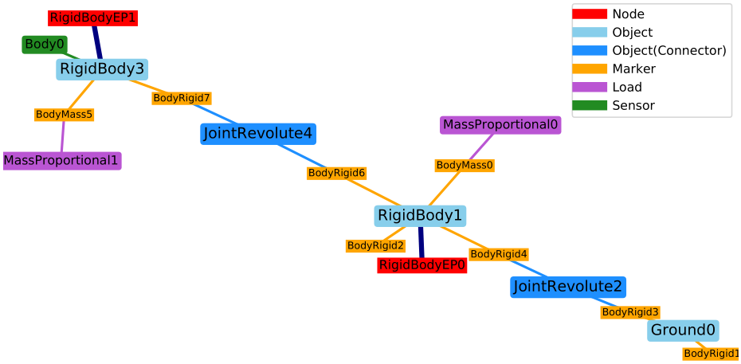

|RTD documentation| |PyPI version exudyn| |PyPI pyversions| |PyPI download month| |Github release date| 
|Github issues| |Github stars| |Github commits| |Github last commit| |CI build|

.. |PyPI version exudyn| image:: https://badge.fury.io/py/exudyn.svg
   :target: https://pypi.python.org/pypi/exudyn/

.. |PyPI pyversions| image:: https://img.shields.io/pypi/pyversions/exudyn.svg
   :target: https://pypi.python.org/pypi/exudyn/

.. |PyPI download month| image:: https://img.shields.io/pypi/dm/exudyn.svg
   :target: https://pypi.python.org/pypi/exudyn/

.. |RTD documentation| image:: https://readthedocs.org/projects/exudyn/badge/?version=latest
   :target: https://exudyn.readthedocs.io/en/latest/?badge=latest

.. |Github issues| image:: https://img.shields.io/github/issues-raw/jgerstmayr/exudyn
   :target: https://jgerstmayr.github.io/EXUDYN/

.. |Github stars| image:: https://img.shields.io/github/stars/jgerstmayr/exudyn?style=plastic
   :target: https://jgerstmayr.github.io/EXUDYN/

.. |Github release date| image:: https://img.shields.io/github/release-date/jgerstmayr/exudyn?label=release
   :target: https://jgerstmayr.github.io/EXUDYN/

.. |Github commits| image:: https://img.shields.io/github/commits-since/jgerstmayr/exudyn/v1.0.6
   :target: https://jgerstmayr.github.io/EXUDYN/

.. |Github last commit| image:: https://img.shields.io/github/last-commit/jgerstmayr/exudyn
   :target: https://jgerstmayr.github.io/EXUDYN/

.. |CI build| image:: https://github.com/jgerstmayr/EXUDYN/actions/workflows/wheels.yml/badge.svg

******
Exudyn
******

**A flexible multibody dynamics systems simulation code with Python and C++**

Exudyn version = 1.8.0 (Jones)

+  **University of Innsbruck**, Department of Mechatronics, Innsbruck, Austria

If you like using Exudyn, please add a *star* on github and follow us on 
`Twitter @RExudyn <https://twitter.com/RExudyn>`_ !

+  **NOTE**: for pure installation, use **pip install exudyn** (see further description below)
+  *free, open source* and with plenty of *documentation* and *examples*
+  **pre-built** for Python 3.8 - 3.12 under **Windows** , **Linux** and **MacOS** available ( **NEW** : now with manylinux2014 compatibility and PEP518 build); build wheels yourself, see `theDoc.pdf <https://github.com/jgerstmayr/EXUDYN/blob/master/docs/theDoc/theDoc.pdf>`_ )
+  Exudyn can be linked to any other Python package, but we explicitly mention: `NGsolve <https://github.com/NGSolve/ngsolve>`_, `OpenAI <https://github.com/openai>`_, `OpenAI gym <https://github.com/openai/gym>`_, `Robotics Toolbox (Peter Corke) <https://github.com/petercorke/robotics-toolbox-python>`_, `Pybind11 <https://github.com/pybind/pybind11>`_

.. |pic1| image:: ../demo/screenshots/pistonEngine.gif
   :width: 200

.. |pic4| image:: ../demo/screenshots/shaftGear.png
   :width: 160

   
|pic1| |pic2| |pic3| |pic4| |pic5| |pic6|

Johannes Gerstmayr. Exudyn -- A C++ based Python package for flexible multibody systems. Multibody System Dynamics, 2023. `https://doi.org/10.1007/s11044-023-09937-1 <https://doi.org/10.1007/s11044-023-09937-1>`_

Due to limitations for complex formulas, images and references in .rst files, some (small) details are only available in theDoc.pdf, see the `github page of Exudyn <https://github.com/jgerstmayr/EXUDYN/blob/master/docs/theDoc/theDoc.pdf>`_! There may also be some conversion errors in the auto-generated html pages.

For license, see LICENSE.txt in the root github folder on github!

In addition to the tutorial in the documentation, many ( **250+** ) examples can be downloaded on github under main/pythonDev/Examples and main/pythonDev/TestModels . They are also on ReadTheDocs.

Note that **ChatGPT** and other large language models know Exudyn quite well. They are able to build parts of your code or even full models, see `https://doi.org/10.1007/s11044-023-09962-0 <https://doi.org/10.1007/s11044-023-09962-0>`_

Tutorial videos ( **new Feb 2024** )can be found in the `youtube channel of Exudyn <https://www.youtube.com/playlist?list=PLZduTa9mdcmOh5KVUqatD9GzVg_jtl6fx>`_ !

Enjoy the Python library for multibody dynamics modeling, simulation, creating large scale systems, parameterized systems, component mode synthesis, optimization, ...

Changes can be tracked in the :ref:`Issue tracker <sec-issuetracker>` 

For searching on Read the Docs (especially with the search preview), add \* or ~1 / ~2 / ... to your search to search more general, e.g., FEMinter\* to search for FEMinterface, or objetfrf~3 to find ObjectFFRF. Your search preview usually finds less results than the search when pressing Enter. See also `Read the Docs documentation <https://docs.readthedocs.io/en/stable/server-side-search/syntax.html#special-queries>`_ 

\ **READ Exudyn documentation** : `theDoc.pdf <https://github.com/jgerstmayr/EXUDYN/blob/master/docs/theDoc/theDoc.pdf>`_ 

