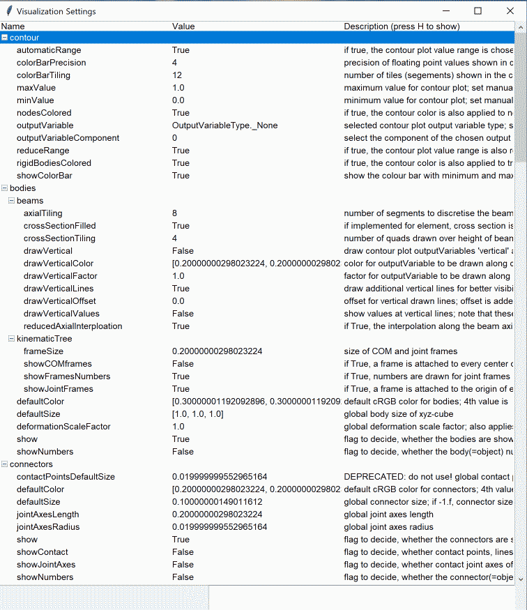

.. _sec-overview-basics:

Exudyn Basics
=============

This section will show:

+  Interaction with the Exudyn module
+  Simulation settings
+  Visualization settings
+  Generating output and results
+  Graphics pipeline
+  Generating animations

.. _sec-overview-basics-interactionmodule:

Interaction with the Exudyn module
----------------------------------

It is important that the Exudyn module is basically a state machine, where you create items on the C++ side using the Python interface. This helps you to easily set up models using many other Python modules (numpy, sympy, matplotlib, ...) while the computation will be performed in the end on the C++ side in a very efficient manner. 

\ **Where do objects live?**\ 

Whenever a system container is created with \ ``SC = exu.SystemContainer()``\ , the structure \ ``SC``\  becomes a variable in the Python interpreter, but it is managed inside the C++ code and it can be modified via the Python interface.
Usually, the system container will hold at least one system, usually called \ ``mbs``\ .
Commands such as \ ``mbs.AddNode(...)``\  add objects to the system \ ``mbs``\ . 
The system will be prepared for simulation by \ ``mbs.Assemble()``\  and can be solved (e.g., using \ ``exu.SolveDynamic(...)``\ ) and evaluated hereafter using the results files.
Using \ ``mbs.Reset()``\  will clear the system and allows to set up a new system. Items can be modified (\ ``ModifyObject(...)``\ ) after first initialization, even during simulation.

.. _sec-overview-basics-simulationsettings:

Simulation settings
-------------------

The simulation settings consists of a couple of substructures, e.g., for \ ``solutionSettings``\ , \ ``staticSolver``\ , \ ``timeIntegration``\  as well as a couple of general options -- for details see Section :ref:`sec-solutionsettings`\  and Section :ref:`sec-simulationsettingsmain`\ .

Simulation settings are needed for every solver. They contain solver-specific parameters (e.g., the way how load steps are applied), information on how solution files are written, and very specific control parameters, e.g., for the Newton solver. 

The simulation settings structure is created with 

.. code-block:: python

  simulationSettings = exu.SimulationSettings()

Hereafter, values of the structure can be modified, e.g.,

.. code-block:: python

  tEnd = 10 #10 seconds of simulation time:
  h = 0.01  #step size (gives 1000 steps)
  simulationSettings.timeIntegration.endTime = tEnd
  #steps for time integration must be integer:
  simulationSettings.timeIntegration.numberOfSteps = int(tEnd/h)
  #assigns a new tolerance for Newton's method:
  simulationSettings.timeIntegration.newton.relativeTolerance = 1e-9 
  #write some output while the solver is active (SLOWER):
  simulationSettings.timeIntegration.verboseMode = 2                 
  #write solution every 0.1 seconds:
  simulationSettings.solutionSettings.solutionWritePeriod = 0.1      
  #use sparse matrix storage and solver (package Eigen):
  simulationSettings.linearSolverType = exu.LinearSolverType.EigenSparse 

Generating output and results
-----------------------------

The solvers provide a number of options in \ ``solutionSettings``\  to generate a solution file. As a default, exporting the solution of all system coordinates (on position, velocity, ... level) to the solution file is activated with a writing period of 0.01 seconds.

Typical output settings are:

.. code-block:: python

  #create a new simulationSettings structure:
  simulationSettings = exu.SimulationSettings()
  
  #activate writing to solution file:
  simulationSettings.solutionSettings.writeSolutionToFile = True
  #write results every 1ms:
  simulationSettings.solutionSettings.solutionWritePeriod = 0.001
  
  #assign new filename to solution file
  simulationSettings.solutionSettings.coordinatesSolutionFileName= "myOutput.txt"

  #do not export certain coordinates:
  simulationSettings.solutionSettings.exportDataCoordinates = False

Furthermore, you can use sensors to record particular information, e.g., the displacement of a body's local
position, forces or joint data. For viewing sensor results, use the \ ``PlotSensor``\  function of the 
\ ``exudyn.plot``\  tool, see the rigid body and joints tutorial.
Finally, the render window allows to show traces (trajectories) of position sensors, sensor vector quantities (e.g., velocity vectors),
or triads given by rotation matrices. For further information, see the \ ``sensors.traces``\  structure of \ ``VisualizationSettings``\ , Section :ref:`sec-vsettingssensortraces`\ .

.. _sec-overview-basics-renderer:

Renderer and 3D graphics
------------------------

A 3D renderer is attached to the simulation. Visualization is started with  \ ``exu.StartRenderer()``\ , see the examples and tutorials.
In order to show your model in the render window, you have to provide 3D graphics data to the bodies. Flexible bodies (e.g., FFRF-like) can visualize their meshes. Further items (nodes, markers, ...) can be visualized with default settings, however, often you have to turn on drawing or enlarge default sizes to make items visible. Item number can also be shown.
Finally, since version 1.6.188, sensor traces (trajectories) can be shown in the render window, see the \ ``VisualizationSettings``\  in  Section :ref:`sec-visualizationsettingsmain`\ .

The renderer uses an OpenGL window of a library called GLFW, which is platform-independent. 
The renderer is set up in a minimalistic way, just to ensure that you can check that the modeling is correct. 

\ **Note**\ :

+  For closing the render window, press key 'Q' or Escape or just close the window.
+  There is no way to contruct models inside the renderer (no 'GUI').
+  Try to avoid huge number of triangles in STL files or by creating large number of complex objects, such as spheres or cylinders.
+  After \ ``visualizationSettings.window.reallyQuitTimeLimit``\  seconds a 'do you really want to quit' dialog opens for safety on pressing 'Q'; if no tkinter is available, you just have to press 'Q' twice. For closing the window, you need to click a second time on the close button of the window after \ ``reallyQuitTimeLimit``\  seconds (usually 900 seconds).

 
There are some main features in the renderer, using keyboard and mouse, for details see Section :ref:`sec-graphicsvisualization`\ :

+  press key H to show help in renderer
+  move model by pressing left mouse button and drag
+  rotate model by pressing right mouse button and drag
+  for further mouse functionality, see Section :ref:`sec-gui-sec-mouseinput`\ 
+  change visibility (wire frame, solid, transparent, ...) by pressing T
+  zoom all: key A
+  open visualization dialog: key V, see Section :ref:`sec-overview-basics-visualizationsettings`\ 
+  open Python command dialog: key X, see Section :ref:`sec-overview-basics-commandandhelp`\ 
+  show item number: click on graphics element with left mouse button
+  show item dictionary: click on graphics element with right mouse button  
+  for further keys, see Section :ref:`sec-gui-sec-keyboardinput`\  or press H in renderer

Depending on your model (size, place, ...), you may need to adjust the following visualization and \ ``openGL``\  parameters in \ ``visualizationSettings``\ , see Section :ref:`sec-visualizationsettingsmain`\ :

+  change window size
+  light and light position 
+  shadow (turned off by using 0; turned on by using, e.g., a value of 0.3) and shadow polygon offset; shadow slows down graphics performance by a factor of 2-3, depending on your graphics card
+  visibility of nodes, markers, etc. in according bodies, nodes, markers, ..., \ ``visualizationSettings``\ 
+  move camera with a selected marker: adjust \ ``trackMarker``\  in \ ``visualizationSettings.interactive``\ 

\ **NOTE**\ : changing \ ``visualizationSettings``\  is not thread-safe, as it allows direct access to the C++ variables. 
In most cases, this is not problematic, e.g., turning on/off some view parameters my just lead to some short-time artifacts if
they are changed during redraw. However, more advanced quantities (e.g., \ ``trackMarker``\  or changing strings) may lead to problems, 
which is why it is strongly recommended to:

+  set all \ ``visualizationSettings``\  \ **before start of renderer**\ 

.. _sec-overview-basics-visualizationsettings:

Visualization settings dialog
-----------------------------

Visualization settings are used for user interaction with the model. E.g., the nodes, markers, loads, etc., can be visualized for every model. There are default values, e.g., for the size of nodes, which may be inappropriate for your model. Therefore, you can adjust those parameters. In some cases, huge models require simpler graphics representation, in order not to slow down performance -- e.g., the number of faces to represent a cylinder should be small if there are 10000s of cylinders drawn. Even computation performance can be slowed down, if visualization takes lots of CPU power. However, visualization is performed in a separate thread, which usually does not influence the computation exhaustively.

Details on visualization settings and its substructures are provided in Section :ref:`sec-visualizationsettingsmain`\ . These settings may also be edited by pressing 'V' in the active render window (does not work, if there is no active render loop using, e.g., \ ``SC.WaitForRenderEngineStopFlag()``\  or 
\ ``mbs.WaitForUserToContinue()``\  ).
The visualization settings dialog is shown exemplarily in \ :numref:`fig-visualizationsettings`\ .
Note that this dialog is automatically created and uses Python's \ ``tkinter``\ , which is lightweight, but not very well suited if display scalings are large (e.g., on high resolution laptop screens). If working with Spyder, it is recommended to restart Spyder, if display scaling is changed, in order to adjust scaling not only for Spyder but also for Exudyn.

The appearance of visualization settings dialogs may be adjusted by directly modifying \ ``exudyn.GUI``\  variables (this may change in the future). For example write in your code before opening the render window\ (treeEdit and treeview both mean the settings dialog currently used for visualization settings and partially for right-mouse-click):

.. code-block:: python

  import exudyn.GUI
  exudyn.GUI.dialogDefaultWidth             #unscaled width of, e.g., right-mouse-button dialog
  exudyn.GUI.treeEditDefaultWidth = 800
  exudyn.GUI.treeEditDefaultHeight = 600
  exudyn.GUI.treeEditMaxInitialHeight = 600 #otherwise height is increased for larger screens
  exudyn.GUI.treeEditOpenItems = ['general','contact'] #these tree items are opened each time the dialog is opened
  #
  exudyn.GUI.treeviewDefaultFontSize        #this is the base font size of the dialog (also right-mouse-button dialog)
  exudyn.GUI.useRenderWindowDisplayScaling  #if True, the scaling will follow the current scaling of the render window; if False, it will use the \ ``tkinter``\  internal scaling, which uses the main screen where the dialog is created (which won't scale well, if the window is moved to another screen).
  #
  exudyn.GUI.textHeightFactor = 1.45        #this factor is used to increase height of lines in tree view as compared to font size

.. _fig-visualizationsettings:

   View of visualization settings

Note: Press 'V' in render window to open dialog.

The visualization settings structure can be accessed in the system container \ ``SC``\  (access per reference, no copying!), accessing every value or structure directly, e.g.,

.. code-block:: python

  SC.visualizationSettings.nodes.defaultSize = 0.001      #draw nodes very small

  #change openGL parameters; current values can be obtained from SC.GetRenderState()
  #change zoom factor:
  SC.visualizationSettings.openGL.initialZoom = 0.2       
  #set the center point of the scene (can be attached to moving object):
  SC.visualizationSettings.openGL.initialCenterPoint = [0.192, -0.0039,-0.075]

  #turn of auto-fit:
  SC.visualizationSettings.general.autoFitScene = False

  #change smoothness of a cylinder:
  SC.visualizationSettings.general.cylinderTiling = 100
  
  #make round objects flat:
  SC.visualizationSettings.openGL.shadeModelSmooth = False

  #turn on coloured plot, using y-component of displacements:
  SC.visualizationSettings.contour.outputVariable = exu.OutputVariableType.Displacement
  SC.visualizationSettings.contour.outputVariableComponent = 1 #0=x, 1=y, 2=z

.. _sec-overview-basics-commandandhelp:

Execute Command and Help
------------------------

In addition to the Visualization settings dialog, a simple help window opens upon pressing key 'H'. 
It is also possible to execute single Python commands during simulation by pressing 'X', which opens a dialog, saying 'Exudyn Command Window'. 
Note that the dialog may appear behind the visualization window!
This dialog may be very helpful in long running computations or in case that you may evaluate variables for debugging.
The Python commands are evaluated in the global python scope, meaning that \ ``mbs``\  or other variables of your scripts are available.
User errors are caught by exceptions, but in severe cases this may lead to crash.
To print values, always use \ ``print(...)``\  to see the string representation of an object.

Useful examples (single lines) may be: 

.. code-block:: python

  x=5 #or change any other variable used in Python user functions
  print(mbs) #print current mbs overview
  print(mbs.GetSensorValues(0))
  #adjust simulation end time, in long-run simulations:
  mbs.sys['dynamicSolver'].it.endTime = 1 
  #adjust output behavior
  mbs.sys['dynamicSolver'].output.verboseMode = 0

You can also do quite fancy things during simulation, e.g., to deactivate joints (of course this may result in strange behavior):

.. code-block:: python

  n=mbs.systemData.NumberOfObjects()
  for i in range(n):
      d = mbs.GetObject(i)
      #if 'Joint' in d['objectType']:
      if 'activeConnector' in d:
          mbs.SetObjectParameter(i, 'activeConnector', False)

Note that you could also change \ ``visualizationSettings``\  in this way, but the Visualization settings dialog is much more convenient.
Changing \ ``simulationSettings``\  within the execute command is dangerous and must be treated with care.
Some parameters, such as \ ``simulationSettings.timeIntegration.endTime``\  are copied into the internal solver's \ ``mbs.sys['dynamicSolver'].it``\  structure.

Thus, changing \ ``simulationSettings.timeIntegration.endTime``\  has no effect during simulation. 
As a rule of thumb, all variables that are not stored inside the solvers structures may be adjusted by the \ ``simulationSettings``\  passed to the solver (which are then not copied internally); see the C++ code for details. However, behavior may change in future and unexpected behavior or and changing \ ``simulationSettings``\  will likely cause crashes if you do not know exactly the behavior, e.g., changing output format from text to binary ... !
Specifically, \ ``newton``\  and \ ``discontinuous``\  settings cannot be changed on the fly as they are copied internally.

.. _sec-overview-basics-graphicspipeline:

Graphics pipeline
-----------------

There are basically two loops during simulation, which feed the graphics pipeline.
The solver runs a loop:

+  compute step (or set up initial values)
+  finish computation step; results are in current state
+  copy current state to visualization state (thread safe)
+  signal graphics pipeline that new visualization data is available
+  the renderer may update the visualization depending on \ ``graphicsUpdateInterval``\  in \ \ ``visualizationSettings.general``\ 

The openGL graphics thread (=separate thread) runs the following loop:

+  render openGL scene with a given graphicsData structure (containing lines, faces, text, ...)
+  go idle for some milliseconds
+  check if openGL rendering needs an update (e.g. due to user interaction)
   \ :math:`\ra`\  if update is needed, the visualization of all items is updated -- stored in a graphicsData structure)
+  check if new visualization data is available and the time since last update is larger than a presribed value, the graphicsData structure is updated with the new visualization state

.. _sec-overview-basics-storingmodelview:

Storing the model view
----------------------

There is a simple way to store the current view (zoom, centerpoint, orientation, etc.) by using \ ``SC.GetRenderState()``\  and \ ``SC.SetRenderState()``\ ,
see also Section :ref:`sec-renderstate`\ .
A simple way is to reload the stored render state (model view) after simulating your model once at the end of the simulation\ (
note that \ ``visualizationSettings.general.autoFitScene``\  should be set False if you want to use the stored zoom factor):

.. code-block:: python

  import exudyn as exu
  SC=exu.SystemContainer()
  SC.visualizationSettings.general.autoFitScene = False #prevent from autozoom
  exu.StartRenderer()
  if 'renderState' in exu.sys:
      SC.SetRenderState(exu.sys['renderState']) 
  #+++++++++++++++
  #do simulation here and adjust model view settings with mouse
  #+++++++++++++++

  #store model view for next run:
  StopRenderer() #stores render state in exu.sys['renderState']

 

Alternatively, you can obtain the current model view from the console after a simulation, e.g.,

.. code-block:: python

  In[1] : SC.GetRenderState()
  Out[1]: 
  {'centerPoint': [1.0, 0.0, 0.0],
   'maxSceneSize': 2.0,
   'zoom': 1.0,
   'currentWindowSize': [1024, 768],
   'modelRotation': [[ 0.34202015,  0.        , 0.9396926 ],
                     [-0.60402274,  0.76604444, 0.21984631],
                     [-0.7198463 , -0.6427876 , 0.26200265]])}

which contains the last state of the renderer.
Now copy the output and set this with \ ``SC.SetRenderState``\  in your Python code to have a fixed model view in every simulation (\ ``SC.SetRenderState``\  AFTER \ ``exu.StartRenderer()``\ ):

.. code-block:: python

  SC.visualizationSettings.general.autoFitScene = False #prevent from autozoom
  exu.StartRenderer()
  renderState={'centerPoint': [1.0, 0.0, 0.0],
               'maxSceneSize': 2.0,
               'zoom': 1.0,
               'currentWindowSize': [1024, 768],
               'modelRotation':     [[ 0.34202015,  0.        ,  0.9396926 ],
                                    [-0.60402274,  0.76604444,  0.21984631],
                                    [-0.7198463 , -0.6427876 ,  0.26200265]])
  SC.SetRenderState(renderState)
  #.... further code for simulation here

Note that in the current version of Exudyn there is more data stored in render state, which is not used in \ ``SC.SetRenderState``\ ,
see also Section :ref:`sec-renderstate`\ .

Graphics user functions via Python
----------------------------------

There are some user functions in order to customize drawing:

+  You can assign graphicsData to the visualization to most bodies, such as rigid bodies in order to change the shape. Graphics can also be imported from files (\ ``GraphicsDataFromSTLfileTxt``\ ) using the established format \ :ref:`STL <STL>`\ \ (STereoLithography or Standard Triangle Language; file format available in nearly all CAD systems).
+  Some objects, e.g., \ ``ObjectGenericODE2``\  or \ ``ObjectRigidBody``\ , provide customized a function \ ``graphicsDataUserFunction``\ . This user function just returns a list of GraphicsData, see Section :ref:`sec-graphicsdata`\ . With this function you can change the shape of the body in every step of the computation.
+  Specifically, the \ ``graphicsDataUserFunction``\  in \ ``ObjectGround``\  can be used to draw any moving background in the scene.

Note that all kinds of \ ``graphicsDataUserFunction``\ s need to be called from the main (=computation) process as Python functions may not be called from separate threads (GIL). Therefore, the computation thread is interrupted to execute the \ ``graphicsDataUserFunction``\  between two time steps, such that the graphics Python user function can be executed. There is a timeout variable for this interruption of the computation with a warning if scenes get too complicated.

.. _sec-overview-basics-colorrgba:

Color, RGBA and alpha-transparency
----------------------------------

Many functions and objects include color information. In order to allow alpha-transparency, all colors contain a list of 4 RGBA values, all values being in the range [0..1]:

+  red (R) channel 
+  green (G) channel  
+  blue (B) channel 
+  alpha (A) value, representing the so-called \ **alpha-transparency**\  (A=0: fully transparent, A=1: solid)

E.g., red color with no transparency is obtained by the color=[1,0,0,1]. Color predefinitions are found in \ ``exudynGraphicsDataUtilities.py``\ , e.g., \ ``color4red``\  or \ ``color4steelblue``\  as well a list of 16 colors \ ``color4list``\ , which is convenient to be used in a loop creating objects.

.. _sec-overview-basics-solutionviewer:

Solution viewer
---------------

Exudyn offers a convenient WYSIWYS -- 'What you See is What you Simulate' interface, showing you the computation results during simulation in the render window.
If you are running large models, it may be more convenient to watch results after simulation has been finished.
For this, you can use

+  \ ``interactive.SolutionViewer``\ , see  :ref:`Section <sec-mainsystemextensions-solutionviewer>`\  
+  \ ``interactive.AnimateModes``\ , lets you view the animation of computed modes, see  :ref:`Section <sec-interactive-animatemodes>`\ 

shown exemplary in \ :numref:`fig-solutionviewer`\ .

.. _fig-solutionviewer:
.. figure:: ../theDoc/figures/solutionViewer.png
   :width: 800

   View of \ ``SolutionViewer``\  (as of Exudyn 1.5.42.dev1)

The \ ``SolutionViewer``\  adds a \ ``tkinter``\  interactive dialog, which lets you interact with the model, with the following features:

+  The SolutionViewer represents a 'Player' for the dynamic solution or a series of static solutions, which is available after simulation if \ ``solutionSettings.writeSolutionToFile = True``\ 
+  The parameter \ ``solutionSettings.solutionWritePeriod``\  represents the time period used to store solutions during dynamic computations.
+  As soon as 'Run' is pressed, the player runs (and it may be started automatically as well)
+  In the 'Static' mode, drag the slider 'Solution steps' to view the solution steps
+  In the 'Continuous run' mode, the player runs in an infinite loop
+  In the 'One cycle' mode, the player runs from the current position to the end; this is perfectly suited to record series of images for \ **creating animations**\ , see Section :ref:`sec-overview-basics-animations`\  and works together with the visualization settings dialog.

The solution should be loaded with
\ ``LoadSolutionFile('coordinatesSolution.txt')``\ , where 'coordinatesSolution.txt' represents the stored solution file, 
see 

+  \ ``exu.SimulationSettings().solutionSettings.coordinatesSolutionFileName``\ 

You can call the \ ``SolutionViewer``\  either in the model, or at the command line / IPython to load a previous solution (belonging to the same mbs underlying the solution!):

.. code-block:: python

  from exudyn.interactive import SolutionViewer
  sol = LoadSolutionFile('coordinatesSolution.txt')
  SolutionViewer(mbs, sol)

\ **Alternatively**\ , if no solution is provided, \ ``SolutionViewer``\  tries to reload the solution of the previous simulation 
that is referred to from \ ``mbs.sys\['simulationSettings'\]``\ :

.. code-block:: python

  from exudyn.interactive import SolutionViewer
  SolutionViewer(mbs)

An example for the \ ``SolutionViewer``\  is integrated into the \ ``Examples/``\  directory, see \ ``solutionViewerTest.py``\ . 

\ **Note**\ : The previous function \ ``AnimateSolution``\  in \ ``exudyn.utilities``\  allows to directly visualize the stored solution for according stored time frames without \ ``tkinter``\  (useful for MacOS).

.. _sec-overview-basics-animations:

Generating animations
---------------------

In many dynamics simulations, it is very helpful to create animations in order to better understand the motion of bodies. Specifically, the animation can be used to visualize the model much slower or faster than the model is computed.

Animations are created based on a series of images (frames, snapshots) taken during simulation. It is important, that the current view is used to record these images -- this means that the view should not be changed during the recording of images.
To turn on recording of images during solving, set the following flag to a positive value

+  \ ``simulationSettings.solutionSettings.recordImagesInterval = 0.01``\ 

which means, that after every 0.01 seconds of simulation time, an image of the current view is taken and stored in the directory and filename (without filename ending) specified by 

+  \ ``SC.visualizationSettings.exportImages.saveImageFileName = "myFolder/frame"``\ 

By default, a consecutive numbering is generated for the image, e.g., 'frame0000.png, frame0001.png,...'. Note that the standard file format PNG with ending '.png' uses compression libraries included in glfw, while the alternative TGA format produces '.tga' files which contain raw image data and therefore can become very large.

To create animation files, an external tool FFMPEG is used to efficiently convert a series of images into an animation.
\ :math:`\ra`\  see theDoc.pdf !

.. _sec-overview-basics-examplestestsuite:

Examples, test models and test suite
------------------------------------

The main collection of examples and models is available under

+  \ ``main/pythonDev/Examples``\ 
+  \ ``main/pythonDev/TestModels``\ 

You can use these examples to build up your own realistic models of multibody systems.
Very often, these models show the way which already works. Alternative ways may exist, but
sometimes there are limitations in the underlying C++ code, such that they won't work as you expect.

We would like to note that, even that some examples and test models contain comparison to 
papers of the literature or analytical solutions, there are many models which may not contain real
mechanical values and these models may not be converged in space or time 
(in order to keep running our test suite in less than a minute).

Finally, note that the \ ``main/pythonDev/TestModels``\  are often only intended to preserve functionality
in the Python and C++ code (e.g., if global methods are changed), but they should not be misinterpreted as validation of the 
implemented methods. The \ ``TestModels``\  are used in the Exudyn \ **TestSuite**\  \ ``TestModels/runTestSuite.py``\ 
which is run after a full build of Python versions. Output for very version is written
to \ ``main/pythonDev/TestSuiteLogs``\  containing the Exudyn version and Python version. At the end of these
files, a summary is included to show if all models completed successfully (which means that a certain error level is achieved, which is rather small and different for the models).
There are also performance tests (e.g., if a certain implementation leads to a significant drop of performance).
However, the output of the performance tests is not stored on github.

We are trying hard to achieve error-free algorithms of physically correct models, but there may always be some errors in the code.

.. _sec-overview-basics-convergenceproblems:

Removing convergence problems and solver failures
-------------------------------------------------

Nonlinear formulations (such as most multibody systems, especially nonlinear finite elements) cause problems and there is no general nonlinear solver which may reliably and accurately solve such problems.
Tuning solver parameters is at hand of the user. 
In general, the Newton solver tries to reduce the error by the factor given in 

+  \ ``simulationSettings.staticSolver.newton.relativeTolerance``\  (for static solver), 

which is not possible for very small (or zero) initial residuals. The absolute tolerance is helping out as a lower bound for the error, given in

+  \ ``simulationSettings.staticSolver.newton.absoluteTolerance``\  (for static solver),

which is by default rather low (1e-10) -- in order to achieve accurate results for small systems or small motion (in mm or \ :math:`\mu`\ m regime). Increasing this value helps to solve such problems. Nevertheless, you should usually set tolerances as low as possible because otherwise, your solution may become inaccurate.

The following hints / rules for described problems shall be followed.

+  \ **static solver**\ : \ **load steps get very small**\  even if the solution seems to be smooth (or linear) and less steps are expected:
  
    |  →  this may happen for \ **system without loads**\ ; larger number of steps may happen for finer discretization; 
    |  →  you may adjust (increase) \ ``.newton.relativeTolerance``\  / \ ``.newton.absoluteTolerance``\  in static solver or in time integration to resolve such problems, but check if solution achieves according accuracy
  
+  \ **static solver**\ :  load steps are reduced significantly for \ **highly nonlinear problems**\ : 
  
    |  →  solver repeatedly writes that steps are reduced \ :math:`\ra`\  try to use \ ``loadStepGeometric``\  and use a large \ ``loadStepGeometricRange``\ : this allows to start with very small loads in which the system is nearly linear (e.g. for thin strings or belts under gravity).
  
+  \ **static solver**\ : system is (nearly) \ **kinematic**\ :
  
    |  →  a static solution can be achieved using \ ``stabilizerODE2term``\ , which adds mass-proportional stiffness terms during load steps \ :math:`< 1`\ ; see also hints for singular Jacobians below
  
+  very small loads or even \ **zero loads**\  do not converge: \ ``SolveDynamic``\  or \ ``SolveStatic``\  \ **terminated due to errors**\ 
  
    |  →  the reason is the nonlinearity of formulations (nonlinear kinematics, nonlinear beam, etc.) and round off errors, which restrict Newton to achieve desired tolerances
    |  →  adjust (increase) \ ``.newton.relativeTolerance``\  / \ ``.newton.absoluteTolerance``\  in static solver or in time integration
    |  →  in many cases, especially for static problems, the \ ``.newton.newtonResidualMode = 1``\  evaluates the increments; the nonlinear problems is assumed to be converged, if increments are within given absolute/relative tolerances; this also works usually better for kinematic solutions
  
+  for \ **discontinuous problems**\ : 
  
    |  →  try to adjust solver parameters; especially the \ ``discontinuous.iterationTolerance``\  and \ ``discontinuous.maxIterations``\ ; try to make smaller load or time steps in order to resolve switching points of contact or friction; generalized alpha solvers may cause troubles when reducing step sizes \ :math:`\ra`\  use TrapezoidalIndex2 solver
    |  →  in case of \ **user functions**\ , make sure that there is no switching inside the user function (if or \ ``sign``\  function); switching must be done in the PostNewtonStep, otherwise convergence severely suffers
  
+  \ **singular Jacobians**\  or \ **redundant constraints**\ :
  
    |  →  in case of systems that lead to a singular Jacobian due to redundant constraints or kinematic DOF in static solutions, you may switch to Eigen's FullPivotLU solver using:
    |  →  \ ``simulationSettings.linearSolverType = exu.LinearSolverType.EigenDense``\  and 
    |  →  \ ``simulationSettings.linearSolverSettings.ignoreSingularJacobian=True``\  ;
    |  →  however, check your results as they may be erroneous, because the solver tries to find an optimal solution / compromise which may not be what you intend to get!
  
+  if you see further problems, please post them (including relevant example) at the Exudyn github page!

.. _sec-overview-basics-speedup:

Performance and ways to speed up computations
---------------------------------------------

Multibody dynamics simulation should be accurate and reliable on the one hand side. Most solver settings are such that they lead to comparatively reliable results.
However, in some cases there is a significant possibility for speeding up computations, which are described in the following list. Not all recommendations may apply to your models.

The following examples refer to \ ``simulationSettings = exu.SimulationSettings()``\ .
In general, to see where CPU time is lost, use the option turn on \ ``simulationSettings.displayComputationTime = True``\  to see which parts of the solver need most of the time (deactivated in exudynFast versions!).

To activate the Exudyn C++ versions without range checks, which may be approx. 30 percent faster in some situations, use the following code snippet before first import of \ ``exudyn``\ :

.. code-block:: python

  import sys
  sys.exudynFast = True #this variable is used to signal to load the fast exudyn module
  import exudyn as exu

The faster versions are available for all release versions, but only for some \ ``.dev1``\  development versions (Python 3.10), which can be determined by trying \ ``import exudyn.exudynCPPfast``\ .

However, there are many \ **ways to speed up Exudyn in general**\ :

+  for models with more than 50 coordinates, switching to sparse solvers might greatly improve speed: \ ``simulationSettings.linearSolverType = exu.LinearSolverType.EigenSparse``\ 
+  when preferring dense direct solvers, switching to Eigen's PartialPivLU solver might greatly improve speed: \ ``simulationSettings.linearSolverType = exu.LinearSolverType.EigenDense``\ ; however, the flag \ ``simulationSettings.linearSolverSettings.ignoreSingularJacobian=True``\  will switch to the much slower (but more robust) Eigen's FullPivLU
+  try to avoid Python functions or try to speed up Python functions; if this is not possible, see solutions below
+  instead of user functions in objects or loads (computed in every iteration), some problems would also work if these parameters are only updated in \ ``mbs.SetPreStepUserFunction(...)``\ 
+  Python user functions can be speed up (since Exudyn V1.7.40) by converting conventional Python functions into Exudyn (internal) symbolic user functions, which have similar performance as C++ functions with the ability to parallelize; see Section :ref:`sec-cinterface-symbolic`\ 
+  Alternatively, Python user functions can be speed up using the Python numba package, using \ ``@jit``\  in front of functions (for more options, see `https://numba.pydata.org/numba-doc/dev/user/index.html <https://numba.pydata.org/numba-doc/dev/user/index.html>`_); Example given in \ ``Examples/springDamperUserFunctionNumbaJIT.py``\  showing speedups of factor 4; more complicated Python functions may see speedups of 10 - 50
+  for \ **discontinuous problems**\ , try to adjust solver parameters; especially the discontinuous.iterationTolerance which may be too tight and cause many iterations; iterations may be limited by discontinuous.maxIterations, which at larger values solely multiplies the computation time with a factor if all iterations are performed
+  For multiple computations / multiple runs of Exudyn (parameter variation, optimization, compute sensitivities), you can use the processing sub module of Exudyn to parallelize computations and achieve speedups proporional to the number of cores/threads of your computer; specifically using the \ ``multiThreading``\  option or even using a cluster (using \ ``dispy``\ , see \ ``ParameterVariation(...)``\  function)
+  In case of multiprocessing and cluster computing, you may see a very high CPU usage of "Antimalware Service Executable", which is the Microsoft Defender Antivirus; you can turn off such problems by excluding \ ``python.exe``\  from the defender (on your own risk!) in your settings:

  Settings \ :math:`\ra`\  Update \& Security \ :math:`\ra`\  Windows Security \ :math:`\ra`\  Virus \& threat protection settings \ :math:`\ra`\  Manage settings \ :math:`\ra`\  Exclusions \ :math:`\ra`\  Add or remove exclusions 

\ **Possible speed ups for dynamic simulations**\ :

+  for implicit integration, turn on \ **modified Newton**\ , which updates jacobians only if needed: \ ``simulationSettings.timeIntegration.newton.useModifiedNewton = True``\ 
+  use \ **multi-threading**\ : \ ``simulationSettings.parallel.numberOfThreads = ...``\ , depending on the number of cores (larger values usually do not help); improves greatly for contact problems, but also for some objects computed in parallel; will improve significantly in future
+  decrease number of steps (\ ``simulationSettings.timeIntegration.numberOfSteps = int(tEnd/h)``\ ) by increasing the step size \ :math:`h`\  if not needed for accuracy reasons; not that in general, the solver will reduce steps in case of divergence, but not for accuracy reasons, which may still lead to divergence if step sizes are too large
+  switch off measuring computation time, if not needed: \ ``simulationSettings.displayComputationTime = False``\ 
+  try to switch to \ **explicit solvers**\ , if problem has no constraints and if problem is not stiff
+  try to have \ **constant mass matrices**\  (see according objects, which have constant mass matrices; e.g. rigid bodies using RotationVector Lie group node have constant mass matrix)
+  for explicit integration, set \ ``computeEndOfStepAccelerations = False``\ , if you do not need accurate evaluation of accelerations at end of time step (will then be taken from beginning)
+  for explicit integration, set \ ``explicitIntegration.computeMassMatrixInversePerBody=True``\ , which avoids factorization and back substitution, which may speed up computations with many bodies / particles
+  if you are sure that your mass matrix is constant, set:
   \ ``simulationSettings.timeIntegration.reuseConstantMassMatrix = True``\ ; check results!
+  check that \ ``simulationSettings.timeIntegration.simulateInRealtime = False``\ ; if set True, it breaks down simulation to real time
+  do not record images, if not needed: \ ``simulationSettings.solutionSettings.recordImagesInterval = -1``\ 
+  in case of bad convergence, decreasing the step size might also help; check also other flags for adaptive step size and for Newton
+  use \ ``simulationSettings.timeIntegration.verboseMode = 1``\ ; larger values create lots of output which drastically slows down
+  use \ ``simulationSettings.timeIntegration.verboseModeFile = 0``\ , otherwise output written to file
+  adjust \ ``simulationSettings.solutionSettings.sensorsWritePeriod``\  to avoid time spent on writing sensor files
+  use \ ``simulationSettings.timeIntegration.writeSolutionToFile = False``\ , otherwise much output may be written to file; 
+  if solution file is needed, adjust \ ``simulationSettings.solutionSettings.solutionWritePeriod``\  to larger values and also adjust \ ``simulationSettings.solutionSettings.outputPrecision``\ , e.g., to 6, in order to avoid larger files; also adjust \ ``simulationSettings.solutionSettings.exportVelocities = False``\  and \ ``simulationSettings.solutionSettings.exportAccelerations = False``\  to avoid large output files

