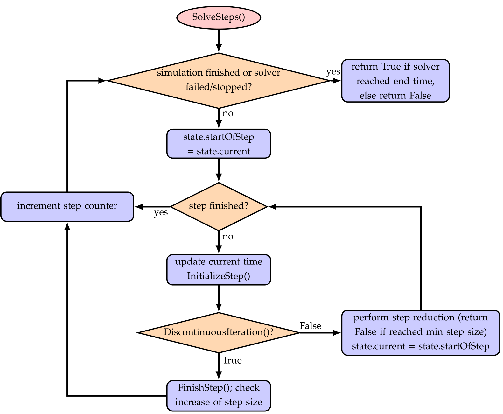
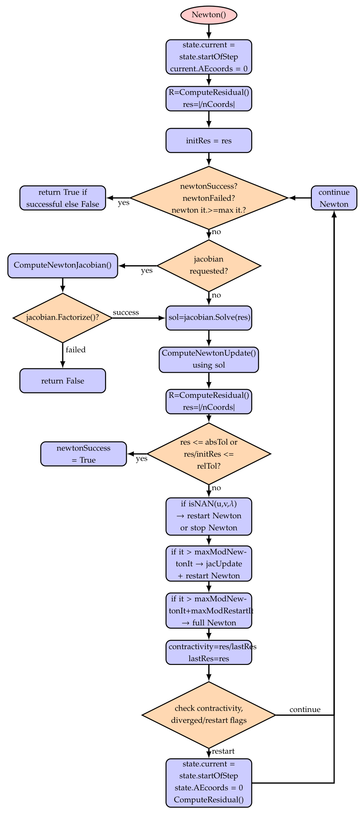

General solver structure
========================

The description of solvers in this section follows the nomenclature given in Section :ref:`sec:generalnotation`\ .
Both in the static as well as in the dynamic case, the solvers run in a loop to solve a nonlinear system of (differential and/or algebraic) equations over a given time or load interval. Explicit solvers only perform a factorization of the mass matrix, but the \ ``Newton``\  loop, see \ :numref:`fig-solver-newton-iteration`\ , is replaced by an explicit computation of the time step according to a given Runge-Kutta tableau.

In case of an implicit time integration, \ :numref:`fig-solver-time-integration`\  shows the basic loops for the solution process. The inner loops are shown in \ :numref:`fig-solver-solve-steps`\  and\ :numref:`fig-solver-discontinuous-iteration`\ .
The static solver behaves very similar, while no velocities or accelerations need to be solved and time is replaced by load steps.

Settings for the solver substructures, like timer, output, iterations, etc.\, are described in Sections  :ref:`sec-csolvertimer`\  --  :ref:`sec-solveroutputdata`\ .
The description of interfaces for solvers starts in Section :ref:`sec-mainsolverstatic`\ .

.. _fig-solver-time-integration:
.. figure:: ../theDoc/figures/solverTimeIntegration.png
   :width: 400

   Basic solver flow chart for SolveSystem(). This flow chart is the same for static solver and for time integration.

.. _fig-solver-initialize-solver:
.. figure:: ../theDoc/figures/solverInitializeSolver.png
   :width: 400

   Basic solver flow chart for function InitializeSolver().

.. _fig-solver-solve-steps:

   Flow chart for SolveSteps(), which is the inner loop of the solver.

.. _fig-solver-discontinuous-iteration:
.. figure:: ../theDoc/figures/solverDiscontinuousIteration.png
   :width: 400

   Solver flow chart for DiscontinuousIteration(), which is run for every solved step inside the static/dynamic solvers. If the DiscontinuousIteration() returns False, SolveSteps() will try to reduce the step size.

.. _fig-solver-newton-iteration:

   Solver flow chart for Newton(), which is run inside the DiscontinuousIteration(). The shown case is valid for newtonResidualMode = 0.

