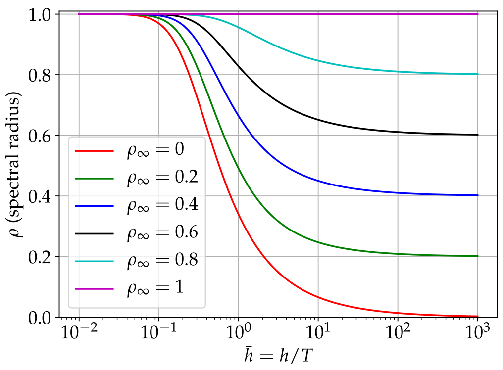

.. _sec-implicittrapezoidalsolver:

Implicit trapezoidal rule-based, Newmark and Generalized-alpha solver
=====================================================================

This solver represents a class of solvers, which are -- in the undamped case -- based on the implicit trapezoidal rule (in the view of Runge-Kutta methods). The interpolation of the quantities for one step includes the start and the end value of the time step, thus being called trapezoidal integration rule. In some special cases in Newmark's method , the interpolation might only depend on the start value or the end value.

For now, all implemented solvers can be viewed as a generalization of Newmark's method, but there are called differently in the solver interfaces

+  \ **Implicit trapezoidal rule**\  (Newmark with \ :math:`\beta = \frac 1 4`\  and \ :math:`\gamma = \frac 1 2`\ ) 
+  \ **Newmark's method**\  
+  \ **Generalized**\ -\ :math:`\alpha`\  \ **method**\  (\ :math:`=`\  generalized Newmark method with additional parameters), see Chung and Hulbert  for the original method and Arnold and Brüls  for the application to multibody system dynamics.

Newmark and Generalized-alpha method
------------------------------------

Newmark's method has two parameters \ :math:`\beta`\  and \ :math:`\gamma`\ . 
The main ideas are given in the following.
First, displacements and velocities are linearly interpolated using the accelerations \ :math:`\ddot {\mathbf{q}}`\  of the beginning of the time step (subindex '0') and the end of the time step (subindex 'T'). 
The \SON displacements and velocities and for \FON coordinates are given by (definition of \ :math:`\aalg`\  will become clear later):

.. math::
   :label: eq-newmark-interpolation

   {\mathbf{q}}_T & = &      {\mathbf{q}}_0 + h \dot {\mathbf{q}}_0 + h^2 (\frac 1 2 -\beta) \aalg_0 + h^2 \beta \aalg_T \nonumber\ \dot {\mathbf{q}}_T & = & \dot {\mathbf{q}}_0 + h (1-\gamma) \aalg_0 + h\gamma \aalg_T \nonumber\\
   {\mathbf{y}}_T & = & {\mathbf{y}}_0 + h (1-\gamma_\FO) \vel^0_\FO + h\gamma_\FO \vel^T_\FO

Hereafter, the system equations are solved at the end of the time step (\ :math:`T`\ ) for the unknown accelerations as well as for \FON and \AEN coordinates.

Remarks:

+  The system of equations may be solved for accelerations \ :math:`\ddot {\mathbf{q}}`\ , but also for displacements \ :math:`{\mathbf{q}}`\  or even velocities as unknowns while the remaining quantities are reconstructed from Eq. :eq:`eq-newmark-interpolation`\ . In case of displacements as unknowns, a scaling of the Jacobian is necessary, see later.
+  For consistency reasons, one may set \ :math:`\gamma_\FO = \gamma`\ , but \ **currently we use**\  \ :math:`\gamma_T = \frac 1 2`\ , leading to no numerical damping for \ :ref:`ODE1 <ODE1>`\  variables \ :math:`{\mathbf{y}}`\ .
+  In the extension to the so-called generalized-\ :math:`\alpha`\  method , algorithmic accelerations \ :math:`\aalg`\  are used in Eq. :eq:`eq-newmark-interpolation`\ . 
+  Algorithmic accelerations are no longer equivalent to the time derivatives of displacements, \ :math:`\aalg \neq \ddot {\mathbf{q}}`\ ; thus, both sets of variables are used independently. In case of Newmark or the implicit trapezoidal rule just use \ :math:`\aalg = \ddot {\mathbf{q}}`\ .
+  Implicit solvers are also available with Lie groups, if according rigid body nodes (\ ``NodeRigidBodyRotVecLG``\ ) are used, for theory see Holzinger et al. .

For generalized-\ :math:`\alpha`\ , the algorithmic accelerations \ :math:`\aalg`\  are computed from the recurrence relation

.. math::

   (1-\alpha_m){\mathbf{a}}_T + \alpha_m {\mathbf{a}}_0 = (1-\alpha_f) \ddot {\mathbf{u}}_T + \alpha_f \ddot {\mathbf{u}}_0

which can be resolved for the unknown \ :math:`{\mathbf{a}}_T`\ ,

.. math::

   {\mathbf{a}}_T = \frac{(1-\alpha_f) \ddot {\mathbf{u}}_T + \alpha_f \ddot {\mathbf{u}}_0 - \alpha_m {\mathbf{a}}_0}{(1-\alpha_m)}

For the first step, one can simply use \ :math:`\aalg_0 = \ddot {\mathbf{q}}_0`\ .

.. _sec-parametersgeneralizedalpha:

Parameter selection for Generalized-alpha
-----------------------------------------

Compared to alternative implicit integration methods (including the Newmark method), the generalized-\ :math:`\alpha`\  integrator's parameters break down to one single parameter \ :math:`\rho_\infty`\ , which allows to chose numerical damping in a practical way.

Based on a simple single DOF mass-spring-damper model , having the eigen frequency \ :math:`\omega = 2\pi f`\  with frequency \ :math:`f`\  and period \ :math:`T=1/f`\ , the spectral radius \ :math:`\rho`\  for the integrator defines the amount of damping for a given step size \ :math:`h`\  related to \ :math:`T`\ , thus using the dimensionless step size \ :math:`\bar h=h/T`\ .

In \ :numref:`fig-spectralradius`\  the spectral radius is shown versus \ :math:`\bar h`\  for various spectral radii at infinity \ :math:`\rho_\infty`\ . 
Here, \ :math:`\rho_\infty`\  specifies the numerical damping of very time step for large step sizes (or very high frequencies). An amount of \ :math:`\rho_\infty=0.9`\  means that high frequency parts of the system ((\ :math:`\bar h \gg 1`\ ); high compared to the step rate) are damped to \ :math:`90\%`\  in every step, reducing an initial value \ :math:`1`\  to \ :math:`2.66e-5`\  after 100 steps, which is already much larger than usual physical damping in many cases.

Furthermore, low frequency parts of the system (\ :math:`\bar h \ll 1`\ ) receive almost no numerical damping, see again \ :numref:`fig-spectralradius`\ . 
Exemplarily, consider \ :math:`\rho`\  a low frequency situation with different \ :math:`\rho_\infty`\ :

+  \ :math:`\rho(\bar h=0.01, \rho_\infty=0.9) = 1 - 1.13\cdot 10^{-9}`\ 
+  \ :math:`\rho(\bar h=0.01, \rho_\infty=0.6) = 1 - 1.22\cdot 10^{-7}`\ 

which shows that numerical damping is very low for moderately small step sizes (100 steps for one oscillation).

Obviously, \ :math:`\rho_\infty`\  does not have a large influence for very high or low frequencies in the system as long as it is \ :math:`\neq 1`\  and we could even use \ :math:`\rho_\infty=0`\ .
Regarding differential algebraic equations (DAEs), \ :math:`\rho_\infty<1`\  allows to integrate index 3 DAEs. Typically a value of \ :math:`\rho_\infty=0.7`\  leads to a stable integration, but values depend on the structure of the multibody system.

Once having chosen \ :math:`\rho_\infty`\ , all other parameters follow automatically , regarding the \ :math:`\alpha`\ s

.. math::

   \alpha_m = \frac{2 \rho_\infty - 1}{\rho_\infty + 1}, \quad \alpha_f = \frac{\rho_\infty}{\rho_\infty + 1}

and Newmarks's parameters,

.. math::

   \gamma = \frac{1}{2} - \alpha_m + \alpha_f, \quad \beta = \frac{1}{4}(1- \alpha_m + \alpha_f)^2

.. _fig-spectralradius:

   Spectral radius for generalized-\ :math:`\alpha`\  method depending on dimensionless step size \ :math:`\bar h=h/T`\ , in which \ :math:`T`\  is the period of an equivalent single DOF mass-spring-damper system.

Newton iteration
----------------

Thus, the residuals at the end of the time step (\ :math:`T`\ ) read (put all terms to \ :ref:`LHS <LHS>`\ ):

.. math::
   :label: eq-generalizedalphares

   {\mathbf{r}}^\GA_\SO &=& {\mathbf{M}} \ddot {\mathbf{q}}_T + \frac{\partial {\mathbf{g}}}{\partial {\mathbf{q}}^\mathrm{T}} \tlambda_T - {\mathbf{f}}_\SO({\mathbf{q}}_T, \dot {\mathbf{q}}_T, t) = 0\\
   {\mathbf{r}}^\GA_\FO &=& \dot {\mathbf{y}}_T + \frac{\partial {\mathbf{g}}}{\partial {\mathbf{y}}^\mathrm{T}} \tlambda_T - {\mathbf{f}}_\FO({\mathbf{y}}_T, t) = 0\\
   {\mathbf{r}}^\GA_\AE &=& {\mathbf{g}}({\mathbf{q}}_T, \dot {\mathbf{q}}_T, {\mathbf{y}}_T, \tlambda_T, t) = 0

We consider two options for \SON: (A) solve for unknown accelerations \ :math:`\acc_T`\ ,  or (B) for unknown displacements \ :math:`{\mathbf{q}}_T`\ .

(A) Solve for unknown accelerations
^^^^^^^^^^^^^^^^^^^^^^^^^^^^^^^^^^^

The unknowns for the Newton method then are

.. math::
   :label: eq-newton-unknowns1

   \txi^\GA_{k+1} = \vr{\acc_T}{{\mathbf{y}}_T}{\tlambda_T}

and at the beginning of the step, we have

.. math::
   :label: eq-newton-unknowns2

   \txi^\GA_{k} = \vr{\acc_0}{{\mathbf{y}}_0}{\tlambda_0}

For the Newton method, we need to compute an update for the unknowns of Eq. :eq:`eq-newton-unknowns1`\ , using the previous residual \ :math:`{\mathbf{r}}_{k}`\  and the inverse of the Jacobian \ :math:`{\mathbf{J}}_{k}`\  of Newton iteration \ :math:`k`\ ,

.. math::

   \txi^\GA_{k+1} = \txi^\GA_{k} - {\mathbf{J}}^{-1} \left( \txi^\GA_{k} \right) \cdot {\mathbf{r}}^\GA \left( \txi^\GA_{k} \right)

The Jacobian has the following \ :math:`3 \times 3`\  structure,

.. math::

   {\mathbf{J}} = \mr{{\mathbf{J}}_{\SO\SO}}{{\mathbf{J}}_{\SO\FO}}{{\mathbf{J}}_{\SO\AE}} {{\mathbf{J}}_{\FO\SO}}{{\mathbf{J}}_{\FO\FO}}{{\mathbf{J}}_{\FO\AE}} {{\mathbf{J}}_{\AE\SO}}{{\mathbf{J}}_{\AE\FO}}{{\mathbf{J}}_{\AE\AE}} = \mr{{\mathbf{J}}_{\SO\SO}}{\Null}{{\mathbf{J}}_{\SO\AE}} {\Null}{{\mathbf{J}}_{\FO\FO}}{{\mathbf{J}}_{\FO\AE}} {{\mathbf{J}}_{\AE\SO}}{{\mathbf{J}}_{\AE\FO}}{{\mathbf{J}}_{\AE\AE}}

in which we consider \ :math:`{\mathbf{J}}_{\FO\SO}`\  and \ :math:`{\mathbf{J}}_{\SO\FO}`\  to vanish in the current implementations, which means that coupling of \ :ref:`ODE1 <ODE1>`\  and \ :ref:`ODE2 <ODE2>`\  coordinates is only possible due to algebraic equations.

The remaining terms in the Jacobian are currently (or by default settings) evaluated as:

.. math::

   {\mathbf{J}}_{\SO\SO}&=&\frac{\partial {\mathbf{r}}^\GA_\SO}{\partial \acc} = \frac{\partial {\mathbf{r}}^\GA_\SO}{\partial {\mathbf{q}}} \frac{\partial {\mathbf{q}}}{\partial \acc} + \frac{\partial {\mathbf{r}}^\GA_\SO}{\partial \dot {\mathbf{q}}} \frac{\partial \dot {\mathbf{q}}}{\partial \acc} = h^2 \beta {\mathbf{K}} + h \gamma {\mathbf{D}} \nonumber \\
   {\mathbf{J}}_{\SO\AE}&=&\frac{\partial {\mathbf{r}}^\GA_\SO}{\partial \tlambda} = \frac{\partial {\mathbf{g}}}{\partial {\mathbf{q}}} \quad (\mbox{or } \frac{\partial {\mathbf{g}}}{\partial \dot {\mathbf{q}}} \mbox{ for constraints at velocity level)} \nonumber \\
   {\mathbf{J}}_{\FO\FO}&=&\frac{\partial {\mathbf{r}}^\GA_\FO}{\partial {\mathbf{y}}} \nonumber \\
   {\mathbf{J}}_{\AE\SO}&=&\frac{\partial {\mathbf{r}}^\GA_\AE}{\partial \acc} = \frac{\partial {\mathbf{g}}}{\partial \acc} = \frac{\partial {\mathbf{g}}}{\partial {\mathbf{q}}} \frac{\partial {\mathbf{q}}}{\partial \acc} + \frac{\partial {\mathbf{g}}}{\partial \dot {\mathbf{q}}} \frac{\partial \dot {\mathbf{q}}}{\partial \acc} = h^2 \beta \frac{\partial {\mathbf{g}}}{\partial {\mathbf{q}}} + h \gamma \frac{\partial {\mathbf{g}}}{\partial \dot {\mathbf{q}}} \nonumber \\
   {\mathbf{J}}_{\AE\FO}&=&\frac{\partial {\mathbf{r}}^\GA_\AE}{\partial {\mathbf{y}}} \nonumber \\
   {\mathbf{J}}_{\AE\AE}&=&\frac{\partial {\mathbf{r}}^\GA_\AE}{\partial \tlambda} = \frac{\partial {\mathbf{g}}}{\partial \tlambda}

Note that some parts of the Jacobian are \ **neglected**\ , such as mass matrix and constraint Jacobian terms in \ :math:`{\mathbf{J}}_{\SO\SO}`\ , which are usually of minor influence. Furthermore, Jacobians for state-dependent loads are neglected except for system-wide numerical Jacobians.

Once an update \ :math:`{\mathbf{q}}^\mathrm{Newton}_{k+1}`\  has been computed, the interpolation formulas \ :eq:`eq-newmark-interpolation`\  need to be evaluated before the next residual and Jacobian can be computed.

(B) Solve for unknown displacements
^^^^^^^^^^^^^^^^^^^^^^^^^^^^^^^^^^^

This approach is similar to the previous approach and follows exactly the algorithm given by Arnold and Brüls , however, extended for \ :ref:`ODE1 <ODE1>`\  variables, which are integrated by the (undamped) trapezoidal rule.
Documentation will be added lateron.

Initial accelerations
---------------------

For the solvers based on the implicit trapezoidal rule, initial accelerations are necessary in order to significantly increase the accuracy
of the first time step.
For this reason, the constraints \ :math:`{\mathbf{g}}({\mathbf{q}}_0, \dot {\mathbf{q}}_0, {\mathbf{y}}_0, \tlambda_0, t) = 0`\  in Eq. :eq:`eq-system-eom`\  are differentiated w.r.t. time,

.. math::
   :label: eq-initialaccelerationsvel

   \dot {\mathbf{g}}({\mathbf{q}}_0, \dot {\mathbf{q}}_0, {\mathbf{y}}_0, \tlambda_0, t) = \frac{\partial {\mathbf{g}}}{\partial {\mathbf{q}}} \dot {\mathbf{q}}_0 + \frac{\partial {\mathbf{g}}}{\partial \dot {\mathbf{q}}}\ddot {\mathbf{q}}_0 + \frac{\partial {\mathbf{g}}}{\partial {\mathbf{y}}} \dot {\mathbf{y}}_0 + \frac{\partial {\mathbf{g}}}{\partial \tlambda} \dot \tlambda + \frac{\partial {\mathbf{g}}}{\partial t} = 0 .

Currently, we assume \ :math:`\frac{\partial {\mathbf{g}}}{\partial \tlambda} = 0`\  for all further derivations on initial accelerations.
For velocity level constraints, Eq. :eq:`eq-initialaccelerationsvel`\  is used to extract initial accelerations \ :math:`\ddot {\mathbf{q}}_0`\ ,

.. math::

   \frac{\partial {\mathbf{g}}}{\partial \dot {\mathbf{q}}}\ddot {\mathbf{q}}_0 = -\frac{\partial {\mathbf{g}}}{\partial {\mathbf{q}}} \dot {\mathbf{q}}_0 -\frac{\partial {\mathbf{g}}}{\partial {\mathbf{y}}} \dot {\mathbf{y}}_0 -  \frac{\partial {\mathbf{g}}}{\partial t} .

Finally, the equations for the computation of the initial accelerations read for velocity level constraints,
note that \ :math:`{\mathbf{y}}_{init}`\  are the nodal initial values for \ :math:`{\mathbf{y}}`\ ,

.. math::
   :label: eq-initialaccelerationsvelb

   \mr{{\mathbf{M}}}{\Null}{\frac{\partial {\mathbf{g}}}{\partial \dot {\mathbf{q}}^\mathrm{T}}} {\Null}{{\mathbf{I}}}{\Null} {\frac{\partial {\mathbf{g}}}{\partial \dot {\mathbf{q}}}}{\Null}{\Null} \vr{\ddot {\mathbf{q}}_0}{{\mathbf{y}}_0}{\tlambda_0} = \vr{{\mathbf{f}}_\SO({\mathbf{q}}_T, \dot {\mathbf{q}}_T, t)}{{\mathbf{y}}_{init}} {-\frac{\partial {\mathbf{g}}}{\partial {\mathbf{q}}} \dot {\mathbf{q}}_0-\frac{\partial {\mathbf{g}}}{\partial {\mathbf{y}}} \dot {\mathbf{y}}_0 - \frac{\partial {\mathbf{g}}}{\partial t}}  ,

The term \ :math:`\frac{\partial {\mathbf{g}}}{\partial t}`\  can only occur in case of user functions and therefore currently not implemented, and the \ :ref:`ODE1 <ODE1>`\  term \ :math:`\frac{\partial {\mathbf{g}}}{\partial {\mathbf{y}}} = 0`\  is not used yet in constraints.

For position level constraints, we assume \ :math:`\frac{\partial {\mathbf{g}}}{\partial \dot {\mathbf{q}}} = 0`\  and \ :math:`\frac{\partial {\mathbf{g}}}{\partial {\mathbf{y}}} = 0`\  in Eq. :eq:`eq-initialaccelerationsvel`\  and perform a second derivation w.r.t. time,

.. math::
   :label: eq-initialaccelerationspos

   \ddot {\mathbf{g}}({\mathbf{q}}_0, \dot {\mathbf{q}}_0, {\mathbf{y}}_0, \tlambda_0, t) = \frac{\partial^2 {\mathbf{g}}}{\partial {\mathbf{q}}^2} \dot {\mathbf{q}}_0^2 + 2 \frac{\partial^2 {\mathbf{g}}}{\partial {\mathbf{q}} \partial t} \dot {\mathbf{q}}_0 + \frac{\partial {\mathbf{g}}}{\partial {\mathbf{q}}} \ddot {\mathbf{q}}_0 + \frac{\partial^2 {\mathbf{g}}}{\partial t^2} = 0 .

For position level constraints, Eq. :eq:`eq-initialaccelerationspos`\  is used to extract initial accelerations \ :math:`\ddot {\mathbf{q}}_0`\ ,

.. math::

   \frac{\partial {\mathbf{g}}}{\partial {\mathbf{q}}} \ddot {\mathbf{q}}_0 = - 2 \frac{\partial^2 {\mathbf{g}}}{\partial {\mathbf{q}} \partial t} \dot {\mathbf{q}}_0 - \frac{\partial^2 {\mathbf{g}}}{\partial {\mathbf{q}}^2} \dot {\mathbf{q}}_0^2 - \frac{\partial^2 {\mathbf{g}}}{\partial t^2} .

Finally, the equations for the computation of the initial accelerations for position level constraints read

.. math::
   :label: eq-initialaccelerationsposb

   \mr{{\mathbf{M}}}{\Null}{\frac{\partial {\mathbf{g}}}{\partial {\mathbf{q}}^\mathrm{T}}} {\Null}{{\mathbf{I}}}{\Null} {\frac{\partial {\mathbf{g}}}{\partial {\mathbf{q}}} }{\Null}{\Null} \vr{\ddot {\mathbf{q}}_0}{{\mathbf{y}}_0}{\tlambda_0} = \vr{{\mathbf{f}}_\SO({\mathbf{q}}_T, \dot {\mathbf{q}}_T, t)}{{\mathbf{y}}_{init}} {- 2 \frac{\partial^2 {\mathbf{g}}}{\partial {\mathbf{q}} \partial t} \dot {\mathbf{q}}_0 - \frac{\partial^2 {\mathbf{g}}}{\partial {\mathbf{q}}^2} \dot {\mathbf{q}}_0^2  - \frac{\partial^2 {\mathbf{g}}}{\partial t^2}}  ,

The linear system of equations, either Eq. :eq:`eq-initialaccelerationsvelb`\  or Eq. :eq:`eq-initialaccelerationsposb`\ , is solved prior to an implicit time integration if 

   \ ``simulationSettings.timeIntegration.generalizedAlpha.computeInitialAccelerations = True``\ ,

which is the default value.

