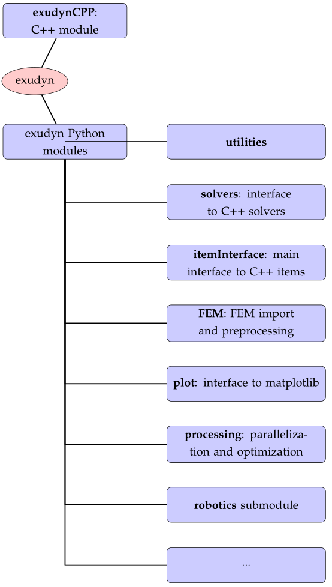

.. _sec-overview-modulestructure:

Module structure
================

This section will show:

+  Overview of modules
+  Conventions: dimension of nodes, objects and vectors
+  Coordinates: reference coordinates and displacements
+  Nodes, Objects, Markers and Loads

For an introduction to the solvers, see  :ref:`sec-solvers`\ .

|picOverviewExudynModules|

[Overview on Exudyn C++ and Python modules]

.. _sec-overview-overviewmodules:

Overview of modules
-------------------

Currently, the Exudyn module structure is split into a C++ core part and a set of 
Python parts.

+  \ **C++ parts**\ :
  
 -  \ ``exudyn``\ :
    on this level, there are just very few functions: \ ``SystemContainer()``\ , \ ``StartRenderer()``\ , \ ``StopRenderer()``\ , \ ``GetVersionString()``\ , \ ``SolveStatic(...)``\ , \ ``SolveDynamic(...)``\ , ... as well as system and user variable dictionaries \ ``exudyn.variables``\  and \ ``exudyn.sys``\ 
 -  \ ``SystemContainer``\ : contains the systems (most important), solvers (static, dynamics, ...), visualization settings
 -  \ ``mbs``\ : fmbs created with \ ``mbs = SC.AddSystem()``\ , this structure contains everything that defines a solvable multibody system; a large set of nodes, objects, markers, 
    loads can added to the system, see  :ref:`sec-item-reference-manual`\ ;
 -  \ ``mbs.systemData``\ : contains the initial, current, visualization, ... states of the system and holds the items, see [figure in theDoc.pdf]
  
+  \ **Python parts**\  (this list is continuously extended, see  :ref:`sec-pythonutilityfunctions`\ ), sorted by importance:
  
 -  \ ``exudyn.utilities``\ : constains helper classes in Python and includes Exudyn modules \ ``basicUtilities``\ , \ ``rigidBodyUtilities``\ , \ ``graphicsDataUtilities``\ , and \ ``itemInterface``\ , which is recommended to be loaded at beginning of your model file
 -  \ ``exudyn.itemInterface``\ : contains the interface, which transfers Python classes (e.g., of a NodePoint) to dictionaries that can be understood by the C++ module
 -  \ ``exudyn.basicUtilities``\ : contains basic helper classes, without importing numpy
 -  \ ``exudyn.rigidBodyUtilities``\ : contains important helper classes for creation of rigid body inertia, rigid bodies, and rigid body joints; includes helper functions for rotation parameterization, rotation matrices, homogeneous transformations, etc.
 -  \ ``exudyn.graphicsDataUtilities``\ : provides some basic drawing utilities, definition of colors and basic drawing objects (including sSTL import); rotation/translation of graphicsData objects
 -  \ ``exudyn.plot``\ : contains PlotSensor(...), a very versatile interface to matplotlib and other valuable helper functions
 -  \ ``exudyn.processing``\ : methods for optimization, parameter variation, sensitivity analysis, etc.
 -  \ ``exudyn.FEM``\ : everything related to finite element import and creation of model order reduction flexible bodies
 -  \ ``exudyn.robotics``\ : submodule containing several helper modules related to manipulators (\ ``robotics``\ , \ ``robotics.models``\ ), mobile robots (\ ``robotics.mobile``\ ), trajectory generation (\ ``robotics.motion``\ ), etc.
 -  \ ``exudyn.beams``\ : helper functions for creation of beams along straight lines and curves, sliding joints, etc.
 -  \ ``exudyn.interactive``\ : helper classes to create interactive models (e.g. for teaching or demos)
 -  \ ``exudyn.physics``\ : containing helper functions, which are physics related such as friction
 -  \ ``exudyn.signalProcessing``\ : filters, FFT, etc.; interfaces to scipy and numpy methods
 -  \ ``exudyn.solver``\ : functions imported when loading \ ``exudyn``\ , containing main solvers
  

.. |picOverviewExudynCppModule| image:: ../theDoc/figures/overviewExudynCppModule.png
   :width: 60%

|picOverviewExudynCppModule|

[Overview on Exudyn C++ module]

.. _sec-overview-conventionsitems:

Conventions: items, indexes, coordinates
----------------------------------------

In this documentation, we will use the term \ **item**\  to identify nodes, objects, markers, loads and sensors:

  item \in \node, object, marker, load, sensor \

\ **Indexes: arrays and vectors starting with 0:**\  

As known from Python, all \ **indexes**\  of arrays, vectors, matrices, ... are starting with 0. This means that the first component of the vector \ ``v=[1,2,3]``\  is accessed with \ ``v[0]``\  in Python (and also in the C++ part of Exudyn ). The range is usually defined as \ ``range(0,3)``\ , in which '3' marks the index after the last valid component of an array or vector.

\ **Dimensionality of objects and vectors:**\  \ 
2D vs. 3D

As a convention, quantities in Exudyn are 3D, such as nodes, objects, markers, loads, measured quantities, etc. 
For that reason, we denote planar nodes, objects, etc. with the suffix 2D, but 3D objects do not get this suffix (There are some rare exceptions, such as Beam3D as the pure beam may easily lead to name space conflicts in Python).

Output and input to objects, markers, loads, etc. is usually given by 3D vectors (or matrices), such as (local) position, force, torque, rotation, etc. However, initial and reference values for nodes depend on their dimensionality.
As an example, consider a \ ``NodePoint2D``\ :

+  \ ``referenceCoordinates``\  is a 2D vector (but could be any dimension in general nodes)
+  measuring the current position of \ ``NodePoint2D``\  gives a 3D vector
+  when attaching a \ ``MarkerNodePosition``\  and a \ ``LoadForceVector``\ , the force will be still a 3D vector

Furthermore, the local position in 2D objects is provided by a 3D vector. Usually, the dimensionality is given in the reference manual. User errors in the dimensionality will be usually detected either by the Python interface (i.e., at the time the item is created) or by the system-preprocessor

