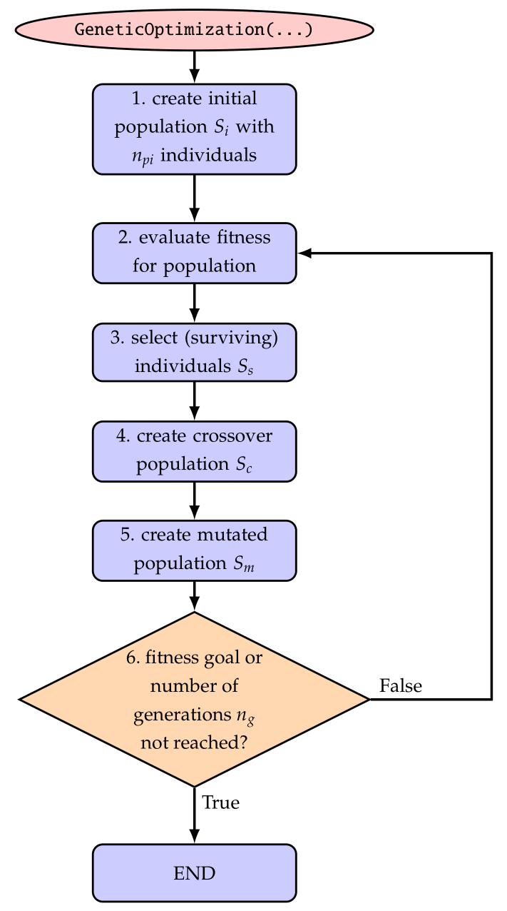

Optimization and parameter variation
====================================

The real benefit of powerful multi-body simulation emerges only if combined with modern but also simple analysis and evaluation methods.
Therefore, Exudyn has been integrated into the Python language, which offers a virtually unlimited number of methods of post-processing, evaluation and optimization.
In this section, two methods that are directly integrated into Exudyn are revisited.

.. _sec-parametervariation:

Parameter Variation
-------------------

Parameter variation is one of the simplest tools to evaluate the dependency of the solution of a problem on certain parameters. This usually requires the computation of an objective (goal, result) value for a single computation (e.g, some error norm, maximum vibration amplitude, maximum stress, maximum deflection, etc.) for every computation. Furthermore, it needs to be run for a set of parameters, e.g., using a \ ``for``\  loop.
While this could be done manually in Exudyn , it is recommended to use built-in functions, which simplify evaluation and postprocessing and directly enable parallelization.
The according function \ ``ParameterVariation(...)``\ , see Section :ref:`sec-processing-parametervariation`\ , performs a set of multi-dimensional parameter variations using a dictionary that describes the variation of parameters. See also \ ``parameterVariationExample.py``\  in the \ ``Examples``\  folder for a simple example showing a 2D parameter variation. The function \ ``ParameterVariation(...)``\  requires the \ ``multiprocessing``\  Python module which enables simple multi-threaded parallelism and has been tested for up to 80 cores on the LEO4 supercomputer at the University of Innsbruck, achieving a speedup of 50 as compared to a serial computation.

.. _sec-optimization:

Genetic Optimization
--------------------

In engineering, we often need to find a set of unknown, independent parameters \ :math:`{\mathbf{x}} \in \Rcal^n`\ , \ :math:`{\mathbf{x}}`\  being denoted as design variables and \ :math:`\Rcal^n`\  as design space. Sometimes, the design space is further subjected to constraints \ :math:`{\mathbf{g}}({\mathbf{x}})=0`\  as well as inequalities \ :math:`{\mathbf{h}}(x) \le 0`\ , which are not considered here. For simple solutions for constrained optimization problems using penalty methods, see the introductory literature .

Optimization problems are written in general in the form

.. math::

   \min\limits_{{\mathbf{x}}} f({\mathbf{x}}), \quad {\mathbf{x}} \in \Rcal^n ,

where \ :math:`f({\mathbf{x}})`\  denotes the \ *objective function*\  (=\ *fitness function*\ ). If we would like to maximize a function \ :math:`\bar f({\mathbf{x}})`\ , simply set \ :math:`f({\mathbf{x}})=-\bar f({\mathbf{x}})`\ .

In engineering, the optimization problem could seek model parameters, e.g., the geometric dimensions and inertia parameters of a slider crank mechanism, in order to achieve smallest possible forces at the supports.
Another example is the identification of unknown physical parameters, such as stiffness, damping of friction. This can be achieved by comparing measurement and simulation data (e.g., accelerations measured at relevant parts of a machine). Lets assume that \ :math:`\epsilon(t)`\  is an error computed in every time step of a computation, then we can set the objective (=fitness) function, e.g., as 

.. math::

   f(x) = \frac 1 T \sqrt{\int_{t=0}^T \epsilon(t)^2 dt}

as the integral over the error \ :math:`\epsilon`\  between measurement and simulation data.
In general, a parameter variation would be sufficient to compute sufficient computations for all combinations within the design space, however, a 3D design space with 100 variations into every direction (e.g., varying the unknown damping coefficient between 1 and 100, etc.) would already require 1000.000 computations, which in an ideal case of 1 second/computation leads to almost 2 weeks of computation time.

As an alternative stochastic methods can be use to compute only the objective function for a smaller set of randomly generated design variables, which usually show regions with better parameters (lower \ :math:`f`\ ) in scatter plots.

\ **Genetic algorithms**\  can significantly reduce the necessary amount of objective function evaluations in order to perform the optimization. Genetic identification algorithms have been already successfully applied to multibody system dynamics. 

The general structure of a (canonical) genetic algorithm is depicted in \ :numref:`fig-geneticoptimization`\ .

.. _fig-geneticOptimization:

   Basic solver flow chart genetic algorithm / optimization.

For details, see the cited literature. Here, we focus on the implementation of the function 
\ ``GeneticOptimization(...)``\ , see Section :ref:`sec-processing-geneticoptimization`\ .
The initial population (step 1) is created with \ ``initialPopulationSize``\  individuals with uniformly distributed random design variables \ :math:`[{\mathbf{x}}_0, \ldots, {\mathbf{x}}_{n_{pi}-1}]`\  \ (\ :math:`{\mathbf{x}}_i=[x_{i0}, x_{i1}, \ldots]`\  being a set of genes, with single genes \ :math:`x_{i0}`\ , \ :math:`x_{i1}`\ , ... ) in the search space, which is given in the dictionary \ ``parameters``\ . Herafter (steps 2-6), we iteratively process a population for a certain \ ``numberOfGenerations``\  generations.

In step 3, the surviving individuals \ :math:`S_s`\  with best fitness (smallest value from evaluation of \ ``objectiveFunction``\ ) are selected and considered further in the optimization. If the \ ``distanceFactor``\  is used, the surviving individuals must be located within a certain distance (measured relative to the range of the search space) to all other surviving individuals. This option guarantees the search within several local minima, while a conventional search often converges to one single minimum.
Crossover (step 4)  is performed using a crossover of all available parameters of two randomly selected parents when generating children from the surviving individuals. The crossover of genes is performed only for a part of the new population, defined by \ ``crossoverAmount``\ .

Finally, in step 5, we apply mutation to all genes, which extends the search to the surrounding design space of the individuals created by crossover. The mutation could be performed by means of certain distribution functions in order to focus on the currently best search regions. However, in the current implementation of \ ``GeneticOptimization(...)``\  we simply use a uniform random variable to distribute the genes over a certain percentage of the design space, which is reduced in every generation defined by the \ ``rangeReductionFactor``\  \ :math:`r_r`\ . This allows us to restrict further search to a smaller subregion of the design space and in general allows a reduction of search space by means of \ :math:`r_r^{n_g}`\ . In the ideal case, using sufficiently large population sizes and being lucky with the found random values, a range reduction factor \ :math:`r_r=0.7`\  reduces the search space by a factor of \ :math:`100`\  after every 13 generations, allowing to obtain 4 digits of accuracy for design variables after 26 generations for suitable optimization problems.

It should be noted that still this optimization method is based on random values and thus may fail occasionally for any problem case. In order to get reproducible results, set \ ``randomizerInitialization``\  to any integer value (simply: 0) in order to get identical results for repeated runs. Setting the latter variable guarantees that the Python (numpy) randomizer creates the same series of random values for initial population, mutation, etc.

