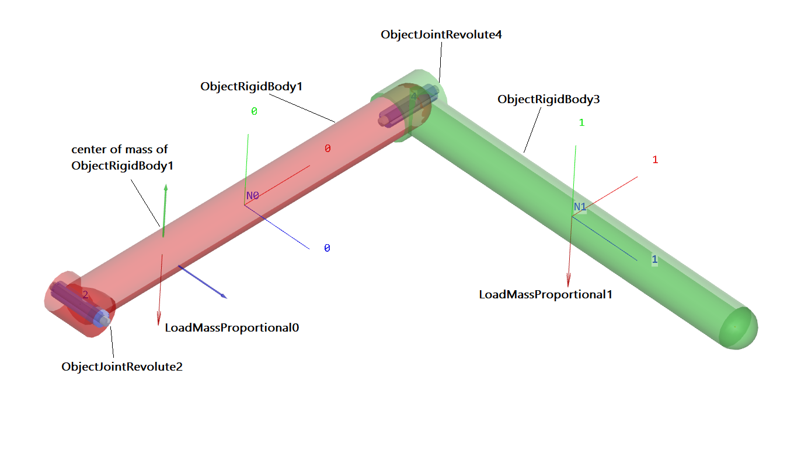

.. _sec-tutorial-rigidbodyjoints:

Rigid body and joints tutorial
==============================

The Python source code of the first tutorial, based on the simple description of revolute joints, can be found in the file:

   \ ``main/pythonDev/Examples/rigidBodyTutorial3.py``\ 

For alternative approaches, see

   \ ``main/pythonDev/Examples/rigidBodyTutorial3withMarkers.py``\ 
   \ ``main/pythonDev/Examples/rigidBodyTutorial2.py``\ 

This tutorial will set up a multibody system containing a ground, two rigid bodies and two revolute joints driven by gravity, compare a 3D view of the example in \ :numref:`fig-rigidbodytutorialview`\ .

.. _fig-rigidbodytutorialview:

   Render view of rigid body tutorial, showing objects, nodes (N0, N1), and loads.

We first import the exudyn library and the interface for all nodes, objects, markers, loads and sensors:

.. code-block:: python

  import exudyn as exu
  from exudyn.utilities import * #includes itemInterface, graphicsDataUtilities and rigidBodyUtilities
  import numpy as np #for postprocessing

The submodule \ ``exudyn.utilities``\  contains helper functions for graphics representation, 3D rigid bodies and joints.

As in the first tutorial, we need a \ ``SystemContainer``\  and add a new MainSystem \ ``mbs``\ :

.. code-block:: python

  SC = exu.SystemContainer()
  mbs = SC.AddSystem()

We define some geometrical parameters for lateron use.

.. code-block:: python

  #physical parameters
  g =     [0,-9.81,0] #gravity
  L = 1               #length
  w = 0.1             #width
  bodyDim=[L,w,w]     #body dimensions
  p0 =    [0,0,0]     #origin of pendulum
  pMid0 = np.array([L*0.5,0,0]) #center of mass, body0

We add an empty ground body, using default values. It's origin is at [0,0,0] and here we use no visualization.

.. code-block:: python

  #ground body, located at specific position (there could be several ground objects)
  oGround = mbs.CreateGround(referencePosition=[0,0,0])

For physical parameters of the rigid body, we can use the class \ ``RigidBodyInertia``\ , which allows to define mass, center of mass (COM) and inertia parameters, as well as shifting COM or adding inertias.
The \ ``RigidBodyInertia``\  can be used directly to create rigid bodies. Special derived classes can be use to define rigid body inertias for cylinders, cubes, etc., so we use a cube here:

.. code-block:: python

  #first link:
  #inertia for cubic body with dimensions in sideLengths
  iCube0 = InertiaCuboid(density=5000, sideLengths=bodyDim)
  iCube0 = iCube0.Translated([-0.25*L,0,0]) #transform COM, COM not at reference point!

Note that the COM is translated in axial direction, while it would be at the body's local position [0,0,0] by default!

For visualization, we add some graphics for the body defined as a 3D cube with center point and dimensions; additionally we draw a basis (three RGB-vectors) at the COM:

.. code-block:: python

  #graphics for body
  graphicsBody0 = GraphicsDataOrthoCubePoint(centerPoint=[0,0,0],size=[L,w,w],color=color4red)
  graphicsCOM0 = GraphicsDataBasis(origin=iCube0.com, length=2*w)

Now we have defined all data for the link (rigid body). We could use \ ``mbs.AddNode(NodeRigidBodyEP(...))``\  and \ ``mbs.AddObject(ObjectRigidBody(...))``\  to create a node and a body, but the \ ``MainSystem``\  since V1.6.110 offers a much more comfortable function:

.. code-block:: python

  #create node, add body and gravity load:
  b0=mbs.CreateRigidBody(inertia = iCube0, #includes COM
                         referencePosition = pMid0,
                         gravity = g,
                         graphicsDataList = [graphicsCOM0, graphicsBody0])

which also adds a gravity load and could also set initial velocities, if wanted. Note that much more options are available for this function, e.g.,
we could define a \ ``nodeType``\  for the underlying formulation of the rigid body node, see Section :ref:`sec-nodetype`\ .
We can use 

+  \ ``RotationEulerParameters``\ : for fast computation, but leads to an additional algebraic equation and thus needs an implicit solver
+  \ ``RotationRxyz``\ : contains a singularity if the second angle reaches +/- 90 degrees, but no algebraic equations
+  \ ``RotationRotationVector``\ : for usage with Lie group integrators, especially with explicit integration, singularities are bypassed; leads to fewest unknowns and usually less Newton iterations

We now add a revolute joint around the (global) z-axis. 
We have several possibilities, which are shown in the following.
For the \ **first two possibilities only**\ , following \ ``rigidBodyTutorial3withMarkers.py``\ , we need the following markers

.. code-block:: python

  #markers for ground and rigid body (not needed for option 3):
  markerGround = mbs.AddMarker(MarkerBodyRigid(bodyNumber=oGround, localPosition=[0,0,0]))
  markerBody0J0 = mbs.AddMarker(MarkerBodyRigid(bodyNumber=b0, localPosition=[-0.5*L,0,0]))

The very general \ **option 1**\  is to use the \ ``GenericJoint``\ , that can be used to define any kind of joint with translations and rotations fixed or free,

.. code-block:: python

  #revolute joint option 1:
  mbs.AddObject(GenericJoint(markerNumbers=[markerGround, markerBody0J0], 
                             constrainedAxes=[1,1,1,1,1,0],
                             visualization=VObjectJointGeneric(axesRadius=0.2*w, 
                                                               axesLength=1.4*w)))

In addition, transformation matrices (\ ``rotationMarker0/1``\ ) can be added, see the joint description.

\ **Option 2**\  is using the revolute joint, which allows a free rotation around the local z-axis of marker 0 (\ ``markerGround``\  in our example)

.. code-block:: python

  #revolute joint option 2:
  mbs.AddObject(ObjectJointRevoluteZ(markerNumbers = [markerGround, markerBody0J0], 
                                     rotationMarker0=np.eye(3),
                                     rotationMarker1=np.eye(3),
                                     visualization=VObjectJointRevoluteZ(axisRadius=0.2*w, 
                                                                         axisLength=1.4*w)
                                     )) 

Additional transformation matrices (\ ``rotationMarker0/1``\ ) can be added in order to chose any rotation axis.

Note that an error in the definition of markers for the joints can be also detected in the render window (if you completed the example), e.g., if you change the following marker in the lines above,

.. code-block:: python

  #example if wrong marker position is chosen:
  markerBody0J0 = mbs.AddMarker(MarkerBodyRigid(bodyNumber=b0, localPosition=[-0.4*L,0,0]))

\ :math:`\ra`\  you will see a misalignment of the two parts of the joint by \ ``0.1*L``\ .
The latter approach is very general and will also work for any kind of flexible bodies.

Due to the fact that the definition of markers for general joints is tedious, \ **option 3**\  is based on a MainSystem function, which allows to attach revolute joints immediately to bodies and defining the rotation axis only once for the joint:

.. code-block:: python

  #revolute joint option 3:
  mbs.CreateRevoluteJoint(bodyNumbers=[oGround, b0], position=[0,0,0], 
                          axis=[0,0,1], axisRadius=0.2*w, axisLength=1.4*w)

For the latter option, there are more arguments that may be specified, e.g., the axis and position can also be defined in the local frame of the first body.

The second link and the according joint can be set up in a very similar way.
For visualization, we need to add some graphics for the body defined as a RigidLink GraphicsData function:

.. code-block:: python

  #second link, simple graphics:
  graphicsBody1 = GraphicsDataRigidLink(p0=[0,0,-0.5*L],p1=[0,0,0.5*L], 
                                        axis0=[1,0,0], axis1=[0,0,0], radius=[0.06,0.05], 
                                        thickness = 0.1, width = [0.12,0.12], 
                                        color=color4lightgreen)

  b1=mbs.CreateRigidBody(inertia = InertiaCuboid(density=5000, sideLengths=[0.1,0.1,1]),
                         referencePosition = np.array([L,0,0.5*L]), 
                         gravity = g,
                         graphicsDataList = [graphicsBody1])

The revolute joint in this case has a free rotation around the global x-axis:

.. code-block:: python

  #revolute joint (free x-axis)
  mbs.CreateRevoluteJoint(bodyNumbers=[b0, b1], position=[L,0,0], 
                          axis=[1,0,0], axisRadius=0.2*w, axisLength=1.4*w)

Optionally, we could also add forces or torques onto bodies

.. code-block:: python

  #forces can be added like in the following
  force = [0,0.5,0]       #0.5N   in y-direction
  torque = [0.1,0,0]      #0.1Nm around x-axis
  mbs.CreateForce(bodyNumber=b1,
                  loadVector=force,
                  localPosition=[0,0,0.5], #at tip
                  bodyFixed=False) #if True, direction would corotate with body
  mbs.CreateTorque(bodyNumber=b1, 
                  loadVector=torque,
                  localPosition=[0,0,0],   #at body's reference point/center
                  bodyFixed=False) #if True, direction would corotate with body

Finally, we also add a sensor for some output of the double pendulum:

.. code-block:: python

  #position sensor at tip of body1
  sens1=mbs.AddSensor(SensorBody(bodyNumber = b1, localPosition = [0,0,0.5*L],
                                 fileName = 'solution/sensorPos.txt',
                                 outputVariableType = exu.OutputVariableType.Position))

Before simulation, we need to call \ ``Assemble()``\  for our system, which links objects, nodes, ..., assigns initial values and does further pre-computations and checks:

.. code-block:: python

  mbs.Assemble()

After \ ``Assemble()``\ , markers, nodes, objects, etc. are linked and we can analyze the internal structure. First, we can print out useful information, either just typing \ ``mbs``\  in the iPython console to print out overal information:

.. code-block:: 

  <systemData: 
    Number of nodes= 2
    Number of objects = 5
    Number of markers = 8
    Number of loads = 4
    Number of sensors = 1
    Number of ODE2 coordinates = 14
    Number of ODE1 coordinates = 0
    Number of AE coordinates   = 12
    Number of data coordinates   = 0
    For details see mbs.systemData, mbs.sys and mbs.variables
  >

Note that there are 2 nodes for the two rigid bodies. The five objects are due to ground object, 2 rigid bodies and 2 revolute joints.
The meaning of markers can be seen in the graphical representation described below.

Furthermore, we can print the full internal information as a dictionary using:

.. code-block:: python

  mbs.systemData.Info() #show detailed information

which results in the following output (shortened):

.. code-block:: 

  node0:
      {'nodeType': 'RigidBodyEP', 'referenceCoordinates': [0.5, 0.0, 0.0, 1.0, 0.0, 0.0, 0.0], 'addConstraintEquation': True, 'initialCoordinates': [0.0, 0.0, 0.0, 0.0, 0.0, 0.0, 0.0], 'initialVelocities': [0.0, 0.0, 0.0, 0.0, 0.0, 0.0, 0.0], 'name': 'node0', 'Vshow': True, 'VdrawSize': -1.0, 'Vcolor': [-1.0, -1.0, -1.0, -1.0]}
  node1:
      {'nodeType': 'RigidBodyEP', 'referenceCoordinates': [1.0, 0.0, 0.5, 1.0, 0.0, 0.0, 0.0], 'addConstraintEquation': True, 'initialCoordinates': [0.0, 0.0, 0.0, 0.0, 0.0, 0.0, 0.0], 'initialVelocities': [0.0, 0.0, 0.0, 0.0, 0.0, 0.0, 0.0], 'name': 'node1', 'Vshow': True, 'VdrawSize': -1.0, 'Vcolor': [-1.0, -1.0, -1.0, -1.0]}
  object0:
      {'objectType': 'Ground', 'referencePosition': [0.0, 0.0, 0.0], 'name': 'object0', 'Vshow': True, 'VgraphicsDataUserFunction': 0, 'Vcolor': [-1.0, -1.0, -1.0, -1.0], 'VgraphicsData': {'TODO': 'Get graphics data to be implemented'}}
  object1:
      {'objectType': 'RigidBody', 'physicsMass': 50.0, 'physicsInertia': [0.08333333333333336, 7.333333333333334, 7.333333333333334, 0.0, 0.0, 0.0], 'physicsCenterOfMass': [-0.25, 0.0, 0.0], 'nodeNumber': 0, 'name': 'object1', 'Vshow': True, 'VgraphicsDataUserFunction': 0, 'VgraphicsData': {'TODO': 'Get graphics data to be implemented'}}
  object2:
      {'objectType': 'JointRevolute', 'markerNumbers': [3, 4], 'rotationMarker0': [[0.0, 1.0, 0.0], [-1.0, 0.0, 0.0], [0.0, 0.0, 1.0]], 'rotationMarker1': [[0.0, 1.0, 0.0], [-1.0, 0.0, 0.0], [0.0, 0.0, 1.0]], 'activeConnector': True, 'name': 'object2', 'Vshow': True, 'VaxisRadius': 0.019999999552965164, 'VaxisLength': 0.14000000059604645, 'Vcolor': [-1.0, -1.0, -1.0, -1.0]}
  object3:
  ...

Sometimes it is hard to understand the degree of freedom for the constrained system. Furthermore, we may have added -- by error --
redundant constraints, which are not solvable or at least cause solver problems. Both can be checked with the command:

.. code-block:: python

  mbs.ComputeSystemDegreeOfFreedom(verbose=True) #print out DOF and further information

This will print:

.. code-block:: 

  ODE2 coordinates          = 14
  total constraints         = 12
  redundant constraints     = 0
  pure algebraic constraints= 0
  degree of freedom         = 2

We see that there are 14 ODE2 coordinates from the two nodes that are based on Euler parameters. The two joints add \ :math:`2\times 5`\  constraints and there are 2 additional Euler parameter constraints, giving a degree of freedom of 2 (as expected ...).

You can try and duplicate the code for the second revolute joint:

.. code-block:: python

  #add a second constraint for bodies b0 and b1:
  mbs.CreateRevoluteJoint(bodyNumbers=[b0, b1], ...)

such that we have two identical joints (which would be unwanted, in general). This would give 

.. code-block:: 

  ODE2 coordinates          = 14
  total constraints         = 17
  redundant constraints     = 5
  pure algebraic constraints= 0
  degree of freedom         = 2

which clearly shows the 5 redundant constraints, which will lead to a solver failure (except for the \ ``EigenDense``\  solver, see there). In practical cases, redundant constraints may be much more involved, but can be detected in this way.

A graphical representation of the internal structure of the model can be shown using the command \ ``DrawSystemGraph``\ :

.. code-block:: python

  mbs.DrawSystemGraph(useItemTypes=True) #draw nice graph of system

For the output see \ :numref:`fig-drawsystemgraphexample`\ . 
Note that obviously, markers are always needed to connect objects (or nodes) as well as loads. We can also see, that 2 markers MarkerBodyRigid1 and MarkerBodyRigid2 are unused, which is no further problem for the model and also does not require additional computational resources (except for some bytes of memory). Having isolated nodes or joints that are not connected (or having too many connections) may indicate that you did something wrong in setting up your model.
Furthermore, it can be seen that the function \ ``CreateRigidBody``\  added a body \ ``ObjectRigidBody``\ , a node \ ``NodeRigidBodyEP``\ , a \ ``LoadMassProportional``\  for gravity load with a \ ``MarkerBodyMass``\ , and the function \ ``CreateRevoluteJoint``\  created two \ ``MarkerBodyRigid``\  and a \ ``ObjectJointRevoluteZ``\  which represents a revolute joint about a Z-axis in the joint coordinate system. For further information, consult the respective pages in the Items reference manual.

.. _fig-drawsystemgraphexample:
.. figure:: ../theDoc/figures/DrawSystemGraphExample.png
   :width: 600

   System graph for rigid body tutorial (with option 3 for the first revolute joint). Numbers are always related to the node number, object number, etc.; note that colors are used to distinguish nodes, objects, markers, loads and sensors

Before starting our simulation, we should adjust the solver parameters, especially the end time and the step size (no automatic step size for implicit solvers available!):

.. code-block:: python

  simulationSettings = exu.SimulationSettings() #takes currently set values or default values

  tEnd = 4 #simulation time
  h = 1e-3 #step size
  simulationSettings.timeIntegration.numberOfSteps = int(tEnd/h)
  simulationSettings.timeIntegration.endTime = tEnd
  simulationSettings.timeIntegration.verboseMode = 1
  #simulationSettings.timeIntegration.simulateInRealtime = True
  simulationSettings.solutionSettings.solutionWritePeriod = 0.005 #store every 5 ms

The \ ``verboseMode``\  tells the solver the amount of output during solving. Higher values (2, 3, ...) show residual vectors, jacobians, etc. for every time step, but slow down simulation significantly.
The option \ ``simulateInRealtime``\  is used to view the model during simulation, while setting this false, 
the simulation finishes after fractions of a second. It should be set to false in general, 
while solution can be viewed using the \ ``SolutionViewer()``\ .
With \ ``solutionWritePeriod``\  you can adjust the frequency which is used to store the solution of the whole model, 
which may lead to very large files and may slow down simulation, but is used in the \ ``SolutionViewer()``\  to reload the solution after simulation.

In order to improve visualization, there are hundreds of options, see Visualization settings in Section :ref:`sec-visualizationsettingsmain`\ , some of them used here:

.. code-block:: python

  SC.visualizationSettings.window.renderWindowSize = [1600,1200]
  SC.visualizationSettings.openGL.multiSampling = 4  #improved OpenGL rendering
  SC.visualizationSettings.general.autoFitScene = False

  SC.visualizationSettings.nodes.drawNodesAsPoint = False
  SC.visualizationSettings.nodes.showBasis = True #shows three RGB (=xyz) lines for node basis

The option \ ``autoFitScene``\  is used in order to avoid zooming while loading the last saved render state, see below.

We can start the 3D visualization (Renderer) now:

.. code-block:: python

  exu.StartRenderer()

In order to reload the model view of the last simulation (if there is any), we can use the following commands:

.. code-block:: python

  if 'renderState' in exu.sys: #reload old view
      SC.SetRenderState(exu.sys['renderState'])

  mbs.WaitForUserToContinue() #stop before simulating

the function \ ``WaitForUserToContinue()``\  waits with simulation until we press SPACE bar. This allows us to make some pre-checks.

Finally, the \ **index 2**\  (velocity level) implicit time integration (simulation) is started with:

.. code-block:: python

  mbs.SolveDynamic(simulationSettings = simulationSettings,
                   solverType = exu.DynamicSolverType.TrapezoidalIndex2)

This solver is used in the present example, but should be considered with care as it leads to (small) drift of position constraints, linearly increasing in time. Using sufficiently small time steps, this effect is often negligible on the advantage of having a \ **energy-conserving integrator**\  (guaranteed for linear systems, but very often also for the nonlinear multibody system). Due to the velocity level, the integrator is less sensitive to consistent initial conditions on position level and compatible to frequent step size changes, however, initial jumps in velocities may never damp out in undamped systems.

Alternatively, an \ **index 3**\  implicit time integration -- the generalized-\ :math:`\alpha`\  method -- is started with the default settings for \ ``solverType``\ :

.. code-block:: python

  mbs.SolveDynamic(simulationSettings = simulationSettings)

Note that the \ **generalized-\ :math:`\alpha`\  method**\  includes numerical damping (adjusted with the spectral radius) for stabilization of index 3 constraints. This leads to effects every time the integrator is (re-)started, e.g., when adapting time step sizes. For fixed step sizes, this is \ **the recommended integrator**\ .

After simulation, the library would immediately exit (and jump back to iPython or close the terminal window). In order to avoid this, we can use \ ``WaitForRenderEngineStopFlag()``\  to wait until we press key 'Q'.

.. code-block:: python

  SC.WaitForRenderEngineStopFlag() #stop before closing
  exu.StopRenderer() #safely close rendering window!

If you entered everything correctly, the render window should show a nice animation of the 3D double pendulum after pressing the SPACE key. 
If we do not stop the renderer (\ ``StopRenderer()``\ ), it will stay open for further simulations. However, it is safer to always close the renderer at the end.

As the simulation will run very fast, if you did not set \ ``simulateInRealtime``\  to true. However, you can reload the stored solution and view the stored steps interactively:

.. code-block:: python

  mbs.SolutionViewer()
  #alternatively, we could load solution from a file:
  #sol = LoadSolutionFile('coordinatesSolution.txt')
  #mbs.SolutionViewer(sol)

Finally, we can plot our sensor, drawing the y-component of the sensor (check out the many options in \ ``PlotSensor(...)``\  to conveniently represent results!):

.. code-block:: python

  mbs.PlotSensor(sensorNumbers=[sens1],components=[1],closeAll=True)

\ **Congratulations**\ ! You completed the rigid body tutorial, which gives you the ability to model multibody systems. Note that much more complicated models are possible, including feedback control or flexible bodies, see the Examples!

