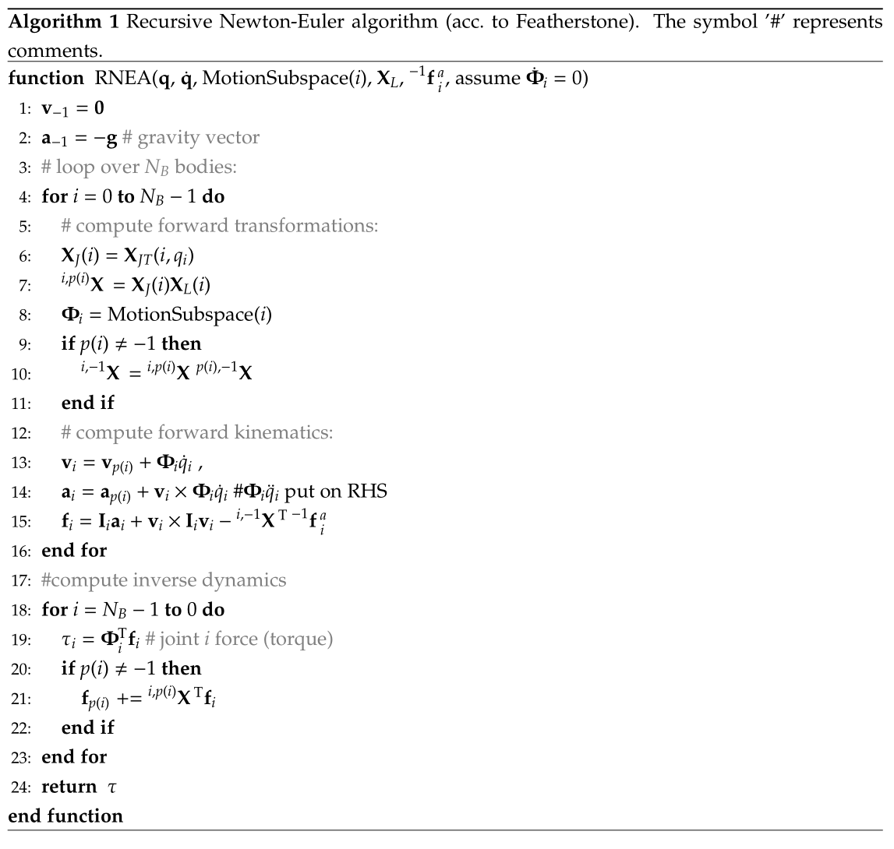

.. _sec-item-objectkinematictree:

ObjectKinematicTree
===================

A special object to represent open kinematic trees using minimal coordinate formulation. The kinematic tree is defined by lists of joint types, parents, inertia parameters (w.r.t. COM), etc.\ per link (body) and given joint (pre) transformations from the previous joint. Every joint / link is defined by the position and orientation of the previous joint and a coordinate transformation (incl.\ translation) from the previous link's to this link's joint coordinates. The joint can be combined with a marker, which allows to attach connectors as well as joints to represent closed loop mechanisms. Efficient models can be created by using tree structures in combination with constraints and very long chains should be avoided and replaced by (smaller) jointed chains if possible. The class Robot from exudyn.robotics can also be used to create kinematic trees, which are then exported as KinematicTree or as redundant multibody system. Use specialized settings in VisualizationSettings.bodies.kinematicTree for showing joint frames and other properties.

\ **Additional information for ObjectKinematicTree**\ :

* | This \ ``Object``\  has/provides the following types = \ ``Body``\ , \ ``MultiNoded``\ , \ ``SuperElement``\ 
* | Requested \ ``Node``\  type = \ ``GenericODE2``\ 
* | \ **Short name**\  for Python = \ ``KinematicTree``\ 
* | \ **Short name**\  for Python visualization object = \ ``VKinematicTree``\ 

The item \ **ObjectKinematicTree**\  with type = 'KinematicTree' has the following parameters:

* | **name** [type = String, default = '']:
  | objects's unique name
* | **nodeNumber** [\ :math:`n_0 \in \Ncal^n`\ , type = NodeIndex, default = invalid (-1)]:
  | node number (type NodeIndex) of GenericODE2 node containing the coordinates for the kinematic tree; \ :math:`n`\  being the number of minimal coordinates
* | **gravity** [\ :math:`\LU{0}{{\mathbf{g}}} \in \Rcal^{3}`\ , type = Vector3D, default = [0.,0.,0.]]:
  | gravity vector in inertial coordinates; used to simply apply gravity as LoadMassProportional is not available for KinematicTree
* | **baseOffset** [\ :math:`\LU{0}{{\mathbf{p}}_b} \in \Rcal^{3}`\ , type = Vector3D, default = [0.,0.,0.]]:
  | offset vector for base, in global coordinates
* | **jointTypes** [\ :math:`{\mathbf{j}}_T \in \Ncal^{n}`\ , type = JointTypeList, default = []]:
  | joint types of kinematic Tree joints; must be always set
* | **linkParents** [\ :math:`{\mathbf{i}}_p = [p_0,\, p_1,\, \ldots] \in \Ncal^{n}`\ , type = ArrayIndex, default = []]:
  | index of parent joint/link; if no parent exists, the value is \ :math:`-1`\ ; by default, \ :math:`p_0=-1`\  because the \ :math:`i`\ th parent index must always fulfill \ :math:`p_i<i`\ ; must be always set
* | **jointTransformations** [\ :math:`{\mathbf{T}} = [\LU{p_0,j_0}{{\mathbf{T}}_0},\, \LU{p_1,j_1}{{\mathbf{T}}_1},\, \ldots ] \in [\Rcal^{3 \times 3}, ...]`\ , type = Matrix3DList, default = []]:
  | list of constant joint transformations from parent joint coordinates \ :math:`p_0`\  to this joint coordinates \ :math:`j_0`\ ; if no parent exists (\ :math:`-1`\ ), the base coordinate system \ :math:`0`\  is used; must be always set
* | **jointOffsets** [\ :math:`{\mathbf{V}} = [\LU{p_0}{o_0},\, \LU{p_1}{o_1},\, \ldots ] \in [\Rcal^{3}, ...]`\ , type = Vector3DList, default = []]:
  | list of constant joint offsets from parent joint to this joint; \ :math:`p_0`\ , \ :math:`p_1`\ , \ :math:`\ldots`\  denote the parent coordinate systems; if no parent exists (\ :math:`-1`\ ), the base coordinate system \ :math:`0`\  is used; must be always set
* | **linkInertiasCOM** [\ :math:`{\mathbf{J}}_{COM} = [\LU{j_0}{{\mathbf{J}}_0},\, \LU{j_1}{{\mathbf{J}}_1},\, \ldots ] \in [\Rcal^{3 \times 3}, ...]`\ , type = Matrix3DList, default = []]:
  | list of link inertia tensors w.r.t.\ \ :ref:`COM <COM>`\  in joint/link \ :math:`j_i`\  coordinates; must be always set
* | **linkCOMs** [\ :math:`{\mathbf{C}} = [\LU{j_0}{{\mathbf{c}}_0},\, \LU{j_1}{{\mathbf{c}}_1},\, \ldots ] \in [\Rcal^{3}, ...]`\ , type = Vector3DList, default = []]:
  | list of vectors for center of mass (COM) in joint/link \ :math:`j_i`\  coordinates; must be always set
* | **linkMasses** [\ :math:`{\mathbf{m}} \in \Rcal^{n}`\ , type = Vector, default = []]:
  | masses of links; must be always set
* | **linkForces** [\ :math:`\LU{0}{{\mathbf{F}}} \in [\Rcal^{3}, ...]`\ , type = Vector3DList, default = []]:
  | list of 3D force vectors per link in global coordinates acting on joint frame origin; use force-torque couple to realize off-origin forces; defaults to empty list \ :math:`[]`\ , adding no forces
* | **linkTorques** [\ :math:`\LU{0}{{\mathbf{F}}_\tau} \in [\Rcal^{3}, ...]`\ , type = Vector3DList, default = []]:
  | list of 3D torque vectors per link in global coordinates; defaults to empty list \ :math:`[]`\ , adding no torques
* | **jointForceVector** [\ :math:`{\mathbf{f}} \in \Rcal^{n}`\ , type = Vector, default = []]:
  | generalized force vector per coordinate added to RHS of EOM; represents a torque around the axis of rotation in revolute joints and a force in prismatic joints; for a revolute joint \ :math:`i`\ , the torque \ :math:`f[i]`\  acts positive (w.r.t.\ rotation axis) on link \ :math:`i`\  and negative on parent link \ :math:`p_i`\ ; must be either empty list/array \ :math:`[]`\  (default) or have size \ :math:`n`\ 
* | **jointPositionOffsetVector** [\ :math:`{\mathbf{u}}_o \in \Rcal^{n}`\ , type = Vector, default = []]:
  | offset for joint coordinates used in P(D) control; acts in positive joint direction similar to jointForceVector; should be modified, e.g., in preStepUserFunction; must be either empty list/array \ :math:`[]`\  (default) or have size \ :math:`n`\ 
* | **jointVelocityOffsetVector** [\ :math:`{\mathbf{v}}_o \in \Rcal^{n}`\ , type = Vector, default = []]:
  | velocity offset for joint coordinates used in (P)D control; acts in positive joint direction similar to jointForceVector; should be modified, e.g., in preStepUserFunction; must be either empty list/array \ :math:`[]`\  (default) or have size \ :math:`n`\ 
* | **jointPControlVector** [\ :math:`{\mathbf{P}} \in \Rcal^{n}`\ , type = Vector, default = []]:
  | proportional (P) control values per joint (multiplied with position error between joint value and offset \ :math:`{\mathbf{u}}_o`\ ); note that more complicated control laws must be implemented with user functions; must be either empty list/array \ :math:`[]`\  (default) or have size \ :math:`n`\ 
* | **jointDControlVector** [\ :math:`{\mathbf{D}} \in \Rcal^{n}`\ , type = Vector, default = []]:
  | derivative (D) control values per joint (multiplied with velocity error between joint velocity and velocity offset \ :math:`{\mathbf{v}}_o`\ ); note that more complicated control laws must be implemented with user functions; must be either empty list/array \ :math:`[]`\  (default) or have size \ :math:`n`\ 
* | **forceUserFunction** [\ :math:`{\mathbf{f}}_{user} \in \Rcal^{n}`\ , type = PyFunctionVectorMbsScalarIndex2Vector, default =  0]:
  | A Python user function which computes the generalized force vector on RHS with identical action as jointForceVector; see description below
* | **visualization** [type = VObjectKinematicTree]:
  | parameters for visualization of item

The item VObjectKinematicTree has the following parameters:

* | **show** [type = Bool, default = True]:
  | set true, if item is shown in visualization and false if it is not shown
* | **showLinks** [type = Bool, default = True]:
  | set true, if links shall be shown; if graphicsDataList is empty, a standard drawing for links is used (drawing a cylinder from previous joint or base to next joint; size relative to frame size in KinematicTree visualization settings); else graphicsDataList are used per link; NOTE visualization of joint and COM frames can be modified via visualizationSettings.bodies.kinematicTree
* | **showJoints** [type = Bool, default = True]:
  | set true, if joints shall be shown; if graphicsDataList is empty, a standard drawing for joints is used (drawing a cylinder for revolute joints; size relative to frame size in KinematicTree visualization settings)
* | **color** [type = Float4, size = 4, default = [-1.,-1.,-1.,-1.]]:
  | RGBA color for object; 4th value is alpha-transparency; R=-1.f means, that default color is used
* | **graphicsDataList** [type = BodyGraphicsDataList]:
  | Structure contains data for link/joint visualization; data is defined as list of BodyGraphicdData where every BodyGraphicdData corresponds to one link/joint; must either be emtpy list or length must agree with number of links

----------

.. _description-objectkinematictree:

DESCRIPTION of ObjectKinematicTree
----------------------------------

\ **The following output variables are available as OutputVariableType in sensors, Get...Output() and other functions**\ :

* | ``Coordinates``\ : 
  | all \ :ref:`ODE2 <ODE2>`\  joint coordinates, including reference values; these are the minimal coordinates of the object
* | ``Coordinates\_t``\ : 
  | all \ :ref:`ODE2 <ODE2>`\  velocity coordinates
* | ``Coordinates\_tt``\ : 
  | all \ :ref:`ODE2 <ODE2>`\  acceleration coordinates
* | ``Force``\ : 
  | generalized forces for all coordinates (residual of all forces except mass*accleration; corresponds to ComputeODE2LHS)

.. _sec-kinematictree-additionaloutput:

SensorKinematicTree output variables
------------------------------------

The following output variables are available with \ ``SensorKinematicTree``\  for a specific link.
Within the link \ :math:`n_i`\ , a local position \ :math:`\LU{n_i}{{\mathbf{p}}_{n_i}}`\  is required. All output variables are available for different
configurations. Furthermore, \ :math:`\LU{0,n_i}{{\mathbf{T}}}`\  is the homogeneous transformation from link \ :math:`n_i`\  coordinates to global coordinates.

.. list-table:: \ 
   :widths: auto
   :header-rows: 1

   * - | Kinematic tree output variables
     - | symbol
     - | description
   * - | Position
     - | \ :math:`\LU{0}{{\mathbf{p}}_{n_i}} = \LU{0,n_i}{{\mathbf{T}}} \LU{n_i}{{\mathbf{p}}_{n_i}}`\ 
     - | global position of local position at link \ :math:`n_i`\ 
   * - | Displacement
     - | \ :math:`\LU{0}{{\mathbf{u}}_{n_i}} = \LU{0,n_i}{{\mathbf{T}}} \LU{n_i}{{\mathbf{p}}_{n_i}} - \LU{0}{{\mathbf{p}}_{n_i,\cRef}}`\ 
     - | global displacement of local position at link \ :math:`n_i`\ 
   * - | Rotation
     - | \ :math:`\tphi_{n_i}`\ 
     - | Tait-Bryan angles of link \ :math:`n_i`\ 
   * - | RotationMatrix
     - | \ :math:`\LU{0,n_i}{\Rot_{n_i}}`\ 
     - | rotation matrix of link \ :math:`n_i`\ 
   * - | VelocityLocal
     - | \ :math:`\LU{n_i}{{\mathbf{v}}_{n_i}}`\ 
     - | local velocity of local position at link \ :math:`n_i`\ 
   * - | Velocity
     - | \ :math:`\LU{0}{{\mathbf{v}}_{n_i}} = \LU{0,n_i}{\dot{\mathbf{T}}} \LU{n_i}{{\mathbf{p}}_{n_i}}`\ 
     - | global velocity of local position at link \ :math:`n_i`\ 
   * - | VelocityLocal
     - | \ :math:`\LU{n_i}{{\mathbf{v}}_{n_i}}`\ 
     - | local velocity of local position at link \ :math:`n_i`\ 
   * - | Acceleration
     - | \ :math:`\LU{0}{{\mathbf{a}}_{n_i}} = \LU{0,n_i}{\dot{\mathbf{T}}} \LU{n_i}{{\mathbf{p}}_{n_i}}`\ 
     - | global acceleration of local position at link \ :math:`n_i`\ 
   * - | AccelerationLocal
     - | \ :math:`\LU{n_i}{{\mathbf{a}}_{n_i}}`\ 
     - | local acceleration of local position at link \ :math:`n_i`\ 
   * - | AngularVelocity
     - | \ :math:`\LU{0}{\tomega_{n_i}}`\ 
     - | global angular velocity of local position at link \ :math:`n_i`\ 
   * - | AngularVelocityLocal
     - | \ :math:`\LU{n_i}{\tomega_{n_i}}`\ 
     - | local angular velocity of local position at link \ :math:`n_i`\ 
   * - | AngularAcceleration
     - | \ :math:`\LU{0}{\talpha_{n_i}}`\ 
     - | global angular acceleration of local position at link \ :math:`n_i`\ 
   * - | AngularAccelerationLocal
     - | \ :math:`\LU{n_i}{\talpha_{n_i}}`\ 
     - | local angular acceleration of local position at link \ :math:`n_i`\ 

General notes
-------------

The \ ``KinematicTree``\  object is used to represent the equations of motion of a (open) tree-structured multibody system
using a minimal set of coordinates. Even though that Exudyn is based on redundant coordinates,
the \ ``KinematicTree``\  allows to efficiently model standard multibody models based on revolute and prismatic joints.
Especially, a chain with 3 links leads to only 3 equations of motion, while a redundant formulation would lead
to \ :math:`3 \times 7`\  coordinates using Euler Parameters and \ :math:`3 \times 6`\  constraints for joints and Euler parameters,
which gives a set of 39 equations. However this set of equations is very sparse and the evaluation is much faster
than the kinematic tree.

The question, which formulation to chose cannot be answered uniquely. However, \ ``KinematicTree``\  objects
do not include constraints, so they can be solved with explicit solvers. Furthermore, the joint values (angels)
can be addressed directly -- controllers or sensors are generally simpler.

General
-------

The equations follow the description given in Chapters 2 and 3 in the handbook of robotics, 2016 edition .

Functions like \ ``GetObjectOutputSuperElement(...)``\ , see Section :ref:`sec-mainsystem-object`\ , 
or \ ``SensorSuperElement``\ , see Section :ref:`sec-mainsystem-sensor`\ , directly access special output variables
(\ ``OutputVariableType``\ ) of the (mesh) nodes of the superelement. The mesh nodes are the links of the
\ ``KinematicTree``\ .

Note, however, that some functionality is considerably different for \ ``ObjectGenericODE2``\ .

Equations of motion
-------------------

The \ ``KinematicTree``\  has one node of type \ ``NodeGenericODE2``\  with \ :math:`n`\  coordinates.
The equations of motion are built by special multibody algorithms, following Featherstone . 
For a short introduction into this topic, see Chapter 3 of . 

The kinematic tree defines a set of rigid bodies connected by joints, having no loops.
In this way, every body \ :math:`i`\ , also denoted as link, has either a previous body \ :math:`p(i) \neq \mathrm{-1}`\  or not.
The previous body for body \ :math:`i`\  is \ :math:`p(i)`\ . The coordinates of joint \ :math:`i`\  are defined as \ :math:`q_i`\ .

The following joint transformations are considered (as homogeneous transformations):

+  \ :math:`{\mathbf{X}}_J(i)`\  \ :math:`\ldots`\  joint transformation due to rotation or translation
+  \ :math:`{\mathbf{X}}_L(i)`\  \ :math:`\ldots`\  link transformation (e.g. given by kinematics of mechanism)
+  \ :math:`\LU{i,\mathrm{-1}}{{\mathbf{X}}}`\  \ :math:`\ldots`\  transformation from global (-1) to local joint \ :math:`i`\  coordinates
+  \ :math:`\LU{i,p(i)}{{\mathbf{X}}}`\  \ :math:`\ldots`\  transformation from previous joint to joint \ :math:`i`\  coordinates

Furthermore, we use

   \ :math:`\tPhi_i`\  \ :math:`\ldots`\  motion subspace for joint \ :math:`i`\ 

which denotes the transformation from joint coordinate (scalar) to rotations and translations.
We can compute the local joint angular velocity \ :math:`\tomega_i`\  and translational velocity \ :math:`{\mathbf{w}}_i`\ , as a 6D vector \ :math:`{\mathbf{v}}^J_i`\ , from

.. math::

   {\mathbf{v}}^J_i = \vp{\tomega_i}{{\mathbf{w}}_i} = \tPhi_i \, \dot q_i

The joint coordinates, which can be rotational or translational, are stored in the vector

.. math::

   {\mathbf{q}} = [q_0, \, \ldots,\, q_{N_B-1}]\tp ,

and the vector of joint velocity coordinates reads

.. math::

   \dot {\mathbf{q}} = [\dot q_0, \, \ldots,\, \dot q_{N_B-1}]\tp .

Knowing the motion subspace \ :math:`\tPhi_i`\  for joint \ :math:`i`\ , the velocity of joint \ :math:`i`\  reads

.. math::

   {\mathbf{v}}_i = {\mathbf{v}}_{p(i)} + \tPhi_i \, \dot q_i ,

and accelerations follow as

.. math::

   {\mathbf{a}}_i = {\mathbf{a}}_{p(i)} + \tPhi_i \, \ddot q_i + \dot \tPhi_i \, \dot q_i.

Note that the previous formulas can be interpreted coordinate free, but they are usually implemented in joint coordinates.

The local forces due to applied forces and inertia forces are computed, for now independently, for every link,

.. math::

   {\mathbf{f}}_i = {\mathbf{I}}_i {\mathbf{a}}_i + {\mathbf{v}}_i \times {\mathbf{I}}_i {\mathbf{v}}_i - \LU{i,\mathrm{-1}}{{\mathbf{X}}\tp} \!\cdot\! \LU{\mathrm{-1}}{{\mathbf{f}}}^a

The total forces can be computed from inverse dynamics. 
At every free end of the tree, the forces are added up for the previous link, which needs to be done recursively starting at the leaves of the tree,

.. math::

   {\mathbf{f}}_{p(i)} \mathrel{+}=  \LU{i,p(i)}{{\mathbf{X}}\tp} \!\cdot {\mathbf{f}}_i

The mass matrix is then built by recursively computing the intertia of the links and adding the joint contributions by
projecting the local inertia into the joint motion space, see the composite-rigid-body algorithm.

Note that \ :math:`\cdot`\  for multiplication of matrices and vectors is added for clarity, especially in case of left and right indices.
The whole algorithm for forward and inverse dynamics is given in the following figures.

 

   Recursive Newton-Euler algorithm

  
.. figure:: ../../theDoc/figures/kinematicTreeCRBmass.png
   :width: 750
   
   Composite-rigid-body algorithm

Implementation and user functions
---------------------------------

Currently, there is only the so-called Composite-Rigid-Body (CRB) algorithm implemented.
This algorithm does not show the highest performance, but creates the mass matrix \ :math:`{\mathbf{M}}_{CRB}`\  and forces \ :math:`{\mathbf{f}}_{CRB}`\ 
in a conventional form. The equations read

.. math::
   :label: eq-kinematictree-eom

   {\mathbf{M}}_{CRB}({\mathbf{q}}) \ddot {\mathbf{q}} = {\mathbf{f}}_{CRB}({\mathbf{q}},\dot {\mathbf{q}}) + {\mathbf{f}} + {\mathbf{f}}_{PD} + {\mathbf{f}}_{user}(mbs, t, i_N,{\mathbf{q}},\dot {\mathbf{q}})

The term \ :math:`{\mathbf{f}}_{CRB}({\mathbf{q}},\dot {\mathbf{q}})`\  represents inertial terms, which are due to accelerations and 
quadratic velocities and is computed by \ ``ComputeODE2LHS``\ .
Note that the user function \ :math:`{\mathbf{f}}_{user}(mbs, t, i_N,{\mathbf{q}},\dot {\mathbf{q}})`\  may be empty (=0), 
and \ ``iN``\  represents the itemNumber (=objectNumber). 
The force \ :math:`{\mathbf{f}}`\  is given by the \ ``jointForceVector``\ , which also may have zero length, causing it to be ignored.
While \ :math:`{\mathbf{f}}`\  is constant, it may be varied using a \ ``mbs.preStepUserFunction``\ , which can
then represent any force over time. Note that such changes are not considered in the object's jacobian.

The user force \ :math:`{\mathbf{f}}_{user}`\  is described below and may represent any force over time.
Note that this force is considered in the object's jacobian, but it does not include external 
dependencies -- if a control law is feeds back measured quantities and couples them to forces.
This leads to worse performance (up to non-convergence) of implicit solvers.

The control force \ :math:`{\mathbf{f}}_{PD}`\  realizes a simple linear control law

.. math::

   {\mathbf{f}}_{PD} = {\mathbf{P}} \cdot ({\mathbf{u}}_o - {\mathbf{q}}) + {\mathbf{D}} \cdot ({\mathbf{v}}_o - \dot {\mathbf{q}})

Here, the '.' operator represents an element-wise multiplication of two vectors, resulting in a vector.
The force \ :math:`{\mathbf{f}}_{PD}`\  at the \ :ref:`RHS <RHS>`\  acts in direction of prescribed joint motion \ :math:`{\mathbf{u}}_o`\  and
prescribed joint velocities \ :math:`{\mathbf{v}}_o`\  multiplied with proportional and 'derivative' factors \ :math:`P`\  and \ :math:`D`\ .
Omitting \ :math:`{\mathbf{u}}_o`\  and \ :math:`{\mathbf{v}}_o`\  and putting \ :math:`{\mathbf{f}}_{PD}`\  on the \ :ref:`LHS <LHS>`\ , we immediately can interpret these
terms as stiffness and damping on the single coordinates.
The control force is also considered in the object's jacobian, which is currently computed by numerical
differentiation.
    
More detailed equations will be added later on. Follow exactly the description (and coordinate systems) of the object parameters,
especially for describing the kinematic chain as well as the inertial parameters.

--------

\ **Userfunction**\ : ``forceUserFunction(mbs, t, itemNumber, q, q_t)`` 

A user function, which computes a force vector applied to the joint coordinates depending on current time and states of object. 
Note that itemNumber represents the index of the ObjectKinematicTree object in mbs, which can be used to retrieve additional data from the object through
\ ``mbs.GetObjectParameter(itemNumber, ...)``\ , see the according description of \ ``GetObjectParameter``\ .

.. list-table:: \ 
   :widths: auto
   :header-rows: 1

   * - | arguments /  return
     - | type or size
     - | description
   * - | \ ``mbs``\ 
     - | MainSystem
     - | provides MainSystem mbs to which object belongs
   * - | \ ``t``\ 
     - | Real
     - | current time in mbs
   * - | \ ``itemNumber``\ 
     - | Index
     - | integer number \ :math:`i_N`\  of the object in mbs, allowing easy access to all object data via mbs.GetObjectParameter(itemNumber, ...)
   * - | \ ``q``\ 
     - | Vector \ :math:`\in \Rcal^n`\ 
     - | object coordinates (e.g., nodal displacement coordinates) in current configuration, without reference values
   * - | \ ``q_t``\ 
     - | Vector \ :math:`\in \Rcal^n`\ 
     - | object velocity coordinates (time derivative of \ ``q``\ ) in current configuration
   * - | \returnValue
     - | Vector \ :math:`\in \Rcal^{n}`\ 
     - | returns force vector for object

.. _miniexample-objectkinematictree:

MINI EXAMPLE for ObjectKinematicTree
------------------------------------

.. code-block:: python
   :linenos:

   #build 1R mechanism (pendulum)
   L = 1 #length of link
   RBinertia = InertiaCuboid(1000, [L,0.1*L,0.1*L])
   inertiaLinkCOM = RBinertia.InertiaCOM() #KinematicTree requires COM inertia
   linkCOM = np.array([0.5*L,0.,0.]) #if COM=0, gravity does not act on pendulum!
   
   offsetsList = exu.Vector3DList([[0,0,0]])
   rotList = exu.Matrix3DList([np.eye(3)])
   linkCOMs=exu.Vector3DList([linkCOM])
   linkInertiasCOM=exu.Matrix3DList([inertiaLinkCOM])
   
   
   nGeneric = mbs.AddNode(NodeGenericODE2(referenceCoordinates=[0.],initialCoordinates=[0.],
                                          initialCoordinates_t=[0.],numberOfODE2Coordinates=1))
   
   oKT = mbs.AddObject(ObjectKinematicTree(nodeNumber=nGeneric, jointTypes=[exu.JointType.RevoluteZ], linkParents=[-1],
                                     jointTransformations=rotList, jointOffsets=offsetsList, linkInertiasCOM=linkInertiasCOM,
                                     linkCOMs=linkCOMs, linkMasses=[RBinertia.mass], 
                                     baseOffset = [0.5,0.,0.], gravity=[0.,-9.81,0.]))
   
   #assemble and solve system for default parameters
   mbs.Assemble()
   
   simulationSettings = exu.SimulationSettings() #takes currently set values or default values
   simulationSettings.timeIntegration.numberOfSteps = 1000 #gives very accurate results
   mbs.SolveDynamic(simulationSettings , solverType=exu.DynamicSolverType.RK67) #highly accurate!
   
   #check final value of angle:
   q0 = mbs.GetNodeOutput(nGeneric, exu.OutputVariableType.Coordinates)
   #exu.Print(q0)
   exudynTestGlobals.testResult = q0 #-3.134018551808591; RigidBody2D with 2e6 time steps gives: -3.134018551809384

Relevant Examples and TestModels with weblink:

    \ `kinematicTreeAndMBS.py <https://github.com/jgerstmayr/EXUDYN/blob/master/main/pythonDev/Examples/kinematicTreeAndMBS.py>`_\  (Examples/), \ `stiffFlyballGovernorKT.py <https://github.com/jgerstmayr/EXUDYN/blob/master/main/pythonDev/Examples/stiffFlyballGovernorKT.py>`_\  (Examples/), \ `kinematicTreeTest.py <https://github.com/jgerstmayr/EXUDYN/blob/master/main/pythonDev/TestModels/kinematicTreeTest.py>`_\  (TestModels/)

\ **The web version may not be complete. For details, consider also the Exudyn PDF documentation** : `theDoc.pdf <https://github.com/jgerstmayr/EXUDYN/blob/master/docs/theDoc/theDoc.pdf>`_ 

